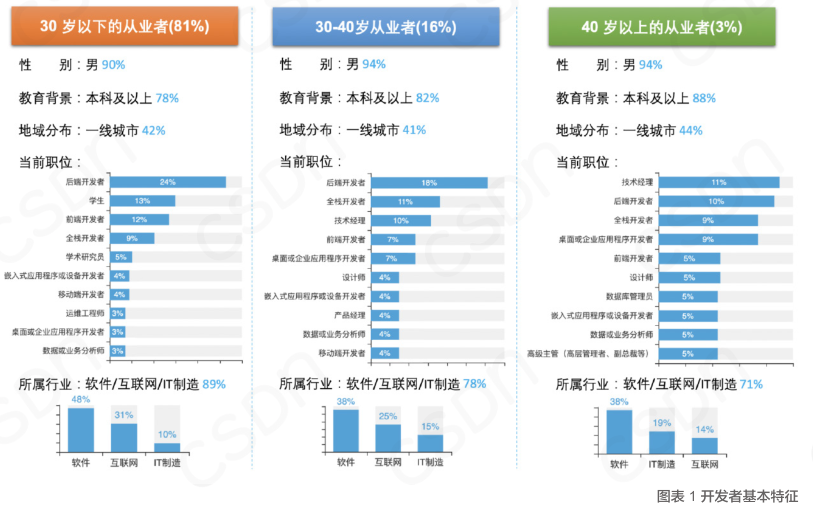
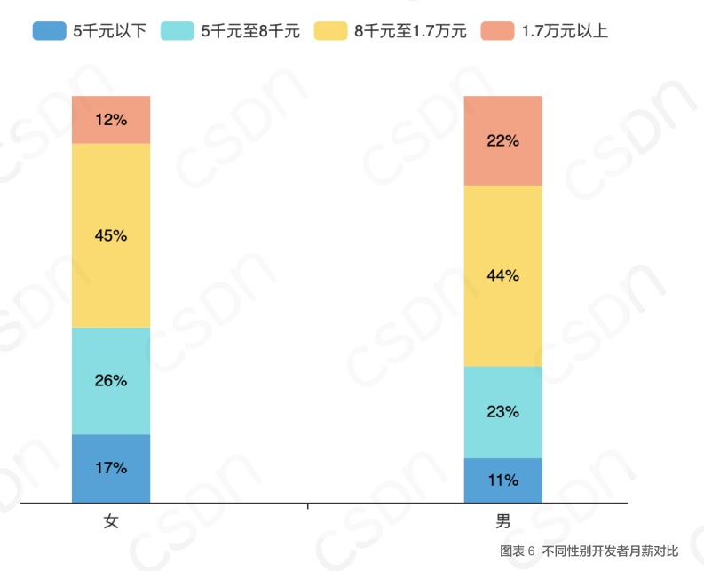

# 💐HelloCoder

## 1、LearnJavaToFindAJob介绍

> LearnJavaToFindAJob ，《Java小白求职之路》，是一个帮助Java程序员到找到一份工作的面试指南。

涵盖几个档位：

- 初级，6~12k
- 中级，12~26k
- 高级，26k~未知

## 2、薪资概况

先来看看2020~2021年度 csdn研究院的数据：

> 数据来源：[https://csdn.gitcode.host/Survey-Report-on-Developers-in-China/survey](https://csdn.gitcode.host/Survey-Report-on-Developers-in-China/survey)

### 1、开发者画像

30岁以下的开发者人数占81%， 全国近半数的开发者分布在一线城市（其中以北京、上海、广州、深圳为主），本科及以上学历占近八成，90%以上为男性开发者。

### 2、开发者薪资

近九成的开发者工资在5000元以上，8001-17000元区间的开发者占比最高，为44.5%。

> 当然，这个和 城市、行业 有很大关系

男、女 开发者薪资：

无论男女，**月薪 8千 至 1.7万** 这个区间的男女开发者占了大部分。

按照这个估算，

**1万 以下的开发者接近 50%，这部分是 1~3 年的工作经验的开发者，属于初级开发者。**

**而3~5年的开发者，薪资都有了一个质的提升，而能力也较初级开发者有了很大的提升，这部分开发者薪资在 1.2w~2w 之间。**

而高级开发者相对较少，薪资往往浮动较大。

---

作者本人结合了自己的求职经历，以及作为 面试官 近几年来看重的技术要求，给出的一些面试考察的内容。

分别为：

- **【初级】6~12k档**

这部分对项目经验要求较低，主要考察开发者的 J**ava基础能力，外加 一些 MySQL、Linux 、操作系统、计算机网络** 的知识，最重要的就是 对**Spring框架**的掌握，如 SSM 框架、MVC、SpringCloud、SpringBoot 等等。

- **【中级】12k-26k档**

中级的薪资浮动较大，和求职者的行业经验、自身的能力、公司的行业 有很大关系。

要求主要是 **项目经验、JVM、Linux调优、Spring源码、中间件的使用和理解（Nginx、Redis、mq等等）**，考察的是开发者对使用框架的深层理解，而不是简简单单停留在使用上。

- **【高级】**

这部分作者本人也不好定义，毕竟这部分求职者市场很稀缺，主要考察 开发者对遇到难题的**解决方案、行业经验、团队管理、技术攻关**。

 

