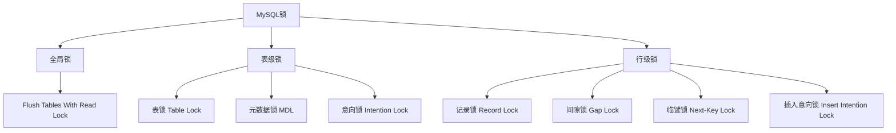

## 一、引擎不同锁也不同

MyISAM 和 MEMORY 采用 表级锁(table-level locking)

BDB 支持页面锁(page-level locking) 或 表级锁，默认为页面锁

> MySQL 5.1+ 已不再支持BDB引擎 ，所以不用关注

InnoDB 支持行级锁(row-level locking) 和 表级锁，默认为行级锁

> 这也是为什么现在业务喜欢选用InnoDB的原因之一


## 二、按锁定粒度分类


**按照对数据的锁定粒度分类，可以分为 ：**




### **1. 全局锁** - 锁整个数据库实例


```sql
-- 加全局读锁（整个数据库只读）
FLUSH TABLES WITH READ LOCK;

-- 解锁
UNLOCK TABLES;
```


**特点**：

- 整个数据库实例只读，所有写操作被阻塞
- 用于**全库逻辑备份**
- 非常重量级，生产环境慎用


### **2. 表级锁** - 锁整张表

#### (1) 表锁（手动锁）


```sql
-- 加表锁
LOCK TABLES users READ;   -- 读锁，只能读操作
LOCK TABLES users WRITE;  -- 写锁 ，只能写操作

-- 解锁 UNLOCK TABLES 不需要指定表名和锁类型
UNLOCK TABLES;
```

#### (2) **元数据锁 MDL**（自动加锁）

- **作用**：防止DDL和DML并发冲突
- **读锁**：增删改查时自动加MDL读锁
- **写锁**：修改表结构时自动加MDL写锁


```sql
-- 会话1：查询（加MDL读锁）
SELECT * FROM users WHERE id = 1;

-- 会话2：修改表结构（等待MDL写锁，被阻塞）
ALTER TABLE users ADD COLUMN age INT;

-- 会话1事务不提交，会话2会一直等待
```

#### (3) **意向锁**（行锁的"预告"）

- **意向共享锁 IS**：事务打算给某些行加共享锁
- **意向排他锁 IX**：事务打算给某些行加排他锁

**意向锁的作用**：快速判断表是否被其他事务加锁，避免逐行检查。

### 3. **行级锁** - InnoDB的核心（最常用）

行级锁一般也分为共享锁和排他锁

#### (1) **记录锁 Record Lock**


```sql
-- 锁定单行记录（id=1的记录）
SELECT * FROM users WHERE id = 1 FOR UPDATE;
-- 或
SELECT * FROM users WHERE id = 1 LOCK IN SHARE MODE;
```


**特点**：只锁住索引记录，id必须有索引，否则会锁表。

#### (2) **间隙锁 Gap Lock**

> 也可以说是 页级锁，一次锁定相邻的一组记录

```sql
-- 表数据：id=1,3,5,7,9

-- 锁定 (5,7) 这个间隙
SELECT * FROM users WHERE id = 6 FOR UPDATE;
-- 或
SELECT * FROM users WHERE id BETWEEN 6 AND 8 FOR UPDATE;
```

GAP锁的目的，是为了防止同一事务的两次当前读，出现幻读的情况。也为了让其他事务无法在间隙中新增数据。该锁只会在隔离级别是RR或者以上的级别内存在。


**特点**：

- 锁住索引记录之间的间隙，防止幻读
- 只存在于**可重复读隔离级别**
- 读已提交级别没有间隙锁

#### (3) **临键锁 Next-Key Lock** = 记录锁 + 间隙锁


```sql
-- 表数据：id=1,3,5,7,9

-- 锁定 (3,5] 这个区间（记录5 + 间隙(3,5)）
SELECT * FROM users WHERE id = 5 FOR UPDATE;
```


**特点**：

- **InnoDB默认行锁算法**
- 解决幻读问题的关键

#### (4) **插入意向锁 Insert Intention Lock**


```sql
-- 事务1：锁住间隙
BEGIN;
SELECT * FROM users WHERE id > 10 FOR UPDATE;  -- 锁住(10, +∞)

-- 事务2：插入时获取插入意向锁
BEGIN;
INSERT INTO users(id, name) VALUES(15, 'Tom');  -- 等待插入意向锁
```


**特点**：插入操作时加的特殊间隙锁，互相不阻塞。


## 三、按锁模式分类

### 1. 共享锁 S Lock（读锁）


```sql
-- 手动加共享锁
SELECT * FROM users WHERE id = 1 LOCK IN SHARE MODE;

-- 自动加锁（某些情况）
SELECT * FROM users WHERE id = 1;  -- 普通查询，快照读，不加锁
```


**特点**：

- 允许其他事务加共享锁
- 不允许其他事务加排他锁
- 多事务可同时持有共享锁

### 2. 排他锁 X Lock（写锁）


```sql
-- 手动加排他锁
SELECT * FROM users WHERE id = 1 FOR UPDATE;

-- 自动加锁（增删改）
UPDATE users SET name = 'Tom' WHERE id = 1;  -- 自动加排他锁
DELETE FROM users WHERE id = 1;             -- 自动加排他锁
INSERT INTO users(id, name) VALUES(2, 'Jerry'); -- 自动加排他锁
```


**特点**：

- 不允许其他事务加任何锁（加读锁也不行）
- 当前事务独占资源


## 四、按加锁方式分类

### 1. **悲观锁** - 默认方式


```sql
-- 显式悲观锁
BEGIN;
SELECT * FROM products WHERE id = 1001 FOR UPDATE;  -- 先加锁
UPDATE products SET stock = stock - 1 WHERE id = 1001;
COMMIT;
```


**思想**：先加锁，再操作，"假定会发生冲突"

### 2. **乐观锁** - 应用程序实现


```sql
-- 基于版本号的乐观锁
UPDATE products 
SET stock = stock - 1, version = version + 1 
WHERE id = 1001 AND version = 5;  -- 检查版本

-- 或者基于时间戳
UPDATE products 
SET stock = stock - 1, update_time = NOW()
WHERE id = 1001 AND update_time = '2024-01-01 10:00:00';
```


**思想**：先操作，冲突时重试，"假定不会冲突"


---

 

 
