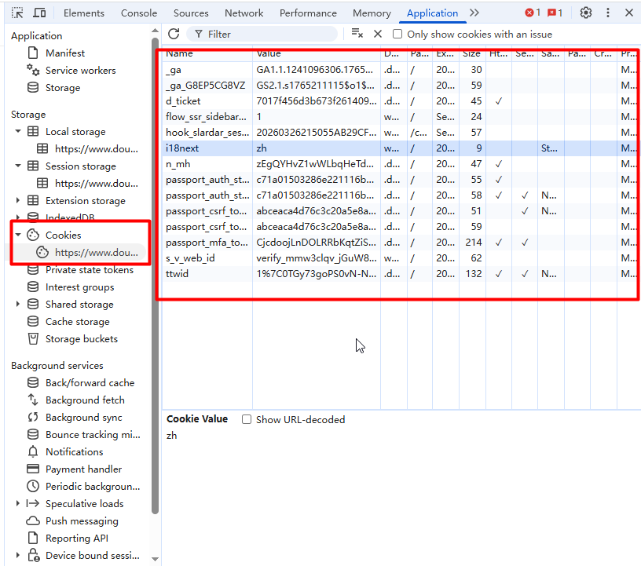

HTTP 协议本身是 **无状态的 (stateless)** 。

服务器默认情况下无法区分两个连续的请求是否来自同一个用户，或者同一个用户之前的操作是什么。


为了解决这个问题，主要有以下几种常用机制：

## 1. Session（基于 Cookie 的服务端状态）

- **原理**：服务器为每个用户创建唯一的 `Session ID`，通过 Cookie 传递给客户端，真实状态数据（如用户信息、购物车）存储在服务端（内存 / Redis / 数据库）。

- 特点

  - 状态数据安全，仅存在服务端
  - 浏览器必须要开启了 Cookie，依赖 Cookie 传递 `Session ID`，若 Cookie 被禁用可通过 URL 重写传递
  - 分布式场景下需解决 Session 共享问题（如 Redis 存储）

  

- **典型场景**：网站登录状态、购物车数据


##  2. Cookie（最经典方案）

- **原理**：服务器通过 `Set-Cookie` 响应头将状态数据（如 Session ID）写入浏览器，之后浏览器每次请求都会自动携带 Cookie。

- 特点

  - 存储在客户端，容量小（通常 4KB 左右）
  - 自动随请求发送，使用简单
  - 存在 CSRF、XSS 等安全风险，需配置 `HttpOnly`、`Secure` 等属性防护

  

- **典型场景**：会话标识、记住登录状态




## 3. Token（无 Cookie 依赖的现代方案）

- **原理**：服务器生成加密 Token（如 JWT），包含用户身份信息，客户端存储后在请求头（`Authorization: Bearer {token}`）或参数中携带。

- 特点

  - 不依赖 Cookie，适合移动端、前后端分离架构
  - 自包含数据，服务器无需存储状态，易于水平扩展
  - 需妥善处理过期与刷新机制

  

- **典型场景**：RESTful API、微服务认证


## 4. URL 重写（兼容旧场景）

- **原理**：将状态标识（如 `Session ID`）直接拼接在 URL 中（如 `https://example.com/home;jsessionid=xxx`）。

- 特点

  - 不依赖 Cookie，兼容性强
  - 安全性差（易泄露、被复制），可读性差

  

- **典型场景**：Cookie 被禁用时的降级方案


## 总结


|     方案     | 存储位置 |     安全性     | 易用性 |        适用场景         |
| :----------: | :------: | :------------: | :----: | :---------------------: |
|    Cookie    |  客户端  | 中等（需防护） |   高   | 会话标识、记住登录状态  |
|   Session    |  服务端  |       高       |   中   |    网站登录、购物车     |
| Token（JWT） |  客户端  |   高（加密）   |   中   |  前后端分离、API 服务   |
|   URL 重写   |  URL 中  |       低       |   低   | Cookie 禁用时的兼容方案 |


## Cookie VS token


### Session + Cookie 登录流程时序图：

```
浏览器                后端服务器                  存储(内存/Redis/DB)
  │                      │                            │
  │  1. 提交账号密码 POST /login                    │
  │ ────────────────────►                            │
  │                      │                            │
  │                      │ 2. 验证账号密码           │
  │                      │ ────────────────────────► │
  │                      │                            │
  │                      │ 3. 验证通过，创建 Session  │
  │                      │    生成唯一 sessionId     │
  │                      │    存入用户信息到 Session │
  │                      │ ────────────────────────► │
  │                      │                            │
  │  4. 返回 Set-Cookie: JSESSIONID=xxx             │
  │ ◄────────────────────                            │
  │                      │                            │
  │  5. 浏览器自动保存 Cookie                       │
  │                      │                            │
  │  6. 下次请求自动携带 Cookie: JSESSIONID=xxx      │
  │ ────────────────────►                            │
  │                      │                            │
  │                      │ 7. 根据 sessionId 查 Session
  │                      │ ────────────────────────► │
  │                      │                            │
  │  8. 识别用户身份，返回业务数据                  │
  │ ◄────────────────────                            │
```

### Token（JWT）登录流程时序图：

```
浏览器                后端服务器                  密钥/数据库
  │                      │                            │
  │  1. 提交账号密码 POST /login                    │
  │ ────────────────────►                            │
  │                      │                            │
  │                      │ 2. 验证账号密码           │
  │                      │ ────────────────────────► │
  │                      │                            │
  │                      │ 3. 生成 JWT Token
  │                      │    (包含用户ID、过期时间)
  │                      │    使用密钥签名           │
  │                      │                            │
  │  4. 返回 { token: "xxx.xxx.xxx" }                │
  │ ◄────────────────────                            │
  │                      │                            │
  │  5. 前端保存到 localStorage/sessionStorage      │
  │                      │                            │
  │  6. 请求时带上: Authorization: Bearer <token>    │
  │ ────────────────────►                            │
  │                      │                            │
  │                      │ 7. 校验 Token 签名 + 过期
  │                      │    无需查库(自包含)       │
  │                      │                            │
  │  8. 认证通过，返回业务数据                      │
  │ ◄────────────────────                            │
```

### Session-Cookie 与 Token 核心区别对比表

|    对比项    |         Session + Cookie         |            Token (JWT)             |
| :----------: | :------------------------------: | :--------------------------------: |
| 状态存储位置 |     服务端 (内存 / Redis/DB)     |       客户端 (浏览器 / APP)        |
|   身份凭证   | sessionId (通过 Cookie 自动携带) |       Token (手动放在请求头)       |
|  服务端压力  |     高，需存储和查询 Session     |       低，无需存储，只做验签       |
|   跨域支持   |      弱，受 Cookie 跨域限制      |  强，适合前后端分离、微服务、APP   |
|  CSRF 风险   |            有，需防护            |                 无                 |
| 分布式扩展性 | 一般，需做 Session 共享 (Redis)  |        好，天然支持集群扩展        |
|   退出登录   |   服务端删除 Session 即可失效    | 无法主动作废，需等待过期或用黑名单 |