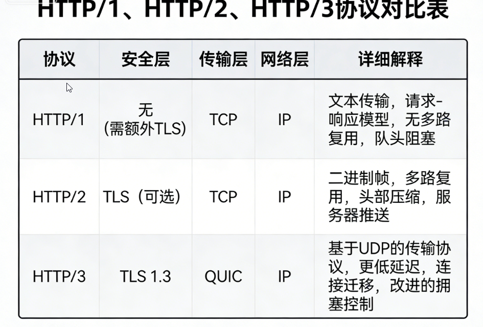

## HTTP 1.0

在 HTTP/1.0 中，HTTP 1.0规定浏览器与服务器只保持短暂的连接（短连接），一个服务器在发送完一个 HTTP 响应后，会断开 TCP 链接。但是这样每次请求都会重新建立和断开 TCP 连接，代价过大。

## HTTP 1.1

HTTP 1.1支持持久连接（HTTP/1.1的默认模式使用带流水线的持久连接），在一个TCP连接上可以传送多个HTTP请求和响应。

HTTP 1.1的 request和reponse头中都有可能出现一个connection的头，此header的含义是当client和server通信时对于长链接如何进行处理。

Connection请求头的值为Keep-Alive时，客户端通知服务器返回本次请求结果后保持连接；Connection请求头的值为close时，客户端通知服务器返回本次请求结果后关闭连接。HTTP 1.1还提供了与身份认证、状态管理和Cache缓存等机制相关的请求头和响应头。HTTP 1.1还支持文件断点续传，传送文件不用从头开始。

HTTP/1.1 引入了 **Host Header**字段，允许在同一 IP 地址上托管多个域名，从而支持虚拟主机的功能。

**总结就是：浏览器再也不用为每个请求重新发起TCP连接了。HTTP 1.1引入cookie以及安全机制**

## HTTP 2.0

HTTP2.0中所有加强性能的**核心是二进制传输，在HTTP1.x中，我们是通过文本的方式传输数据。**

HTTP2.0 使用了HPACK（HTTP2头部压缩算法）压缩格式对传输的header进行编码，减少了header的大小。

HTTP2.0，可以在一个连接里，客户端和服务端都可以同时发送多个请求或回应，而且不用按照顺序一对一对应。

因为`http 1.1` 管道化特性可以让客户端一次发送所有的请求，但是有些问题阻碍了管道化的发展，即是某个请求花了很长时间，那么队头阻塞会影响其他请求。

**总结就是：解决了http1.1中的队头阻塞问题，用户体验的感知多数延迟的效果有了量化的改善，以及提升了TCP连接的利用率**

---

现在还有HTTP3.0版本：使用基于 UDP 的 QUIC 协议、使用更高效的 QPACK 进行头部压缩、在 QUIC 中直接集成了 TLS。QUIC 协议具备连接迁移、拥塞控制与避免、流量控制等特性。

