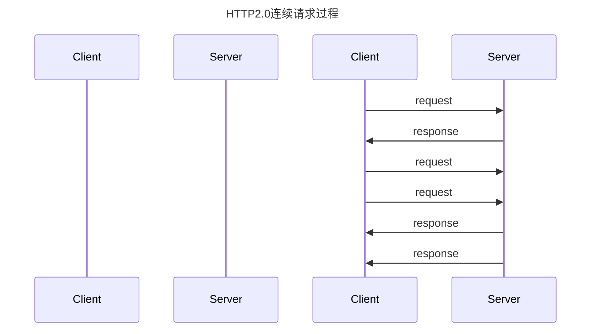

首先，HTTP用 `Keep-Alive` 标识， TCP 用 `Keepalive`标识。

再者，这两个是完全不一样的东西，其实现的原理也不一样：

- HTTP 的 Keep-Alive，是由**应用层（用户态）** 实现的，称为 HTTP 长连接；
- TCP 的 Keepalive，是由 **TCP 层（内核态）** 实现的，称为 TCP 保活机制；

> 值得注意的是，HTTP 是基于 TCP 传输协议实现的，客户端与服务端要进行 HTTP 通信前，需要先建立 TCP 连接。


## HTTP 的 Keep-Alive

**三次握手**大家应该都了解，可以看一下前面的文章。

三次握手后，客户端 和 服务端 就建立了连接。

此时双方就进入了 【请求-应答】的过程，最后进入 **四次挥手**环节，释放TCP连接。


所以大致的过程就是 ：

建立 TCP -> 请求资源 -> 响应资源 -> 释放连接


如果每次HTTP请求都要走这样的过程，这种就是 **HTTP短连接**

相信大家都看出来了，这样每次HTTP请求一次，就要建立一次TCP连接，实在太消耗资源了。


能不能一次性把连接建立后，就往这个通道一直发送请求数据呢？


答案是可以的。

HTTP 的 Keep-Alive 就是干这个的。它可以在第一次建立TCP后，不断开，让后续的HTTP继续使用该TCP连接。


甚至在HTTP2.0版本，它还可以使用同一个TCP连续发送 或者 连续接收多个 `HTTP请求/应答`

这种就称为 **HTTP 长连接**



现在大多数浏览器都默认是使用 HTTP/1.1，是默认打开的。

也可以通过 HTTP的Header 标识一下：

```shell
# 开启
Connection: Keep-Alive
# 关闭
Connection:close
```


虽然说TCP打开后，能复用TCP连接，如果客户端只请求了一次，接下来再无请求/应答，那TCP连接还是保留着，岂不是更浪费资源。

此时就需要定义一个  `keepalive_timeout` 参数，用来指定 HTTP 长连接的超时时间。

## TCP 的 Keepalive

如果客户端和服务端 TCP 连接一直没有数据交互，达到了触发 **TCP 保活机制**的条件，内核里的 TCP 协议栈就会发送**探测报文**。

TCP 保活机制 的条件比较多。

保活是为验证该连接是否还有效，之后确定该连接是否应该关闭。当 TCP 保活的探测报文发送给对方, 对方如果正常响应，这样 **TCP 保活时间会被重置**，时间间隔后，等待下一个 TCP 保活时间的到来，重复以上动作。


## 总结

HTTP 的 Keep-Alive 也叫 HTTP 长连接，该功能是由「应用程序」实现的，可以使得用同一个 TCP 连接来发送和接收多个 HTTP 请求/应答，减少了 HTTP 短连接带来的多次 TCP 连接建立和释放的开销。

TCP 的 Keepalive 也叫 TCP 保活机制，该功能是由「内核」实现的，当客户端和服务端长达一定时间没有进行数据交互时，内核为了确保该连接是否还有效，就会发送探测报文，来检测对方是否还在线，然后来决定是否要关闭该连接。

