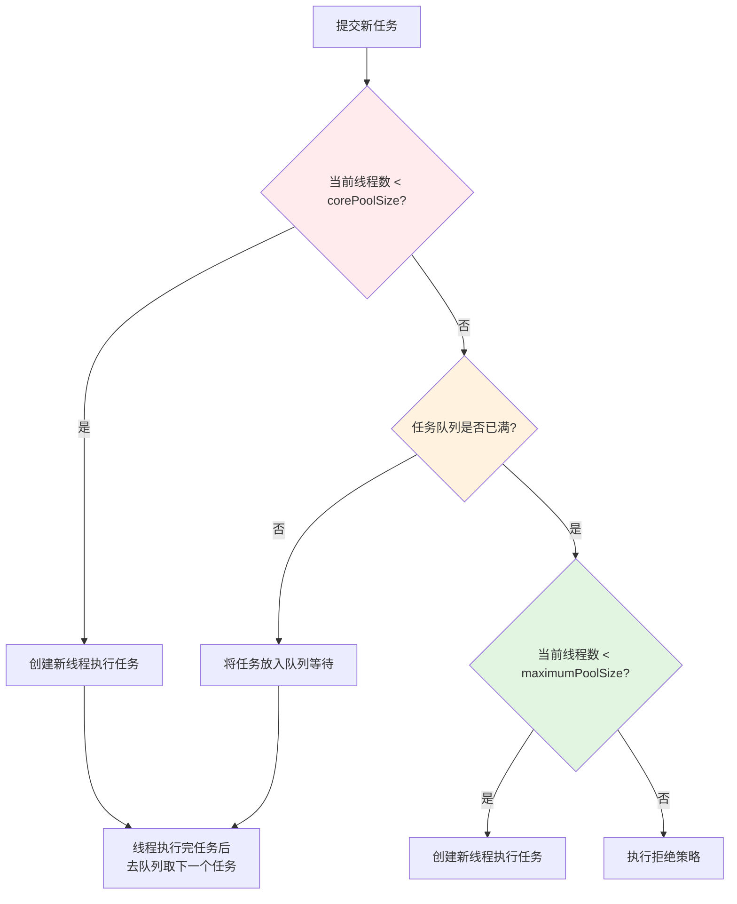

## 一、什么是线程池？

**线程池是一种池化技术，预先创建并管理一组可复用的线程，避免频繁创建和销毁线程的开销。**


```javascript
// 没有线程池：每次任务都创建新线程
new Thread(() -> doTask()).start();  // 创建线程 → 执行 → 销毁

// 有线程池：复用已有线程
executor.submit(() -> doTask());  // 从池子里拿现成线程去执行
```


**类比**：数据库连接池、对象池、字符串常量池，都是同一个思想——**复用昂贵的资源**。

------

## 二、为什么要使用线程池？

| 原因                 | 说明                                   | 没有线程池的问题                      |
| :------------------- | :------------------------------------- | :------------------------------------ |
| **降低资源消耗**     | 复用已创建的线程，避免频繁创建/销毁    | 每个任务都要新建线程，创建+销毁开销大 |
| **提高响应速度**     | 任务来了直接拿现成线程执行，不用等创建 | 创建线程需要时间（毫秒级）            |
| **提高线程可管理性** | 统一管理线程的数量、生命周期           | 线程分散在各处，无法统一监控和控制    |
| **防止资源耗尽**     | 限制并发线程数，避免拖垮系统           | 无限制创建线程，最终导致 OOM          |

**一个真实案例**：

- 没有线程池：1000 个并发请求 → 创建 1000 个线程 → 每个线程占用约 1MB 栈内存 → 1GB 内存没了 → OOM
- 有线程池：固定 10 个线程 → 1000 个任务排队执行 → 内存稳定

## 三、Java 中如何使用线程池？

### 核心类：`ThreadPoolExecutor`


```java
// 创建线程池
ThreadPoolExecutor executor = new ThreadPoolExecutor(
    corePoolSize,      // 核心线程数
    maximumPoolSize,   // 最大线程数
    keepAliveTime,     // 空闲线程存活时间
    TimeUnit.SECONDS,  // 时间单位
    workQueue,         // 任务队列
    threadFactory,     // 线程工厂
    handler            // 拒绝策略
);

// 提交任务
executor.execute(() -> System.out.println("执行任务"));
// 或
Future<String> future = executor.submit(() -> "返回结果");

// 关闭线程池
executor.shutdown();     // 不再接收新任务，等待已有任务完成
executor.shutdownNow();  // 立即停止，返回未执行的任务列表
```


------

## 四、七大参数详解


```java
public ThreadPoolExecutor(
    int corePoolSize,           // 1. 核心线程数
    int maximumPoolSize,        // 2. 最大线程数
    long keepAliveTime,         // 3. 空闲线程存活时间
    TimeUnit unit,              // 4. 时间单位
    BlockingQueue<Runnable> workQueue,  // 5. 任务队列
    ThreadFactory threadFactory,        // 6. 线程工厂
    RejectedExecutionHandler handler    // 7. 拒绝策略
)
```


参数 1：`corePoolSize`（核心线程数）

- 线程池保持存活的线程数（即使空闲）
- 任务数 < corePoolSize → 直接创建新线程执行

参数 2：`maximumPoolSize`（最大线程数）

- 线程池允许创建的最大线程数
- 任务队列满了之后，还能创建多少线程（但不能超过这个数）

参数 3 & 4：`keepAliveTime`  （空闲存活时间）

- **核心线程以外的线程**，空闲超过这个时间就会被回收
- 如果设置 `allowCoreThreadTimeOut(true)`，**核心线程也会被回收**

参数 5：`workQueue`（任务队列）

| 队列类型                | 特点                         | 适用场景                           |
| :---------------------- | :--------------------------- | :--------------------------------- |
| `ArrayBlockingQueue`    | 有界队列，容量固定           | 控制资源使用                       |
| `LinkedBlockingQueue`   | 可选的边界队列（默认无界）   | Executors.newFixedThreadPool 使用  |
| `SynchronousQueue`      | **不存储任务，直接交给线程** | Executors.newCachedThreadPool 使用 |
| `PriorityBlockingQueue` | 支持优先级                   | 任务有优先级区分时使用             |

参数 6：`threadFactory`（线程工厂）

```java
// 自定义线程工厂，给线程起名字、设优先级
ThreadFactory factory = r -> {
    Thread t = new Thread(r);
    t.setName("my-pool-" + System.currentTimeMillis());
    t.setDaemon(false);
    return t;
};
```


参数 7：`handler`（拒绝策略）—— 队列满了且线程数已达最大时的处理方式

> **触发拒绝的前置条件：**（满足三点后，新任务触发对应拒绝策略。）
>
> 1. 核心线程已满；
> 2. 阻塞队列已满；
> 3. 最大线程数已满；

| 策略                  | 行为                               | 适用场景                                       |
| :-------------------- | :--------------------------------- | :--------------------------------------------- |
| `AbortPolicy`（默认） | 抛出 `RejectedExecutionException`  | 任务不能丢、需要感知失败、业务主动捕获异常处理 |
| `CallerRunsPolicy`    | 谁提交的谁自己执行（一般是主线程） | 降级，让调用方承受压力                         |
| `DiscardPolicy`       | 直接丢弃，不报错                   | 非关键日志、监控                               |
| `DiscardOldestPolicy` | 丢弃队列里最老的任务               | 新任务更重要时                                 |

------

## 五、线程池的工作流程（重点面试题）



**文字版流程**：

1. 提交任务后，先看当前线程数 **是否 < corePoolSize**：是 → 创建新线程执行
2. 否则看 **任务队列是否已满**：否 → 任务放入队列
3. 队列满了，再看 **当前线程数是否 < maximumPoolSize**：是 → 创建新线程执行
4. 否则 → **执行拒绝策略**

------

## 六、常见的线程池框架（Executors 工具类提供）

| 工厂方法                    | 参数                                             | 特点                             | 问题                                   |
| :-------------------------- | :----------------------------------------------- | :------------------------------- | :------------------------------------- |
| `newFixedThreadPool(n)`     | core=max=n 队列：`LinkedBlockingQueue`（无界）   | 线程数固定，任务队列无界         | **队列可能无限堆积**，导致 OOM         |
| `newCachedThreadPool()`     | core=0，max=Integer.MAX 队列：`SynchronousQueue` | 来一个任务就建线程（没有就新建） | **线程数无上限**，可能耗尽系统资源     |
| `newSingleThreadExecutor()` | core=max=1 队列：`LinkedBlockingQueue`           | 单线程串行执行                   | 队列无界，可能 OOM                     |
| `newScheduledThreadPool(n)` | 支持定时、延迟执行                               | 可做定时任务                     | 底层 `DelayedWorkQueue` 无界，可能 OOM |

**阿里巴巴 Java 开发手册强制规定**：

> 线程池不允许使用 `Executors` 去创建，而是通过 `ThreadPoolExecutor` 的方式。因为 `Executors` 创建的线程池可能引发 OOM（`FixedThreadPool` 和 `SingleThreadPool` 队列无界；`CachedThreadPool` 线程数无上限）。

------

## 七、如何合理配置线程池参数？

这个问题没有标准答案，取决于**任务类型**和**机器配置**。

### 先区分任务类型：

| 任务类型       | 特点                   | 配置建议                        |
| :------------- | :--------------------- | :------------------------------ |
| **CPU 密集型** | 大量计算，不阻塞       | 线程数 = CPU 核数 + 1           |
| **IO 密集型**  | 大量网络调用、磁盘读写 | 线程数 = CPU 核数 × 2（或更大） |
| **混合型**     | 计算 + IO              | 可以拆分，或按比例估算          |

### 计算公式（经验值）

- **CPU 密集型任务 (N)：** 这种任务消耗的主要是 CPU 资源，线程数应设置为 N+1（CPU 核心数）。由于任务主要瓶颈在于 CPU 计算能力，与核心数相等的线程数能够最大化 CPU 利用率，过多线程反而会导致竞争和上下文切换开销。
- **I/O 密集型任务**：大部分时间都花在了等待 IO 操作完成上。

```java
// CPU 密集型
int poolSize = Runtime.getRuntime().availableProcessors() + 1;

// IO 密集型（简化版）
int poolSize = Runtime.getRuntime().availableProcessors() * 2;

// IO 密集型（精确版，假设 IO 耗时占 80%）
int poolSize = Runtime.getRuntime().availableProcessors() / (1 - 0.8)
              = 核数 / 0.2 = 核数 × 5
```


### 队列大小参考：

- 任务量大但要求响应快 → 小队列 + 大线程池
- 任务量大但能接受排队 → 大队列 + 适中线程池
- 关键业务 → 用有界队列 + 合理拒绝策略

------

## 八、面试常见追问

### Q1：核心线程数会被回收吗？

- 即使它们已经空闲了，也不会回收；除非调用 `allowCoreThreadTimeOut(true)`，这样就会回收空闲（时间间隔由 `keepAliveTime` 指定）


所以，核心线程空闲时，其状态分为以下两种情况：

- **allowCoreThreadTimeOut=true（设了核心存活时间）**

  空闲核心调用`poll(keepAlive)` → **TIMED_WAITING**；超时取不到任务，线程退出销毁。

  **allowCoreThreadTimeOut=false（默认，无核心超时）**

  空闲核心调用`take()` → **WAITING 无限阻塞**，线程永远存活不回收。 （线程池关闭才会终止）

### Q2：线程池里的线程抛了异常怎么办？

- 当前线程会被移除，然后线程池会新建一个线程
- 不影响其他任务
- 建议在 `Runnable.run()` 里自己 catch 异常

### Q3：如何监控线程池状态？


```java
executor.getPoolSize();        // 当前线程数
executor.getActiveCount();     // 活跃线程数
executor.getQueue().size();    // 队列中等待的任务数
executor.getCompletedTaskCount(); // 已完成任务数
```


### Q4：`execute()` 和 `submit()` 的区别？

- `execute()`：无返回值，不能感知执行结果和异常
- `submit()`：返回 `Future`，可 `get()` 获取结果或捕获异常

------

## 九、总结

| 知识点       | 核心要点                                               |
| :----------- | :----------------------------------------------------- |
| **是什么**   | 预先创建并管理一组可复用线程的池化技术                 |
| **为什么用** | 降低开销、提高响应、便于管理、防止资源耗尽             |
| **核心参数** | 7 个，重点是 corePoolSize、maxPoolSize、队列、拒绝策略 |
| **工作流程** | core → 队列 → max → 拒绝                               |
| **常见陷阱** | Executors 创建的线程池可能 OOM                         |
| **配置原则** | CPU 密集型（核+1）、IO 密集型（核×2 ~ 核×5）           |

**一句话记忆**：

> 线程池就是**"先养一批工人在线（core），任务多了排队（queue），队太长了扩招（max），还堵着就关门（reject）"**。

