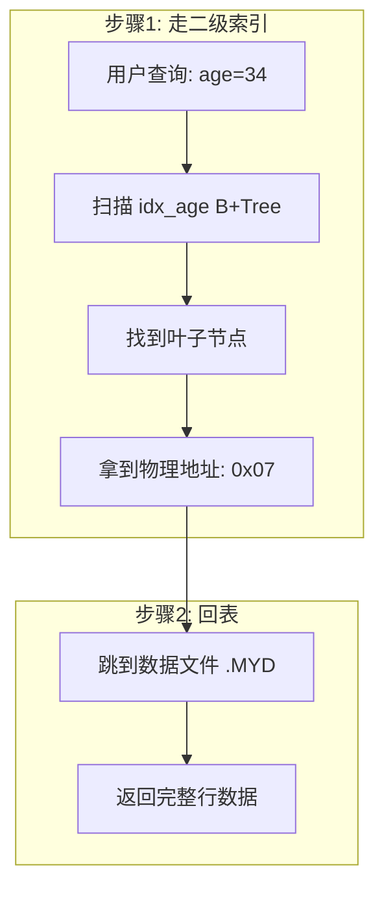
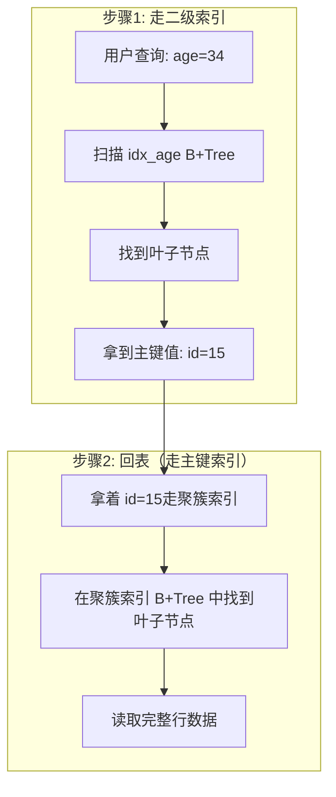

虽然说MyISAM和InnoDB都是使用了`B+Tree`作为索引结构，但是它们两者在实现却有很大的差异。

**最大的区别在于：MyISAM 的叶子节点存的是数据的物理地址（指针），而 InnoDB 的叶子节点存的是完整的数据行（聚簇索引）。**

作为面试中MySQL必不可少的一环节，本文就来简单介绍一下两者的区别。

以下整改表为示例表`users` 

| Col1 / id | Col2 / age | Col3 / name |
| --------- | ---------- | ----------- |
| 15        | 34         | Bob         |
| 18        | 77         | Alice       |
| 20        | 5          | Jim         |
| 30        | 91         | Eric        |
| 49        | 22         | Tom         |
| 50        | 89         | Rose        |

## MyISAM索引实现

MyISAM引擎使用`B+Tree`作为索引结构，叶节点的data域存放的是数据记录的地址。下图是MyISAM索引的原理图：

 

> 索引会按照顺序排列，只有索引树有序，数据文件 (.MYD) 物理存储无序

这里设表一共有三列，假设我们以`Col1`为主键，则上图是一个MyISAM表的主键索引（Primary key）示意。可以看出MyISAM的索引文件仅仅保存数据记录的地址。

**假如是普通索引呢？**

在MyISAM中，**主键索引**和**辅助索引**（**Secondary key**，可以理解为普通索引）**在结构上没有任何区别**，只是主索引要求key是唯一的，而辅助索引的key可以重复。如果我们在`Col2`上建立一个辅助索引，则此索引的结构如下图所示：

 

> 索引是 5、22、34、77、89、91 排列，而Col2的物理行是无序的

同样也是一颗**B+Tree**，data域保存数据记录的地址。

因此，MyISAM中索引检索的算法为首先按照B+Tree搜索算法搜索索引，如果指定的Key存在，则取出其data域的值，然后以data域的值为地址，读取相应数据记录。

MyISAM的索引方式也叫做“**非聚集**”的，之所以这么称呼是为了与InnoDB的**聚集索引**区分。

## InnoDB索引实现

虽然InnoDB也使用`B+Tree`作为索引结构，但具体实现方式却与MyISAM截然不同。

第一个重大区别是InnoDB的数据文件本身就是索引文件。从上文知道，MyISAM索引文件和数据文件是分离的，索引文件仅保存数据记录的地址。而在InnoDB中，表数据文件本身就是按B+Tree组织的一个索引结构，这棵树的叶节点data域保存了完整的数据记录。这个索引的key是数据表的主键，因此InnoDB表数据文件本身就是主索引。

上图是InnoDB主索引（同时也是数据文件）的示意图，可以看到叶节点包含了完整的数据记录。这种索引叫做**聚集索引**。

因为InnoDB的数据文件本身要按主键聚集，所以InnoDB要求表必须有主键（MyISAM可以没有），如果没有显

指定，则MySQL系统会自动选择一个可以唯一标识数据记录的列作为主键；如果不存在唯一非空列，MySQL 会自动为 InnoDB 表生成一个 6 字节隐藏 ROW_ID 作为主键。

第二个与MyISAM索引的不同是**InnoDB的辅助索引data域存储相应记录主键的值**而不是地址。换句话说，InnoDB的所有辅助索引都引用主键作为data域。例如，下图为定义在Col3上的一个辅助索引：

这里以英文字符的ASCII码作为比较准则。聚集索引这种实现方式使得按主键的搜索十分高效，但是辅助索引搜索需要检索两遍索引：**首先检索辅助索引获得主键，然后用主键到主索引中检索获得记录。**（又称为 **回表**）

了解不同存储引擎的索引实现方式对于正确使用和优化索引都非常有帮助，例如知道了InnoDB的索引实现后，就很容易明白为什么不建议使用过长的字段作为主键，因为所有辅助索引都引用主索引，过长的主索引会令辅助索引变得过大。

再例如，用非单调的字段作为主键在InnoDB中不是个好主意，因为InnoDB数据文件本身是一颗B+Tree，非单调的主键会造成在插入新记录时数据文件为了维持B+Tree的特性而频繁的分裂调整，十分低效，而使用自增字段作为主键则是一个很好的选择。

## 举例说明

执行 `SELECT * FROM users WHERE age = 34;`

> 因为 Col2 / age 列 不是一级索引，所以必然会回表

**MyISAM 的查找过程**：

1. 在 age 索引的 B+Tree 中找到 age=34的叶子节点
2. 读取叶子节点中存储的**物理地址指针** 0x07
3. 根据指针0x07去查找数据文件（.MYD）中读取完整行 → **回表**
4. 回表后，返回完整行

**InnoDB 的查找过程**：

1. 在 age 索引的 B+Tree 中找到 age=34 的叶子节点
2. 读取叶子节点中存储的**主键值**（比如 `id=15`）
3. 拿着主键值id=15，去**主键索引**（聚簇索引）中找完整行 → **回表**
4. 回表后，返回完整行

MyISAM 和 InnoDB 的二级索引都需要回表，但 MyISAM 回表是直接取物理地址（更快一点），而 InnoDB 回表是拿主键再去聚簇索引查（多一次 B+Tree 查找），所以在效率上要优于InnoDB，小型应用可以考虑使用MyISAM。

> 不过 InnoDB 有缓冲池机制：聚簇索引数据页会缓存，大量热点数据下主键查询命中内存，二次 B+Tree 几乎无磁盘 IO；
>
> MyISAM 数据页不持久缓存，回表极易触发随机磁盘 IO。
>
> 所以这不是绝对的。

### 覆盖索引

覆盖索引：当 select 字段全部包含在二级索引中，MyISAM、InnoDB 都无需回表；

如： `SELECT id,age FROM users WHERE age = 34;`

### **聚簇索引** vs 非聚簇索引

所以我们可以区分这两种索引：

- **聚簇索引**：聚集（clustered）索引，也叫聚簇索引。

> 定义：数据行的物理顺序与列值（一般是主键的那一列）的逻辑顺序相同，一个表中只能拥有一个聚集索引。

就像一本字典一样，汉字通过A—Z排列，比如说查找一个**“中”**字，我们通过字典的目录，就可以找到对应的页码；如果要插入一个**“啊”**字，那么它必然要插入到**“中”**字前面。

数据行的物理顺序与列值的**顺序相同**，如果我们查询id比较靠后的数据，那么这行数据的地址在磁盘中的物理地址也会比较靠后。而且由于物理排列方式与聚集索引的顺序相同，所以也就只能建立一个聚集索引了。

- **非聚簇索引**：将数据存储于索引分开结构，索引结构的叶子节点指向了数据的对应行，MyISAM通过key_buffer把索引先**缓存到内存**中，当需要访问数据时（通过索引访问数据），在内存中**直接搜索索引**，**然后通过索引找到磁盘相应数据**，这也就是为什么索引不在key buffer命中时，速度慢的原因。

## 两者使用场景：

| 维度                 | MyISAM                       | InnoDB                                 |
| :------------------- | :--------------------------- | :------------------------------------- |
| **索引与数据关系**   | 分离（索引存地址）非聚集     | 合一（索引即数据）聚集                 |
| **主键索引类型**     | 非聚簇索引                   | **聚簇索引**（必须有主键）             |
| **叶子节点存什么**   | 物理行地址                   | 完整行数据                             |
| **二级索引存什么**   | 物理行地址                   | **主键值**                             |
| **是否必须要有主键** | 不要求                       | **必须有主键**（无则自动生成隐藏主键） |
| **支持事务**         | ❌ 不支持                     | ✅ 支持                                 |
| **锁粒度**           | 表锁（写锁锁整表）           | 行锁 + 间隙锁（支持 MVCC）             |
| **外键约束**         | ❌ 不支持                     | ✅ 支持                                 |
| **全文索引**         | 支持（较成熟）               | 支持（MySQL 5.6+）                     |
| **压缩表**           | 支持（压缩后只读）           | ❌ 不支持                               |
| **适用场景**         | 读多写少、对事务无要求       | **所有生产环境（默认）**               |
| 数据风险             | 崩溃无事务回滚，表损坏概率大 | 事务回滚                               |

## 总结

**1. 索引与回表核心差异**

MyISAM为非聚簇索引，索引和数据文件分离，二级索引叶子节点存放数据物理偏移地址，回表只需一次磁盘地址跳转，数据磁盘存储无序；

InnoDB为聚簇索引，数据和主键索引合二为一，叶子节点由有序双向链表串联，物理数据和主键顺序一致，天然支持主键有序查询，但其二级索引回表需要两次B+Tree查询（先查二级索引拿主键，再查聚簇索引拿整行数据）。

**2. 性能误区与选型建议**

单条冷数据查询时，MyISAM回表链路更短，只读场景有微弱性能优势，但该优势局限性极强。MyISAM采用表锁、不支持事务、宕机易丢数据，并发读写场景性能拉胯；

而InnoDB行锁、事务、缓冲池能力完善，适配绝大多数线上业务。

**选型结论**：海量纯读无写入的离线场景可酌情用MyISAM；但凡有增删改、线上业务、需要数据安全，一律使用InnoDB，线上项目禁止使用MyISAM。

