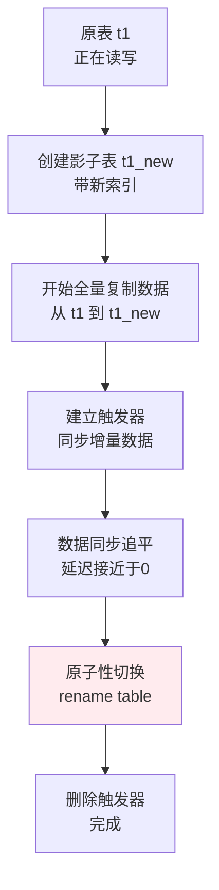

**MySQL大表（千万级+）重建 / 新建 索引，核心原则是“不要直接在线上跑 ALTER TABLE”，会锁表导致业务不可用。**


注意：生产环境操作时，建议先从从库试一次


## 方案一：MySQL 5.6+ Online DDL（推荐首选）

MySQL 5.6 开始，InnoDB 支持 Online DDL。**加普通二级索引（非主键、非唯一）不会锁表，不会阻塞写操作。**

```sql
-- 推荐写法（显式指定算法和锁策略）
ALTER TABLE big_table 
ADD INDEX idx_user_id (user_id) 
ALGORITHM=INPLACE, LOCK=NONE;
```

- `ALGORITHM=INPLACE`：原地修改，不重建表（速度快，空间占用小）
- `LOCK=NONE`：不锁表
  - **允许并发读** ✅ 其他查询可以正常进行。
  - **允许并发写(在主库)** ✅ `INSERT/UPDATE` 操作不会被阻塞。

在 5.7/8.0 中，`ADD INDEX` 默认就是 `INPLACE, LOCK=NONE`，直接执行即可。


## 方案二：MySQL 5.5 + pt-online-schema-change（生产环境首选）

> 为了简单，使用 pt-osc 代表 pt-online-schema-change

**适用场景**：

- 主键变更、唯一索引变更（Online DDL 不支持 `LOCK=NONE`）
- MySQL 5.5 及以下版本
- 需要更精细地控制执行节奏


```bash
pt-online-schema-change \
  --alter "ADD INDEX idx_user_id (user_id)" \
  --execute \
  --max-load="Threads_running=50" \
  --critical-load="Threads_running=100" \
  --chunk-size=1000 \
  D=your_db,t=big_table
```

## 方案三、主从切换（无任何风险）

如果表实在太大（超过 1TB），或者业务对延迟特别敏感，可以考虑：

操作流程如下：

1. 在**从库**上执行加索引操作（不影响主库业务）。（利用 `LOCK=NONE` 降低对复制线程的影响）。

   ```sql
   ALTER TABLE big_table ADD INDEX idx_user_id (user_id), ALGORITHM=INPLACE, LOCK=NONE;
   ```

2. **主从切换**，让从库成为新主库。

3. 在原来的主库（现在是新从库）上加索引。

4. 再次切换回来（可选）。


> DDL 已经记录在 binlog 中，主库会把索引同步到从库，反之不行，所以第4步切换回来后不需要操作。


**Q1：从库在加索引的时候，会加锁吗？从库读是否有阻塞？**

**答案：会加锁，但锁的是写入。从库只读，所以不影响查询，但会影响 binlog 回放，主从延迟会变大**

- `ALTER TABLE` 在从库执行时，和主库一样，会根据 DDL 类型加对应的锁。
- 但**从库本身就是只读的**，所以锁只影响从库的回放线程（SQL Thread）和本地的 DML/DDL。
- 如果你在从库执行 `ALTER`，在此期间：
  - 主库的 binlog 依然在同步，但会卡住，等待 DDL 完成（DDL优先），在这期间，**主库过来的新数据无法写入从库**
  - 从库的 `SHOW SLAVE STATUS\G` 会看到 `Seconds_Behind_Master` 在增加
  - 但**从库上的读查询不会被阻塞**（因为 `ALGORITHM=INPLACE, LOCK=NONE`）


## 方案四、重建表

**这正是方案二 `pt-online-schema-change` 和 `gh-ost` 这类工具的核心工作方式。** 





### **Q： 如何保证业务数据的衔接**？

新建索引不一定要“原地”建，可以“建一张新表，再把数据搬过去”，这个过程中，通过特定机制来保证两个表的衔接。

#### 1. `pt-online-schema-change` 的衔接机制（触发器模式）

pt-osc 的做法是：**在原表上建立触发器，把增量操作同步到影子表。**

原表 `t1` 上有三个触发器：

```sql
-- INSERT 触发器：新数据插入到 t1_new
CREATE TRIGGER t1_insert AFTER INSERT ON t1
FOR EACH ROW INSERT INTO t1_new VALUES (NEW.*);

-- UPDATE 触发器：数据更新时，同步更新 t1_new
CREATE TRIGGER t1_update AFTER UPDATE ON t1
FOR EACH ROW UPDATE t1_new SET ... WHERE id = NEW.id;

-- DELETE 触发器：删除时，同步删除 t1_new
CREATE TRIGGER t1_delete AFTER DELETE ON t1
FOR EACH ROW DELETE FROM t1_new WHERE id = OLD.id;
```

**衔接保证**：

- 全量复制期间，所有增量 DML（增删改）通过触发器同步到 `t1_new`。
- 全量复制完成后，`t1_new` 的数据与 `t1` 是**最终一致**的（触发器会补上复制期间的变化）。
- 切换瞬间 `RENAME TABLE t1 TO t1_old, t1_new TO t1` 是原子操作，业务无感知。

**缺点**：触发器有性能损耗（大约 5%-10%），在压力高的表上要留意。

#### 2. `gh-ost` 的衔接机制（Binlog 模式）

gh-ost 的做法更优雅：**不用触发器，而是把自己伪装成从库，通过解析 binlog 来同步增量数据。**


**衔接保证**：

- `gh-ost` 会读取原表的全量数据，灌入影子表。
- 同时作为“从库”拉取 binlog，持续回放增量。
- 直到影子表的数据与全量表完全一致（binlog 事件追平），再执行切换。

**优点**：无触发器，对主库影响更小。
**缺点**：需要 binlog 开启 `ROW` 格式，且对网络和磁盘 I/O 要求稍高。


在操作执行期间，业务视角下的数据流是这样的：

| 阶段           | 业务读操作                                   | 业务写操作                   | 影子表                   |
| :------------- | :------------------------------------------- | :--------------------------- | :----------------------- |
| **全量复制中** | 读原表 `t1`                                  | 写原表 `t1`                  | 通过触发器/binlog 同步写 |
| **切换瞬间**   | 读原表 `t1`（RENAME 是原子操作，极短暂等待） | 写原表 `t1`                  | 切换完成后数据已一致     |
| **切换后**     | 读 `t1`（实际是原 `t1_new`）                 | 写 `t1`（实际是原 `t1_new`） | 业务无感知               |

**切换瞬间的锁行为**：

- `RENAME TABLE` 会持有表级的元数据锁（MDL），但只会持续极短时间（毫秒级）。
- 在这期间，所有对该表的读写请求会被**短暂阻塞**，切换完成后立即恢复。
- 这就是为什么 pt-osc/gh-ost 切换时的“影响”远比直接 `ALTER TABLE` 小得多。


## 不同加索引类型的限制说明

| 操作                            | 算法与锁                                  | 读                     | 写       | 阻塞原因                           | 方案                 |
| :------------------------------ | :---------------------------------------- | :--------------------- | :------- | :--------------------------------- | -------------------- |
| **`ADD INDEX`（普通二级索引）** | `INPLACE, LOCK=NONE`                      | ❌ 不阻塞               | ❌ 不阻塞 | 无阻塞（Online）                   | Online DDL 直接执行  |
| **`ADD UNIQUE INDEX`**          | `INPLACE, LOCK=SHARED`                    | ❌ 不阻塞               | ⚠️ 阻塞   | 需要检查唯一性，过程中会持有共享锁 | Online DDL 或 pt-osc |
| **`ADD PRIMARY KEY`**           | `INPLACE, LOCK=EXCLUSIVE`（或 `REBUILD`） | ⚠️ 可能阻塞             | ⚠️ 阻塞   | 需要重建整张表，改数据页结构       | pt-osc 或主从切换    |
| 5.5 及以下任何索引变更          | `COPY`                                    | ⚠️ 允许读（但性能极差） | ✅ 阻塞   | ✅ 锁表，复制表全程加写锁           | 重建表或主从切换     |
| **主键变更（改列）**            | `COPY, LOCK=EXCLUSIVE`                    | ✅ 阻塞                 | ✅ 阻塞   | 表级排他锁，全表重建               | pt-osc 或主从切换    |