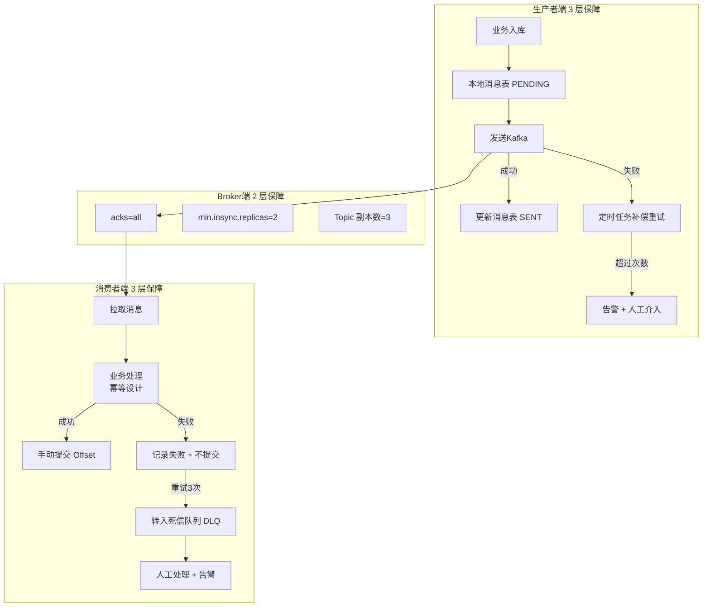

## 一、消息丢失的几个典型场景

我们先定位消息可能丢在哪，再来谈如何解决。

| 阶段                | 丢失场景                          | 根因                                                         |
| :------------------ | :-------------------------------- | :----------------------------------------------------------- |
| **生产者 → Broker** | 发送成功但实际未落盘              | `acks=0` 或 `acks=1`，Leader 收到但未同步给 Follower 就挂了  |
| **Broker 端**       | 消息落盘后丢失                    | 磁盘损坏、日志段删除策略误删、副本未同步                     |
| **Broker → 消费者** | 消费者收到但未处理完就提交 Offset | `enable.auto.commit=true`，消费逻辑异常但 Offset 已提交      |
| **消费者端**        | 处理完但 Offset 提交失败          | 业务成功但 `commitSync` 抛出异常，重启后重复消费（注：这属于重复消费而非丢失，但常被误认为丢失） |

我们最需要关注的是 **“生产者丢失”**和 **“消费者丢失”**，这两者占生产事故的 90% 以上。

## 二、如何设计一个防消息丢失的项目？

### 1. 生产端：保证消息“一定到达”

核心要点：**等 Broker 确认落盘再返回成功，并且要有重试机制。**

```java
@Configuration
public class KafkaProducerConfig {
    
    @Bean
    public KafkaTemplate<String, String> kafkaTemplate() {
        Map<String, Object> props = new HashMap<>();
        
        // ✅ 要求所有 ISR 副本确认写入
        props.put(ProducerConfig.ACKS_CONFIG, "all");
        
        // ✅ 设置重试次数（网络抖动时自动重发）
        props.put(ProducerConfig.RETRIES_CONFIG, 3);
        
        // ✅ 幂等生产者（避免网络重试导致消息重复）
        props.put(ProducerConfig.ENABLE_IDEMPOTENCE_CONFIG, true);
        
        // ✅ 设置最大的消息大小（防止大消息被 Broker 拒绝）
        props.put(ProducerConfig.MAX_REQUEST_SIZE_CONFIG, 1048576);
        
        return new KafkaTemplate<>(new DefaultKafkaProducerFactory<>(props));
    }
}
```


**发送时的兜底策略**：

```java
@Service
public class OrderService {
    
    @Autowired
    private KafkaTemplate<String, String> kafkaTemplate;
    
    public void createOrder(Order order) {
        // 1. 先存本地业务表
        orderDao.insert(order);
        
        // 2. 再存一条“待发送消息”表（本地消息表）
        MessageRecord record = new MessageRecord();
        record.setOrderId(order.getId());
        record.setTopic("order-topic");
        record.setPayload(JSON.toJSONString(order));
        record.setStatus("PENDING");  // 待发送
        messageRecordDao.insert(record);
        
        // 3. 发送消息
        try {
            kafkaTemplate.send("order-topic", order.getId(), JSON.toJSONString(order))
                .addCallback(
                    result -> {
                        // 发送成功 → 更新本地消息状态为 SENT
                        messageRecordDao.updateStatus(record.getId(), "SENT");
                    },
                    ex -> {
                        // 发送失败 → 记录失败次数，定时任务补偿重试
                        messageRecordDao.incrementRetryCount(record.getId());
                        log.error("消息发送失败", ex);
                    }
                );
        } catch (Exception e) {
            // 如果 send() 本身抛出异常，也记录失败，等定时任务补偿
            messageRecordDao.incrementRetryCount(record.getId());
            log.error("消息发送异常", e);
        }
    }
}
```


**兜底的定时补偿任务**：

```java
@Component
public class MessageRetryScheduler {
    
    @Scheduled(fixedDelay = 30000)  // 每30秒执行一次
    @Transactional
    public void retryPendingMessages() {
        List<MessageRecord> pendingList = messageRecordDao.findByStatusAndRetryCountLessThan(
            "PENDING", 5
        );
        
        for (MessageRecord record : pendingList) {
            try {
                kafkaTemplate.send(record.getTopic(), record.getKey(), record.getPayload())
                    .get(10, TimeUnit.SECONDS);
                record.setStatus("SENT");
                messageRecordDao.update(record);
            } catch (Exception e) {
                record.setRetryCount(record.getRetryCount() + 1);
                messageRecordDao.update(record);
                
                if (record.getRetryCount() >= 5) {
                    // 超过重试次数 → 转人工处理（打入死信队列或告警）
                    alertService.sendAlert("消息发送超限", record);
                    record.setStatus("FAILED");
                    messageRecordDao.update(record);
                }
            }
        }
    }
}
```


> **一句话总结生产端**：**先存本地消息表，再发 MQ，用定时任务兜底补偿。**

------

### 2. 服务端（Broker）：配置防丢参数

properties

```
# 保证消息不丢的关键 Broker 配置
# 1. 最小 ISR 副本数（必须至少有 2 个副本同步才算写入成功）
min.insync.replicas=2

# 2. 刷盘策略（同步刷盘，虽然性能稍差但最安全）
flush.messages=1

# 3. 日志保留策略（不要过早删除）
log.retention.hours=72
log.retention.bytes=-1
```


**创建 Topic 时指定副本数**：

bash

```
kafka-topics --create --topic order-topic \
  --partitions 3 --replication-factor 3 \
  --config min.insync.replicas=2
```


------

### 3. 消费端：手动提交 Offset，处理完再确认


```java
@KafkaListener(topics = "order-topic", containerFactory = "manualListenerContainerFactory")
public void consumeOrder(ConsumerRecord<String, String> record, Acknowledgment ack) {
    try {
        // 1. 业务处理（幂等）
        Order order = JSON.parseObject(record.value(), Order.class);
        orderService.processOrder(order);
        
        // 2. ✅ 处理成功 → 手动提交 Offset
        ack.acknowledge();
        
    } catch (Exception e) {
        // 3. ❌ 处理失败 → 不提交 Offset
        // 注意：不要抛异常让 Listener 自己处理，否则会重试
        log.error("消费失败，等待下次拉取重试", e);
        
        // 4. 记录失败次数（建议写入重试表或死信队列）
        failureRecordService.save(record, e);
        
        // 5. 如果失败次数过多 → 转入死信 Topic 避免阻塞
        if (failureRecordService.countByMsgId(record.key()) > 3) {
            kafkaTemplate.send("order-topic-dlq", record.key(), record.value());
            // 手动提交 Offset 跳过这条坏消息
            ack.acknowledge();
        }
        
        // 注意：如果不提交 Offset，这条消息会被不断拉取重试
        // 直到成功或超过阈值。如果一直失败，会形成“活锁”阻塞后续消息。
    }
}
```


------

## 三、完整的防丢失架构图



## 四、最终总结：防消息丢失的黄金法则

| 阶段       | 核心原则               | 具体做法                                             |
| :--------- | :--------------------- | :--------------------------------------------------- |
| **生产端** | **先存后发，补偿兜底** | 本地消息表 + `acks=all` + 重试 + 定时补偿            |
| **服务端** | **多重副本，同步刷盘** | `min.insync.replicas=2` + 副本数 3 + 同步刷盘        |
| **消费端** | **业务幂等，手动提交** | `enable.auto.commit=false` + 处理完再提交 + 死信队列 |

------

## 五、关于本地消息表的思考

你可能会问：**“先存本地消息表再发 MQ”会不会增加业务代码复杂度？**


是的，会带来一些开发成本，但这是**目前生产环境最稳妥的防丢失方案**。


如果觉得维护消息表比较麻烦，可以考虑更轻量的替代方案：

- **使用 Spring 的 `@TransactionalEventListener` + `@Async`**，在事务提交后异步发送 MQ，但这只解决“事务提交后发消息”，不解决消息发送失败的补偿问题。