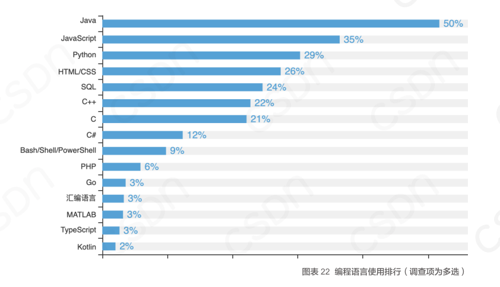

# Hello，Coder

## 絮&叨

### PureJavaCoderRoad 是什么？
<font color=blue>《Java小白之路》、PureJavaCoderRoad   </font>
是一个帮助【Java小白】从入门到找到一份工作所需掌握的技能教程，对标目前企业招聘要求（一线城市8~12k）。 

主要的目标人群：

- 在线大学生
- Java小白


本专栏的内容 也不需要大家都看完，现在网上都有很多学习视频，你也可以参考这个思维导图进行查缺补漏。


### 为什么是8~12K？

通过BOSS招聘，还有CSDN公布的薪资情况（如下），统计得到的Java开发者薪资中位数 &平均数。

外加作者本人在一线城市**多年来的求职经验** 以及 **作为担任面试官以来给出的薪资参考**。


> 数据来源csdn研究院：https://csdn.gitcode.host/Survey-Report-on-Developers-in-China/survey/

### 本项目内容

本项目包含JavaSE、JavaEE（Spring、Mybatis、SpringCloud）、Mysql、Redis、Maven、Nginx、Linux服务器、Git、工具使用、算法 等基础教程。


项目是根据作者本人的工作经历和学习历程的路线整理，力求把最核心的内容列出来，本项目也将根据以下的学习路线进行展开：

> 文件太大，右击 `在新标签页打开图片` （不定期更新）
>


<a href = "https://cdn.jsdelivr.net/gh/DogerRain/image@main/img/20210311-HelloCoder.png" target="_blank">点击访问思维导图</a>

## Java的受欢迎程度

Java 从1995年诞生以来，一直就没有衰退过，而且需求也一直很大。


根据csdn研究院的数据：



>  数据来源：https://csdn.gitcode.host/Survey-Report-on-Developers-in-China/survey/


 历史排名（1985~2021）：


> 图源：TIOBE 编程语言社区排行榜，是编程语言流行趋势的一个指标，每月更新，这份排行榜排名基于全球技术工程师、课程和第三方供应商的数量，其中包括了流行的搜索引擎以及技术社区，如 Google、百度、维基百科、CSDN、必应、Hao 123 等等。


## Java学到什么程度才能找到工作呢？

boss上找个招聘要求看看。

1️⃣


2️⃣


---

剖析：

- **1年的工作经验**，主要还是为了区分实习生，说明还是要有一点项目经验的。

- **JavaEE相关技术**，Spring 框架是必不可少的，SSM、SpringCloud、SpringBoot 作为脚手架是基础。

- **git、svn**  必不可少了，没什么好说的。

**MySQL、Linux** ，MySQL 增删改查，面向业务开发必不可少，Linux就是解决问题、部署项目的时候需要。

**熟悉Javascript、jquery、Css等前台技术，还有 Vue**，前端觉得并不是必要的，只是小公司，职能定义比较混乱，可能夹杂着前端的要求，但是为了自己更好的发展，掌握一点前端技能对自己也有好处的。

**工具使用**，比如 IDEA、json、Maven 这些是必不可少了。


---

看着要求不多，但是把其中一点拎出来详细展开，都能让你学很久。

比如 Spring，虽然你说用过Spring，但是面试却不是仅仅问你有没有用过Spring那么简单，还会问很多复杂的问题，比如最常见的：

- aop和ioc是什么，切面平时有用在什么地方？
- Spring的注解有哪些？@Resource、@Autowired 有什么区别？
- Spring的通知类型有哪些？

这就需要你不断在项目中进行探索和学习，然后沉淀，这样你才能在使用的时候游刃有余。


同时面试的时候，也不是会问到列出的要求，这给求职者一些错觉，如 **明明是普通后端开发岗位，为什么还要问前端？还要问算法？**


而且每个面试官都不一样，考察的点也不一样，问题也就不一样。


面试中有太多点会被问到了，只能一点一点积累，不断查缺补漏，你的技能树不仅要宽，而且还要深，这样才能打动面试官，这样才能比竞争者更值得高的薪资。


> 更多面试题，请参考：[《Java小白求职之路》](/pages/LearnJavaToFindAJob_README)

## 最稳妥的路线

这个专栏在写知识点的时候，不是很深入，目的是让大家入门，和找到一份工作。


这份工作要求不是很高，一线城市 `8k~12k` 左右（非一线城市可能要打8折）。


毕竟不是每个人都是211、985的CS专业科班学生，一毕业就能进入大厂的。


普通人最稳妥的路线：

```
大四实习 ————>>> 跳槽 ————>>> 在中小公司磨炼 ————>>> 去大厂
```

实力不够，学历不够，唯有打怪升级。

## 联系我

### 公众号联系我

由于都是我一个人在维护，难免出现错误，欢迎给我提bug。

欢迎关注我的Java技术公众号，不定时分享Java技术干货（虽然也什么没什么干货😅.....）

<div align="center"> </img> </div>

 

同时，本项目后续会整理成PDF，Github 更新可能存在延迟，如果需要第一时间获取最新版本，可以关注我的公众号，佛系关注，最后都会更新到这里。（目前整理比较费时间，筒子们可以不定时打开）


## 为什么要做PureJavaCoderRoad ？

起初了为了总结自己零基础自学Java到求职找到一份工作的过程，期间写了大量的笔记，后来越写越多，遂完整写下来了。


**在这里，期待与各位共同进步。**

**愿各位看完有收获，找到一份满意的工作。**


