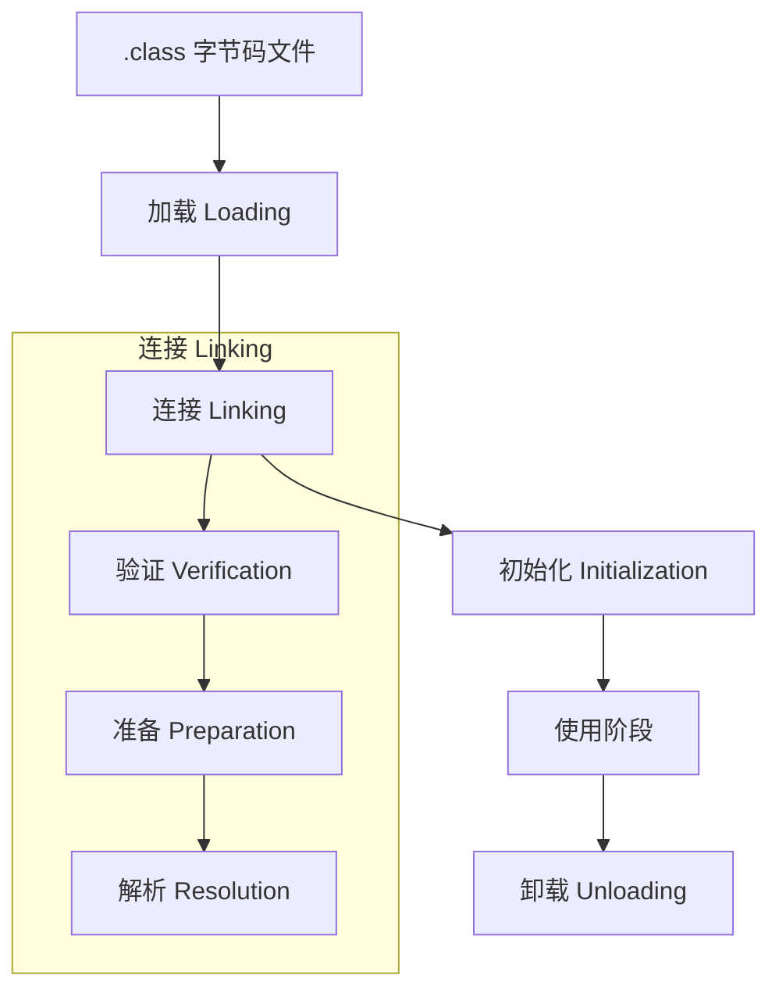

## 类加载过程以及加载机制

### 类加载器的种类：

- 启动类加载器（Bootstrap ClassLoader），是虚拟机自身的一部分，用来加载Java_HOME/lib/目录中的，或者被 -Xbootclasspath 参数所指定的路径中并且被虚拟机识别的类库；

  其他类加载器：

- 扩展类加载器（Extension ClassLoader）：负责加载`\lib\ext`目录或`Java.ext.dirs`系统变量指定的路径中的所有类库；

- 应用程序类加载器（Application ClassLoader）。负责加载用户类路径（classpath）上的指定类库，我们可以直接使用这个类加载器。一般情况，如果我们没有自定义类加载器默认就是用这个加载器。


类加载是 JVM 运行期的核心机制之一，它将 `.class` 文件中的二进制数据读取并转化为 JVM 可以识别的 `java.lang.Class` 对象。

整个过程可以分为三大阶段：**加载（Loading）**、**链接（Linking）**、**初始化（Initialization）**


### 加载过程：

**加载 -> 验证 -> 准备 -> 解析 -> 初始化 -> 使用 -> 卸载**

>  **验证 -> 准备 -> 解析** 这三步合起来称为 **链接** 

#### 阶段一：加载 (Loading)

这是类加载的第一个阶段，负责将类的二进制数据读入内存。

1. **获取二进制流**：通过类的全限定名，查找并读取类的二进制数据流（通常是 `.class` 文件）。
2. **创建数据结构**：在方法区（或元空间/Metaspace）内为该类创建一个运行时数据结构，存储类的元信息。
3. **生成 Class 对象**：在 Java 堆中生成一个代表这个类的 `java.lang.Class` 对象，作为程序访问方法区内该类数据的接口。

> **核心机制**：这个阶段主要由 **类加载器（ClassLoader）** 完成。Java 提供了双亲委派模型来组织类加载器，以保证类的唯一性和安全性。

####  阶段二：链接 (Linking)

链接是将字节码合并到 JVM 运行时状态的过程，分为三个子步骤：

##### 1. 验证 (Verification)

确保 Class 文件的字节流中包含的信息符合 JVM 规范，并且不会危害虚拟机自身的安全。这是 JVM 保证安全性的重要步骤。

- **主要检查**：文件格式（魔数、版本）、元数据（继承规范）、字节码（控制流、类型安全）、符号引用等。

##### 2. 准备 (Preparation)

为类的 **静态变量（Static Fields）** 分配内存，并将其初始化为 **零值（Zero Value）**。

- **注意区别**：此时只是赋予系统默认的初始值（如 `int` 为 0，`boolean` 为 `false`，引用为 `null`），而不是程序中定义的初始值。
  - 比如 `public static int value = 100;` 此时 `value` 的值是 `0`。

##### 3. 解析 (Resolution)

将常量池内的**符号引用（Symbolic References）替换为 直接引用（Direct References）**。

- **符号引用**：一组描述目标的字符串（如类的全限定名、方法的名称和描述符）。
- **直接引用**：直接指向目标的指针、句柄或偏移量。
- **时机**：这个阶段不一定是必须在加载时完成，也可以在运行时首次使用某个符号引用时进行。

#### 阶段三：初始化 (Initialization)

这是类加载过程的最后一步，也是真正执行 Java 代码赋予变量初值的阶段。

1. **执行 `<clinit>()` 方法**：JVM 会执行类的构造器方法。这个方法是由编译器自动收集类中所有**静态变量的赋值动作**和**静态语句块（`static {}` 块）**中的语句合并生成的。
2. **赋予初始值**：在这一步，静态变量才会被赋予程序中定义的初始值。
   - 承接上面的例子，`public static int value = 100;` 此时 `value` 的值才变为 `100`。
3. **线程安全**：JVM 必须保证一个类的 `<clinit>()` 方法在多线程环境中被正确地加锁和同步，确保只被执行一次。





### 类初始化触发时机

JVM 规范严格规定了类在以下 5 种情况下会立即进行**初始化**（Initialization）：

1. 遇到 `new`、`getstatic`、`putstatic` 或 `invokestatic` 这四条字节码指令时（对应于使用 `new` 关键字、读取或设置类的静态字段，以及调用类的静态方法）。
2. 使用 `java.lang.reflect` 包的方法对类进行反射调用时。
3. 初始化一个类时，发现其父类还没有初始化，则必须先初始化其父类。
4. 当 JVM 启动时，用户需要指定一个要执行的主类（包含 `main()` 方法的类），虚拟机会先初始化这个主类。
5. 使用 JDK 7 新增的动态语言支持时，如果一个 `java.lang.invoke.MethodHandle` 实例最后解析的结果是 `REF_getStatic`、`REF_putStatic`、`REF_invokeStatic` 的方法句柄，并且这个方法句柄所对应的类没有进行过初始化，则需要先触发其初始化。


**初始化时机**（主动引用）：

```java
// 1. new 创建实例（最常见）
Object obj = new Object();

// 2. 读取或设置静态字段（final常量除外）
int val = Example.value;  // 触发Example类初始化

// 3. 调用静态方法
Example.staticMethod();

// 4. 反射调用 Class.forName()
Class.forName("com.example.Test");

// 5. 初始化子类时，父类先初始化

// 6. JVM启动时指定的主类 比如 main()方法、 springboot 的 main 入口
```

**不会触发初始化的情况**（被动引用）：

```java
// 1. 通过子类引用父类的静态字段
class Parent { static int value = 10; }
class Child extends Parent {}
// 只初始化Parent，不初始化Child
int val = Child.value;

// 2. 通过数组定义引用类
Example[] array = new Example[10];  // 不触发初始化

// 3. 引用类的常量（编译期放入常量池）
final int CONST = 123;
int val = Example.CONST;  // 不触发初始化
```


##  `Class.forName()`和`ClassLoader.loadClass()`区别？

```java
// Class.forName()：加载+链接+初始化（默认）
Class.forName("com.example.Test");

// ClassLoader.loadClass()：只加载，不初始化
classLoader.loadClass("com.example.Test", false);
```

比如最常见的：

```java
            // 这行代码会：
            // 1. 加载MySQL驱动类
            // 2. 初始化驱动类，执行静态方法块
            // 3. 执行DriverManager.registerDriver()注册驱动
            Class.forName("com.mysql.cj.jdbc.Driver");
```

因为MySQL驱动类的静态代码块中有：

```java
public class Driver extends NonRegisteringDriver implements java.sql.Driver {
    static {
        try {
            // 驱动初始化时自动注册
            DriverManager.registerDriver(new Driver());
        } catch (SQLException e) {
            throw new RuntimeException("注册驱动失败");
        }
    }
}
```

而使用 `classLoader.loadClass("com.mysql.cj.jdbc.Driver");` 则无效；（即不会初始化，不会加载静态代码块）