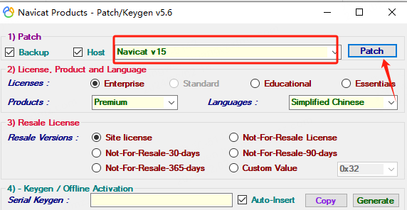
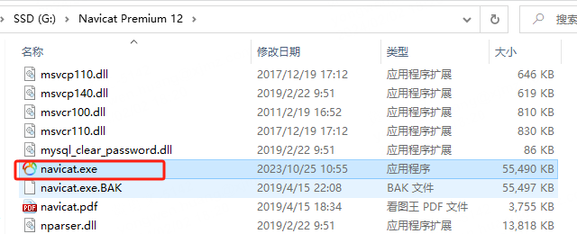
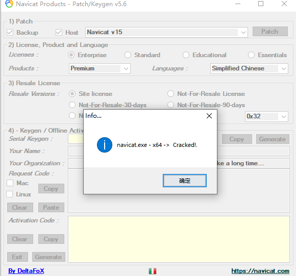
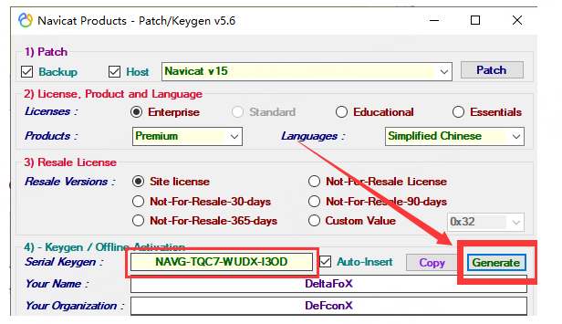
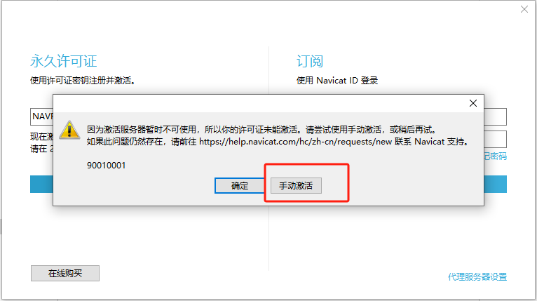
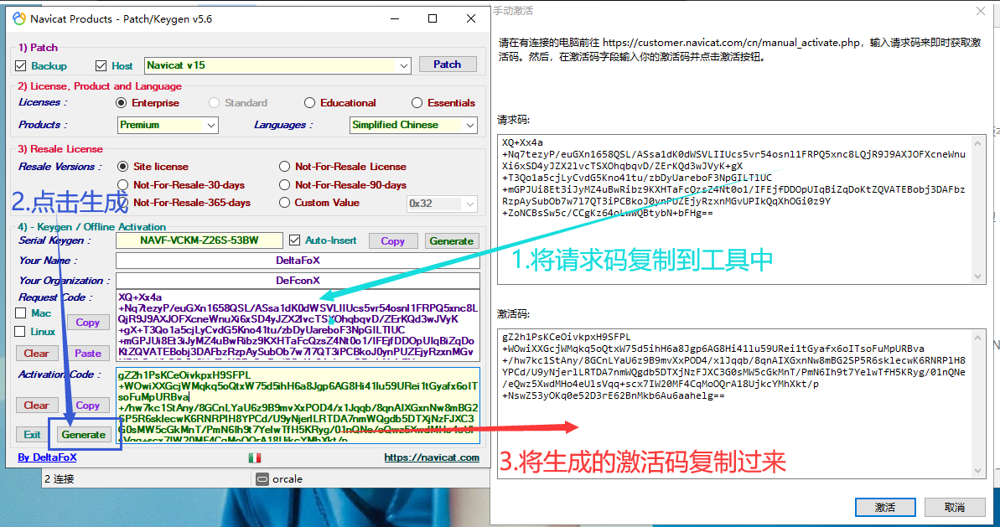

相信用过 Navicat 的人，一定会喜欢上这个产品的。

在同类产品上，Navicat 可谓是 真正基于用户的角度，把产品做到了极致的用户体验。

作者本人从Navicat10开始，一直用这个产品管理MySQL，期间也用过Datagrip、DBeaver ，始终觉得Navicat是最好用的。

但是Navicat的收费也不便宜，可能正因为如此，Navicat才能带来越来越多的功能和产品体验。

本文将说明如何使用pojie版Navicat。

## 1、下次激活机

激活工具支持Navicat11、12 、15、**16** 版本激活。（相对于网上一些版本比较旧，普遍都是只支持15版本）

下载后信任该文件，可能会被病毒误删。

 激活文件见文末附近。

## 2、下载Navicat

Navicat 官网下载 [https://navicat.com.cn](https://navicat.com.cn)

 我看到Navicat 官网目前 是 2024年2月3日 16:21:47 最新版本已经是Navicat 16了。

历史版本下载参考：[https://blog.csdn.net/akaiyijian001/article/details/132967525](https://blog.csdn.net/akaiyijian001/article/details/132967525)

## 3、激活步骤

**注意事项：**

- 安装Navicat后不要打开
- 激活过程断网
- 提前关闭杀毒软件

###  3.1、 选择版本patch 

**注意：只可Patch一次**

选择你 安装目录的  `navicat.exe` 文件

出现以下提示表示成功：

### 3.2、生成注册码

License里选中Enterprise、在Produce里选择Premium、在Languages里选择Simplified Chinese(简体中文)、选择Site License

点击Generate按钮就会生成一个许可证秘钥

### 3.3、注册

打开你的Navicat，点击 **注册**

注意这里需要断网。点击**手动激活**

然后把Navicat请求码粘贴到注册机Request Code框中，见下图。

把激活码复制到Navicat就可以了。

## 4、附件

注册机下载地址：

下载:[https://wwp.lanzout.com/itm9v1n75gbe](https://wwp.lanzout.com/itm9v1n75gbe) 

密码:9i3v

