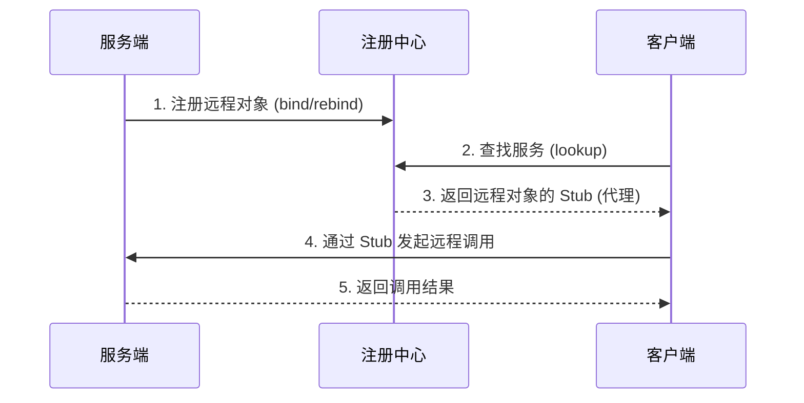

RMI 是 **Remote Method Invocation（远程方法调用）** 的缩写。它是一种允许在 **一个 Java 虚拟机（JVM）** 中运行的对象，去调用 **另一个 JVM** 中对象方法的机制。

简单来说，它让跨越网络的调用，感觉起来就像在调用本地方法一样。它和 Dubbo、gRPC 一样，都属于 RPC（远程过程调用）框架的一种具体实现。


### 核心概念与架构

RMI 定义了三个核心角色来完成一次远程调用：

1. **服务端（Server）**：提供具体服务的 Java 对象，这个对象需要是一个可以远程调用的 **远程对象（Remote Object）**。
2. **客户端（Client）**：需要调用远程服务的应用程序。
3. **注册中心（Registry）**：一个特殊的服务，用于服务端**注册**自己的远程对象，也供客户端**查找**和获取该对象的引用。

这三者之间的典型工作流程是这样的：




### 🔧 核心组件详解

一次 RMI 调用包含几个关键的技术组件：

1. **Stub（存根/客户端代理）**：运行在客户端。它就像是远程服务在客户端的“代言人”。当客户端调用 Stub 上的方法时，Stub 会负责将方法名、参数等序列化，通过网络发送给服务端。
2. **Skeleton（骨架/服务端存根）**：运行在服务端。它负责接收来自 Stub 的网络请求，进行反序列化，然后调用真正的服务实现类，最后将返回结果序列化并回传给 Stub。
3. **Remote 接口**：服务端和客户端必须共用的一个 Java 接口，它继承自 `java.rmi.Remote`，并且所有方法都需要声明抛出 `RemoteException`。它定义了可以远程调用的契约。
4. **RMI Registry**：提供命名服务。服务端使用 `Naming.rebind()` 或 `Registry.rebind()` 将远程对象绑定到一个 URL 地址上，客户端使用 `Naming.lookup()` 通过这个 URL 来获取远程对象的 Stub。

### ⚙️ 一个极简示例

下面是一个最基础的 RMI 示例，帮助你理解其使用方法。

**1. 定义远程接口（服务契约）**


```java
import java.rmi.Remote;
import java.rmi.RemoteException;

// 接口必须继承 Remote
public interface GreetingService extends Remote {
    // 方法必须声明抛出 RemoteException
    String sayHello(String name) throws RemoteException;
}
```


**2. 实现远程接口（服务端逻辑）**


```java
import java.rmi.RemoteException;
import java.rmi.server.UnicastRemoteObject;

// 实现类应继承 UnicastRemoteObject，以便将对象导出为远程对象
public class GreetingServiceImpl extends UnicastRemoteObject implements GreetingService {

    // 构造方法必须抛出 RemoteException
    public GreetingServiceImpl() throws RemoteException {}

    @Override
    public String sayHello(String name) throws RemoteException {
        return "Hello, " + name + "! (from RMI Server)";
    }

    public static void main(String[] args) {
        try {
            // 创建服务对象
            GreetingService service = new GreetingServiceImpl();
            // 通过注册中心发布服务，绑定到 rmi://host:port/name
            java.rmi.Naming.rebind("rmi://localhost:1099/GreetingService", service);
            System.out.println("Server ready...");
        } catch (Exception e) {
            e.printStackTrace();
        }
    }
}
```


**3. 编写客户端（调用服务）**


```java
import java.rmi.Naming;

public class Client {
    public static void main(String[] args) {
        try {
            // 从注册中心查找服务，获取 Stub 代理对象
            GreetingService service = (GreetingService) Naming.lookup("rmi://localhost:1099/GreetingService");
            // 如同调用本地方法一样调用远程方法
            String result = service.sayHello("World");
            System.out.println("Response: " + result);
        } catch (Exception e) {
            e.printStackTrace();
        }
    }
}
```


### 🏛️ RMI 在 RPC 框架中的位置

RMI 可以看作是 Java 原生、最正统的 RPC 实现。现代的一些 RPC 框架，在设计和思想上或多或少都受到了 RMI 的启发。

- **Dubbo**：早期版本**原生支持 RMI 协议**，也就是说 Dubbo 的服务可以配置成使用 RMI 作为底层通信协议。因此，RMI 可以看作是 Dubbo 支持的**多种通信协议中的一种**。
- **Spring RMI**：Spring 框架对 Java RMI 进行了封装，提供了 `RmiServiceExporter` 和 `RmiProxyFactoryBean`，简化了在 Spring 环境中配置和使用 RMI 的步骤。

### ⚖️ RMI 与其他现代 RPC 框架的对比

| 特性           | Java RMI                             | Dubbo                           | gRPC                             |
| :------------- | :----------------------------------- | :------------------------------ | :------------------------------- |
| **协议**       | JRMP (Java Remote Method Protocol)   | Dubbo、RMI、HTTP等              | HTTP/2                           |
| **序列化**     | Java 原生序列化 (性能一般，跨语言差) | Hessian2、Kryo等 (高效，跨语言) | Protobuf (高效，强跨语言)        |
| **跨语言**     | ❌ 仅支持 Java                        | ✅ 支持多语言                    | ✅ 支持多语言                     |
| **服务治理**   | ❌ 无                                 | ✅ 负载均衡、熔断、降级等        | ❌ 无                             |
| **使用复杂度** | 相对简单，适合 Java 内部             | 配置较复杂，功能强大            | 需定义 .proto 文件，学习成本适中 |

### 💎 总结

- **RMI** 是 Java 内置的、用于构建分布式应用的**远程方法调用规范**。它让 Java 程序之间能通过网络透明地调用彼此的方法。
- **RMI 与 Dubbo** 的关系是：Dubbo 是一个功能更全面的服务治理框架，而 RMI 可以看作是其支持的**一种通信协议或实现方式**。
- 它的主要优势在于与 Java 生态的深度集成，简洁直观，特别适合**纯 Java 环境**下的内部系统间通信。它的主要局限是**无法跨语言**，且缺乏现代微服务框架中的服务治理功能。