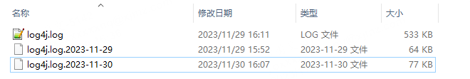
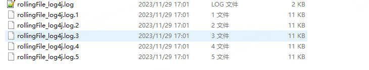

https://blog.csdn.net/wankunde/article/details/116717895

log4j 不推荐使用。原因有以下：

- 有安全漏洞隐患；
- 功能不如 log4j2 、logback ，log4j 缺失日志删除、压缩等功能；
- 性能不如 log4j2、logback 


---

**Appender**:

- org.apache.log4j.ConsoleAppender（控制台）
- org.apache.log4j.FileAppender（文件），
- **org.apache.log4j.DailyRollingFileAppender**（按照时间产生日志文件），
- **org.apache.log4j.RollingFileAppender**（文件大小到达指定尺寸的时候产生一个新的文件），可通过MaxFileSize、MaxBackupIndex 设置滚动策略
- org.apache.log4j.WriterAppender（将日志信息以流格式发送到任意指定的地方）


一般来说，常用的就是**org.apache.log4j.DailyRollingFileAppender** 和 **org.apache.log4j.RollingFileAppender**


配置：

```xml
<?xml version="1.0" encoding="UTF-8"?>
<!DOCTYPE log4j:configuration PUBLIC "-//log4j/log4j Configuration//EN" "log4j.dtd">
<log4j:configuration>

    <!--输出到控制台-->
    <appender name="consoleAppender" class="org.apache.log4j.ConsoleAppender">
        <layout class="org.apache.log4j.PatternLayout">
            <param name="ConversionPattern" value="%d{yyyy-MM-dd HH:mm:ss,SSS} [%5p] [%-10t] - %l : %m%n"/>
        </layout>
    </appender>

    <!--DailyRollingFileAppender 按照每天的日期进行切割-->
    <appender name="dailyRollingFileAppender" class="org.apache.log4j.DailyRollingFileAppender">
        <param name="Threshold" value="info"/>
        <param name="File" value="./logs/daily_rollingFile_log4j.log"/>
        
        <param name="DatePattern" value="'.'yyyy-MM-dd-HH-mm'.log'" />
        <layout class="org.apache.log4j.PatternLayout">
            <param name="ConversionPattern" value="%d{yyyy-MM-dd HH:mm:ss,SSS} [%5p] [%-10t] - %l : %m%n"/>
        </layout>
    </appender>

    <!--RollingFileAppender 按照文件大小或者最大备份量进行切割-->
    <appender name="rollingFileAppender" class="org.apache.log4j.RollingFileAppender">
        <param name="Threshold" value="info"/>
        <param name="File" value="./logs/rollingFile_log4j.log"/>
        <param name="Append" value="true"/>
        <param name="MaxFileSize" value="10KB"/>
        <param name="MaxBackupIndex" value="5"/>
        <layout class="org.apache.log4j.PatternLayout">
            <param name="ConversionPattern" value="%d{yyyy-MM-dd HH:mm:ss,SSS} [%5p] [%-10t] - %l : %m%n"/>
        </layout>
    </appender>

    <root>
        <level value="debug"/>
        <appender-ref ref="consoleAppender"/>
        <appender-ref ref="dailyRollingFileAppender"/>
        <appender-ref ref="rollingFileAppender"/>
    </root>
</log4j:configuration>
```


```xml
<dependency>
    <groupId>log4j</groupId>
    <artifactId>log4j</artifactId>
    <version>1.2.17</version>
</dependency>
```







---

参考：

- 自行实现压缩：[https://blog.csdn.net/qq_42792934/article/details/115962549](https://blog.csdn.net/qq_42792934/article/details/115962549)
- 自定义实现Appender：[https://github.com/foreveryang321/log4j-1x-extras](https://github.com/foreveryang321/log4j-1x-extras)
- log4j扩展插件：[https://blog.csdn.net/wankunde/article/details/116717895](https://blog.csdn.net/wankunde/article/details/116717895)