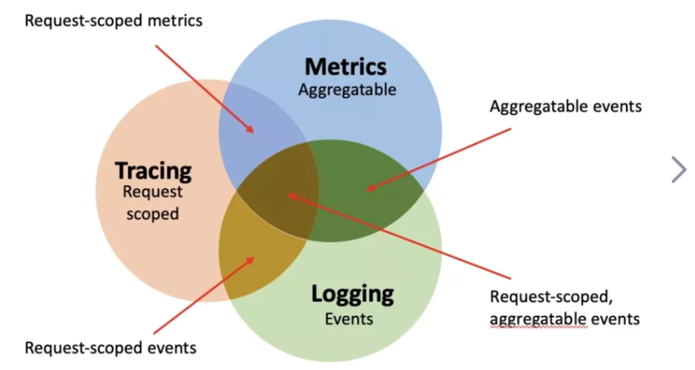

# 1、可观测是什么

What is Observability?
Observability lets us understand a system from the outside, by letting us ask questions about that system without knowing its inner workings. Furthermore, it allows us to easily troubleshoot and handle novel problems (i.e. “unknown unknowns”), and helps us answer the question, “Why is this happening?”

In order to be able to ask those questions of a system, the application must be properly instrumented. That is, the application code must emit signals such as traces, metrics, and logs. An application is properly instrumented when developers don’t need to add more instrumentation to troubleshoot an issue, because they have all of the information they need.

> 可观察性让我们能够在不了解系统内部运作的情况下提出有关系统的问题，从而从外部了解系统。此外，它使我们能够轻松地排除故障并处理新问题（即“未知的未知”），并帮助我们回答“为什么会发生这种情况？”的问题。
>
> 为了能够询问系统的这些问题，必须对应用程序进行适当的检测。也就是说，应用程序代码必须发出 跟踪、 指标和 日志等 信号。当开发人员不需要添加更多工具来解决问题时，应用程序就得到了正确的工具，因为他们拥有所需的所有信息。

以上引用自 OpenTelemetry 对此的解释。

简单来说，

可观测性被定义为根据系统产生的输出数据来衡量当前系统运行状态的能力，包括以下三种：

- 指标 metrics
- 链路 traces
- 日志 logs

# 2、流行的可观测工具

云服务：

- 阿里云ARMS

开源的：

- opentelemetry
- prometheus
- skywalking
- zipkin