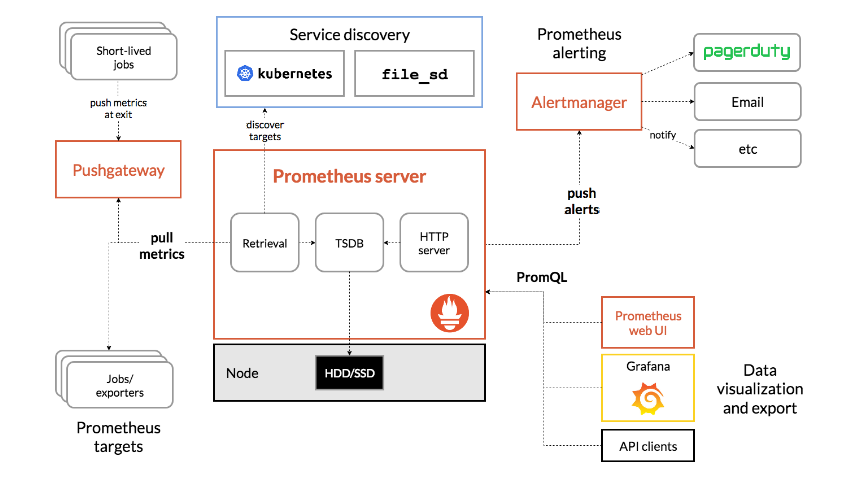
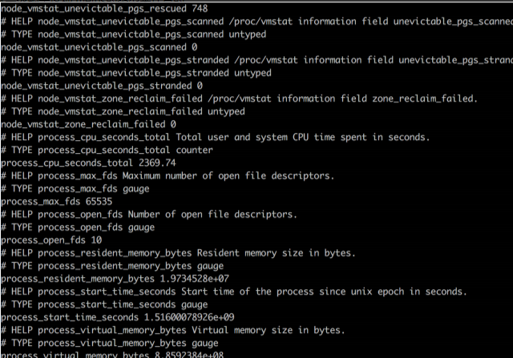
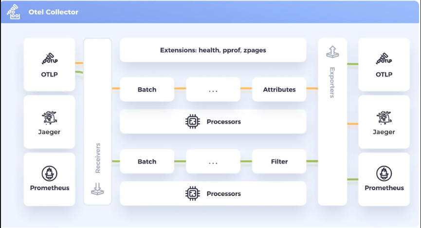

# 1、Prometheus

微服务以及云原生的趋势下，[prometheus](https://prometheus.io/) 应运而生。


[Prometheus](https://github.com/prometheus)是一个开源系统监控和警报工具包。



Prometheus 将其指标收集并存储为时间序列数据，即指标信息与记录时的时间戳一起存储，以及称为标签的可选键值对。

Prometheus 定义了 4 种不同的指标类型：Counter（计数器）、Gauge（仪表盘）、Histogram（直方图）、Summary（摘要）。

这些简单的数据类型，使用PromQL（一种 利用此维度的灵活查询语言 ）对开发人员来说，十分简单。




同时还有grafana、开源 exporter 的配合，prometheus 受到了越来越多人的使用。


同时 prometheus 还自带告警功能。

在可观测建设能力的上来说，选择 prometheus ，可以说是最快速，最简单的方案了。


优点如下：

- 非常适合记录任何纯数字时间序列。它既适合以机器为中心的监控，也适合高度动态的面向服务的架构的监控。在微服务的世界中，它对多维数据收集和查询的支持是一个特殊的优势。（比如说 HTTP接口调用次数、CPU、磁盘、内存 使用率等等）

但是prometheus也有缺点:

- 因为收集的数据可能不够详细和完整，它的数据并不是100%准确

- 只能适合做指标（Metrics），虽然现在也有loki 这种日志工具，但使用场景也有局限性

  


如果 prometheus 对于不是开发的同学来说，是首选。你可以使用它很简单地就把服务器监控起来。

# 2、OpenTelemetry 

同时，还有OpenTelemetry 的出现。

毕竟prometheus只能用来做指标，对于 链路（Traces）、日志（Logs），prometheus 无能为力。

而 OpenTelemetry  的出现，把指标（Metrics）、链路（Traces）、日志（Logs）都一起实现了，统一成OTLP的格式，支持不同的Exporter导出

**最重要的是：**

 **OpenTelemetry  也支持把OTLP格式的指标（Metrics）转换成 prometheus格式。**




OpenTelemetry  是个庞大的工具，里面涉及服务和方案也很多，可以阅读一下官方文档。

# 3、如何选择

这篇文章提到 OpenTelemetry  和 Prometheus 的差异，可以参考一下：

[当 OpenTelemetry 遇上阿里云 Prometheus](https://mp.weixin.qq.com/s/qIYX6npns4AmHegGIP7LHg)


在我的公司，OpenTelemetry  和 Prometheus 是混合使用的：

在基础服务器监控上，运维团队已经很早就使用了prometheus，而且kafka、clickhouse、MySQL 等等组件都有自带或者开源的expoter（prometheus指标采集，见上图），而且还有 grafna监控大盘模板。

只需要几步即可接入。

在这个基础上，应用服务指标（请求量、响应时间、错误率）也需要尽量使用 prometheus 格式。

我们业务团队使用Java居多，springboot已经有相关的sdk开源使用了：

```xml
<dependency>
  <groupId>org.springframework.boot</groupId>
  <artifactId>spring-boot-starter-actuator</artifactId>
</dependency>
<dependency>
  <groupId>io.micrometer</groupId>
  <artifactId>micrometer-registry-prometheus</artifactId>
</dependency>
```

开源的SDK提供了常用的指标，如 HTTP、JVM 等等，都是自动采集的。


但是开源的spring-boot-starter-actuator，对我们来说 有两个缺点：

- 自动埋点的指标不够，如果要上报埋点，需要业务改代码埋点上报
- 只有指标


所以我们就使用了javaagent的形式，拦截常用的足组件埋点  ，另外引入了 OpenTelemetry，解决 链路、日志 问题。

使用 OpenTelemetry   把指标转换成 prometheus 格式。以便接入 prometheus 的告警监控系统。


