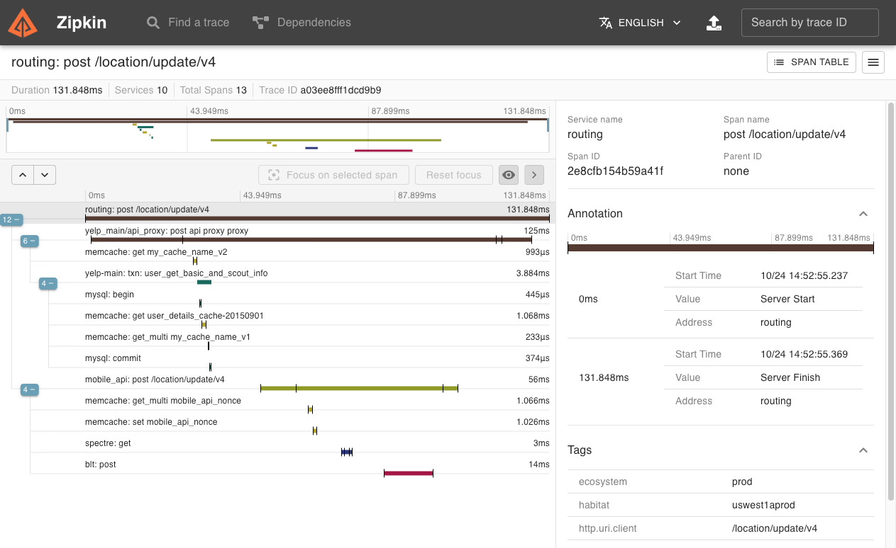
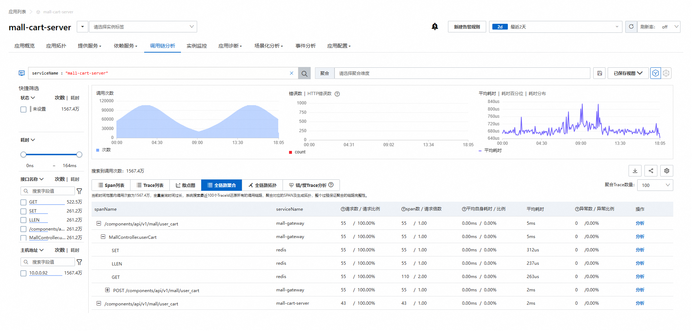

链路（Trace），可以理解为痕迹，这些痕迹记录程序每一步执行的路径。


链路 能让我们能够全面了解向应用程序发出请求时发生的情况。


无论你的应用程序是包含单个数据库的单体应用，还是复杂的服务网格，追踪信息对于理解请求在应用程序中的完整“路径”都至关重要。


特别是在分布式系统调用场景中如果没有跟踪，查找分布式系统中性能问题的根本原因可能非常困难。跟踪可以分解请求在分布式系统中的流动过程，从而简化调试和理解分布式系统的难度。


许多可观察性后端将跟踪可视化为瀑布图，如下所示：

```
A ——---------------------------------->  
    mysql ——------------->
    A.call() ——-------------------> 
				redis------>
 				gateway ————----> 
				  B -------> 
					mysql ————> 

```

A 执行本地call方法， 经过网关 gateway 发起对 B服务的调用。记录了A、B 服务之间的执行细节，形成一条链路。链路的每个执行步骤，都记录了时间、属性值，当业务异常时，我们可以马上看到链路节点的健康值，快速定位问题。


## span

一个span代表一个工作或操作单元。span是 trace 的构建块，一个 trace 由 多个span组成。上面瀑布图中，每一行都是一个span，span 应该包含以下信息：

- span name
- 父span ID（根跨度为空）
- 开始和结束时间戳
- 属性  可以自定义添加属性，比如 用户Id、订单 Id 等
- span 跨度状态 ，正常、异常


## 上下文传播

当服务 A 调用服务 B 时，它会将跟踪 ID 和 Span ID 作为上下文的一部分。服务 B 使用这些值创建一个属于同一跟踪的新 Span，并将服务 A 中的 Span 设置为其父级。这样就可以跟踪跨服务边界的请求的完整流程。


对于分布式调用，跨进程上下文访问，Trace的格式应该遵循 W3C 规范：https://www.w3.org/TR/trace-context/


简单提一下，跨服务调用要传递traceId，必须要使用载体传递，如 http 可以放在 header，且w3c定义了两个载体的名称：

- `tracestate` （可选）传递业务标签、跨厂商上下文，如：

  ```
  tracestate: vendor1=k1:v1,k2=v2,vendor2=value
  ```

- `traceparent`  包含w3c 链路版本、traceId、父span，是否采样标识（`01`=采样，`00`=不采样），如：

  ```
  00-e1070e504ba4b14ed5034564526fbf4a-953ecfa9ceae468a-01
  │  │                                │                │
  │  │                                │                └── Trace Flags (01 = sampled)
  │  │                                └── Parent Span ID (调用者的 Span ID)
  │  └── Trace ID (全局唯一追踪标识)
  └── Version (00)
  ```

  

## 开源链路组件


提到链路，就不得不提 Zipkin。


Zipkin 是一个分布式跟踪系统。它有助于收集解决服务架构中延迟问题所需的时序数据。其功能包括此类数据的收集和查找。





阿里云ARMS 链路详情图：





