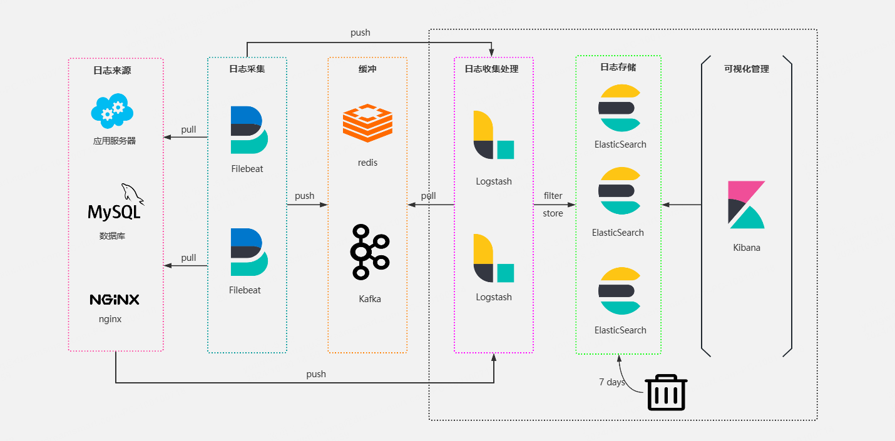

日志是指事件的记录。


日志是带有时间戳的文本记录，并带有可选的元数据。在指标、链路、日志中，日志的遗留影响最为深远。


大多数编程语言都内置了日志记录功能，或者拥有知名且广泛使用的日志记录库，写到filelog文件，然后压缩。

```verilog
[2021-02-23T13:26:23.505892 #22473]  INFO -- : [6459ffe1-ea53-4044-aaa3-bf902868f730] Started GET "/" for ::1 at 2021-02-23 13:26:23 -0800
```


早期的原始架构，没有考虑到日志的记录和存储，通常开发人员直接登入线上服务器查看日志文件：


这种在架构简单，日志量少，单点部署的应用，是没什么问题的。


如果日志量大，加上分布式部署，缺点明显：

- 每次都要登入服务器，需要通过IP定位到是哪台机器，否则只能一台一台查看
- 日志量大的时候，查询很慢，tail、cat 等等命令可能会导致磁盘IO高
- 日志文件格式不规范，可能保存时间较短被删除、压缩，也可能一直保存导致磁盘空间满


目前行业内的日志采集基本上都是采取 ELK 组件：

 


采集后的日志，使用 kibana 做查询。

