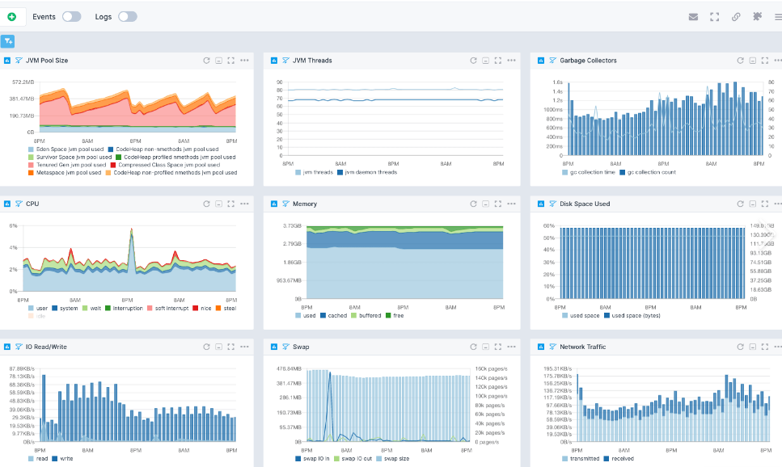
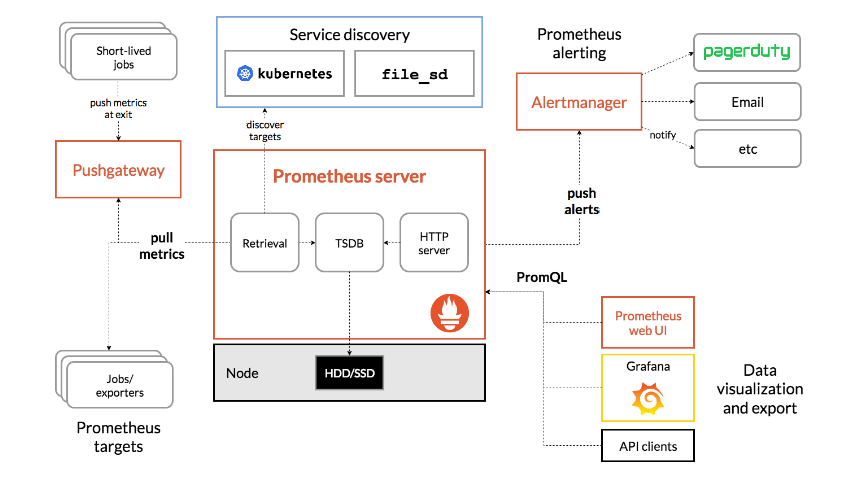

开源监控系统有很多，但是一般来说，国内流行的就两种：

- zabbix
- prometheus


这两者的监控范围都是围绕 **指标** 做监控（现在prometheus也有关于日志、链路的方案，但是没什么人用）


# 1、Zabbix

一个大而全的 monolithic 应用，集成了数据采集、存储、告警、可视化于一身。对传统IT设施（网络设备、VM、数据库）的监控支持非常好。

zabbix 应该很多开发者都会听说过。

注意我说的是 传统IT设施。类似于服务器的CPU、内存、磁盘 等等。

它也可以监控服务，例如Java（通过Java程序开启JMX，监控JVM如堆内存、GC 等等）




不过在我看来，Zabbix 不如 Prometheus ，Prometheus 包含了所有 Zabbix 的功能，同时它更简单、功能更强大。 

# 2、Prometheus

微服务以及云原生的趋势下，[prometheus](https://prometheus.io/) 应运而生。


Prometheus 专为云原生世界而设计，可与 Kubernetes 以及其他云和容器管理器集成，持续发现和监服务。


Prometheus是一个开源系统监控和警报工具包，它太丰富了，既可以收集、存储、查询 指标，又可以做告警、仪表板。

> Prometheus 的查询语言十分强大，但是其数据格式还是 Prometheus 自己定义的。因此，它只能与 Prometheus 服务器集成，不能与其他系统集成。




## Prometheus 指标类型

Prometheus 定义了 4 种不同的指标类型：

- Counter（计数器）
- Gauge（仪表盘）
- Histogram（直方图）
- Summary（汇总）


## prometheus 文本格式（协议）

```properties
# HELP http_requests_total The total number of HTTP requests.
# TYPE http_requests_total counter
http_requests_total{method="post",code="200"} 1027 1395066363000
http_requests_total{method="post",code="400"}    3 1395066363000

# Minimalistic line:
metric_without_timestamp_and_labels 12.47

# A weird metric from before the epoch:
something_weird{problem="division by zero"} +Inf -3982045

# A histogram, which has a pretty complex representation in the text format:
# HELP http_request_duration_seconds A histogram of the request duration.
# TYPE http_request_duration_seconds histogram
http_request_duration_seconds_bucket{le="0.05"} 24054
http_request_duration_seconds_bucket{le="0.1"} 33444
http_request_duration_seconds_bucket{le="0.2"} 100392
http_request_duration_seconds_bucket{le="0.5"} 129389
http_request_duration_seconds_bucket{le="1"} 133988
http_request_duration_seconds_bucket{le="+Inf"} 144320
http_request_duration_seconds_sum 53423
http_request_duration_seconds_count{app="demo"} 144320

```


> http_request_duration_seconds_count{app="demo"} 144320  为例：
>
> http_request_duration_seconds_count  -- 指标名称
>
> {app="demo"} -- 标签，k=v形式，用于丰富指标的描述
>
> 144320  值
>
> 合起来的含义就是： http 请求次数，从程序运行以来累计记录值就是 144320  次


这些简单的数据类型，使用PromQL（一种 利用此维度的灵活查询语言 ）对开发人员来说，十分简单。 


同时还有开源 exporter 的配合（暴露prometheus格式指标） + grafana（展示）， 可以做成更多自定义图表：


在可观测建设能力的上来说，选择 prometheus ，可以说是最快速，最简单的方案了。


