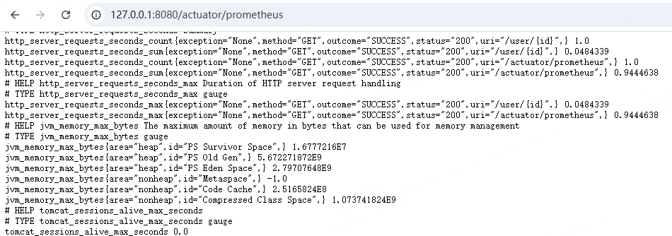
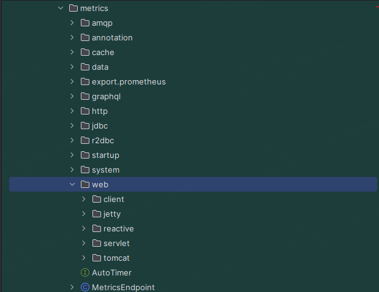

## 自动指标

对于Java开发的同学来说，在使用 springboot 的时候，应该都会看到过以下这两个依赖包：


```xml
 	<dependencyManagement>
     <!-- 导入Spring Boot的版本依赖管理 -->
            <dependency>
                <groupId>org.springframework.boot</groupId>
                <artifactId>spring-boot-dependencies</artifactId>
                <version>2.7.2</version>
                <type>pom</type>
                <scope>import</scope>
            </dependency>
     </dependencyManagement>
     
	 <!-- 子项目依赖包 -->
     <dependency>
         <groupId>org.springframework.boot</groupId>
         <artifactId>spring-boot-starter-actuator</artifactId>
     </dependency>
     <dependency>
         <groupId>io.micrometer</groupId>
         <artifactId>micrometer-registry-prometheus</artifactId>
     </dependency>
```


1. `spring-boot-starter-actuator`: 提供监控和管理功能的基础。
2. `micrometer-registry-prometheus`: Micrometer 是一个监控门面，这个依赖提供了对 Prometheus 格式的支持。


然后你只需要在配置文件 **`application.yml`** 声明：

```yaml
management:
  endpoints:
    web:
      base-path: /actuator
      exposure:
        include:
        - health
        - prometheus
        - info
  endpoint:
    prometheus:
      enabled: true
```

 


你就可以成功地将 Spring Boot 应用的 JVM 及其他指标以 Prometheus 格式输出到浏览器了。


访问 http://127.0.0.1:8080/actuator/prometheus 




可以看到`spring-boot-starter-actuator`框架会记录HTTP接口、JVM 等等 指标信息，除此之外我们看到这个框架还包含了一些 程序运行时间、磁盘空间、JDBC 等等非常多的指标：




这些指标可以直接被 Prometheus 服务器抓取，进而用于在 Grafana 等工具中构建强大的监控仪表盘。


## 自定义埋点指标

```java
    @Resource
    private MeterRegistry meterRegistry;

    Counter myCounter = Counter.builder("my.custom.counter")
            .description("A custom counter to track something important")
                .tag("region", "us-east-1") // 可以添加标签
                .tag("result", "ok") // 可以添加标签
                .register(meterRegistry); 
                
    public void doSomething() {
        myCounter.increment(); // 增加计数器，即触发一次计算器加一
    }
```

触发入口，可以看到 `/actuator/prometheus`  就会生成一条自定义埋点的指标数据：

```prometheus
# HELP my_custom_counter_total A custom counter to track something important
# TYPE my_custom_counter_total counter
my_custom_counter_total{region="us-east-1",result="ok",} 1.0
```