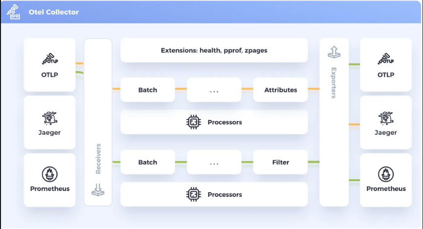

此前说到，opentelemetry  就像一个中介服务，它可以接就收OTLP协议格式的数据，也可以导出成其他供应商识别的数据。


它可以单独部署，并定义如何转化流程，比如从 OTLP —> zipkin ；OTLP—> kafka ； 同时还可以定义一些批处理大小、内存限制等待。

一般把这个中介服务，称为 opentelemetry-collector ，简称 otel-collector。


我们先来看看它的一些基本概念。


## 组成

 opentelemetry   由以下5个部分组成（关键字）：

- receivers 接收器 
- processors 处理器 
- exporters 导出器
- connectors  连接器  ，这个一般很少用到

除以上四个常用的组件以外，还有一个可选的 ：

- extensions 扩展

各组件作用域：




细节：


### receivers 

接收从一个或多个来源的遥测数据。可以基于pull或push，并且可以支持一个或多个数据源。

如：

```yaml
receivers:
# OTLP 协议
  otlp:
    protocols:
      grpc:
        endpoint: 0.0.0.0:4317
      http:
        endpoint: 0.0.0.0:4318
```


### processors

Receivers 接收收集的数据，并在将其发送到Exporters之前对其进行修改或转换，数据处理根据为每个处理器定义的规则或设置进行，这些规则或设置可能包括过滤、删除、重命名或重新计算遥测数据等操作。管道中处理器的顺序决定了收集器对信号应用的处理操作的顺序。

更多 processor参考：https://github.com/open-telemetry/opentelemetry-collector-contrib/tree/main/processor

>  当你使用一个组件为不同场景做区分时，可以 使用 type[/name] 语法

```yaml
processors:
  memory_limiter:
    check_interval: 5s
    limit_percentage: 85
    spike_limit_percentage: 25

  batch/metrics:
    timeout: 200ms
    send_batch_size: 8192
    send_batch_max_size: 8192
  batch/traces:
    timeout: 500ms
    send_batch_size: 9216
    send_batch_max_size: 9216
  batch/logs:
    timeout: 1000ms
    send_batch_size: 7168
    send_batch_max_size: 7168
  transform:
    error_mode: ignore
    metric_statements:
      - context: datapoint
        statements:
          - set(attributes["region.code"], resource.attributes["region.code"])
          - set(attributes["application"], resource.attributes["service.name"])
   
```

### exporters 

导出器将数据发送到一个或多个后端或目标

```yaml
exporters:
  jaeger:
    endpoint:jaeger-collector:14250
    tls:
      insecure:true
  prometheus:
    endpoint: "0.0.0.0:8073"
  kafka:
    brokers:
      - log.gateway.collector:9092
    topic: mop-log
```


### extensions

```yaml
extensions:
  health_check:
    endpoint: 0.0.0.0:13133
  zpages:
    endpoint: 0.0.0.0:55679
```


以上5个概念了解清楚后，最后使用 `service` 将他们启用、串联起来。

### service 

service 包括以下三部分：

- Extensions 对应以上 Extensions 的名称，即选择你上述定义的Extensions 
- Pipelines
- Telemetry 

#### 

重点需要知道 Pipelines 管道的使用。


#### pipelines

管道又包含以下3个：

- `traces`  
- `metrics`  
- `logs`  

显而易见，opentelemetry就是为这仨服务的。


管道由一组接收器、处理器和导出器组成，简单来说。你需要将接收后的数据，以哪一种导出器发送数据，中间还可以使用处理器加工一下数据。

```yaml
service:
  extensions: [health_check, zpages]
  pipelines:
    metrics:
      receivers: [otlp]
      processors: [batch, memory_limiter]
      exporters: [prometheus]
    traces:
      receivers: [otlp, jaeger]
      processors: [batch, memory_limiter]
      exporters: [otlp, zipkin]
    logs:
      receivers: [otlp]
      processors: [memory_limiter, batch/logs]
      exporters: [kafka]      
```


#### telemetry

 OpenTelemetry Collector 实例自身的内部的一些配置。参考：https://opentelemetry.io/docs/collector/internal-telemetry/#activate-internal-telemetry-in-the-collector


一般来说以下是一些常用配置：

```yaml
service:
  telemetry:
  # OTEL collector 指标使用 http://127.0.0.1:8888/metrics暴露，v0.123.0 版本以前配置和这个不一样
    metrics:
      readers:
        - pull:
            exporter:
              prometheus:
                host: '0.0.0.0'
                port: 8888
    logs:
      level: "info"
```


## 部署

https://github.com/open-telemetry/opentelemetry-collector-releases/releases/tag/v0.133.0


我在github下载 v0.133.0 的版本做演示。


解压后我们看到 otel 就只有两个东西：

```
otelcol-contrib
config.yaml
```

otelcol-contrib 是一个二进制的可执行产物，config.yaml 就是配置文件，我们只需要关注的配置文件即可。


修改一下这个配置文件：

```yaml
receivers:
  otlp:
    protocols:
      grpc:
        endpoint: 0.0.0.0:4317
      http:
        endpoint: 0.0.0.0:4318

processors:
  memory_limiter:
    check_interval: 5s
    limit_percentage: 85
    spike_limit_percentage: 15
  batch/metrics:
    timeout: 200ms
    send_batch_size: 8192
    send_batch_max_size: 8192
  batch/traces:
    timeout: 500ms
    send_batch_size: 9216
    send_batch_max_size: 9216
  batch/logs:
    timeout: 1000ms
    send_batch_size: 7168
    send_batch_max_size: 7168
    # 参考 https://github.com/open-telemetry/opentelemetry-collector-contrib/tree/main/processor/transformprocessor#basic-config
  transform:
    error_mode: ignore
    metric_statements:
      - context: datapoint
        statements:
          - set(attributes["region.code"], resource.attributes["region.code"])
          - set(attributes["application"], resource.attributes["service.name"])
exporters:
  #  v0.122.1
  debug:
    verbosity: detailed
  prometheus:
    endpoint: "0.0.0.0:8073"
    resource_to_telemetry_conversion:
      enabled: false
  loadbalancing:
    routing_key: "traceID"
    protocol:
      otlp:
        tls:
          insecure: true
    resolver:
      dns:
        hostname: trace.gateway.collector
  kafka:
    brokers:
      - log.gateway.collector:9092
    protocol_version: 2.1.0
    encoding: otlp_json
    timeout: 5s
    sending_queue:
      enabled: true
      num_consumers: 10
      queue_size: 5000
    producer:
      max_message_bytes: 8388608
      required_acks: 0
      compression: lz4
    topic: mop-log


extensions:
  health_check:
    endpoint: 0.0.0.0:13133
  zpages:
    endpoint: 0.0.0.0:55679


service:
  extensions: [health_check, zpages]
  pipelines:
    metrics:
      receivers: [otlp]
      processors: [memory_limiter, batch/metrics , transform]
      exporters: [prometheus]
    traces:
      receivers: [otlp]
      processors: [memory_limiter, batch/traces]
      exporters: [loadbalancing]
    logs:
      receivers: [otlp]
      processors: [memory_limiter, batch/logs]
      exporters: [kafka]
```


启动：

```shell
otelcol-contrib --config config.yaml
```


启动日志：

```verilog
2025-08-29T14:36:05.179+0800    info    service@v0.124.0/service.go:199 Setting up own telemetry...
2025-08-29T14:36:05.181+0800    info    memorylimiter@v0.124.0/memorylimiter.go:149     Using percentage memory limiter {"total_memory_mib": 7820, "limit_percentage": 85, "spike_limit_percentage": 15}
2025-08-29T14:36:05.181+0800    info    memorylimiter@v0.124.0/memorylimiter.go:74      Memory limiter configured       {"limit_mib": 6647, "spike_limit_mib": 1173, "check_interval": 5}
2025-08-29T14:36:05.183+0800    info    service@v0.124.0/service.go:266 Starting otelcol-contrib...     {"Version": "0.124.1", "NumCPU": 4}
2025-08-29T14:36:05.183+0800    info    extensions/extensions.go:41     Starting extensions...
2025-08-29T14:36:05.183+0800    info    extensions/extensions.go:45     Extension is starting...
2025-08-29T14:36:05.183+0800    info    healthcheckextension@v0.124.1/healthcheckextension.go:32        Starting health_check extension {"config": {"Endpoint":"0.0.0.0:13133","TLSSetting":null,"CORS":null,"Auth":null,"MaxRequestBodySize":0,"IncludeMetadata":false,"ResponseHeaders":null,"CompressionAlgorithms":null,"ReadTimeout":0,"ReadHeaderTimeout":0,"WriteTimeout":0,"IdleTimeout":0,"Path":"/","ResponseBody":null,"CheckCollectorPipeline":{"Enabled":false,"Interval":"5m","ExporterFailureThreshold":5}}}
2025-08-29T14:36:05.183+0800    info    extensions/extensions.go:62     Extension started.
2025-08-29T14:36:05.183+0800    info    extensions/extensions.go:45     Extension is starting...
2025-08-29T14:36:05.183+0800    info    pprofextension@v0.124.1/pprofextension.go:61    Starting net/http/pprof server  {"config": {"TCPAddr":{"Endpoint":":1777","DialerConfig":{"Timeout":0}},"BlockProfileFraction":0,"MutexProfileFraction":0,"SaveToFile":""}}
2025-08-29T14:36:05.183+0800    info    extensions/extensions.go:62     Extension started.
2025-08-29T14:36:05.183+0800    info    extensions/extensions.go:45     Extension is starting...
2025-08-29T14:36:05.183+0800    info    zpagesextension@v0.124.0/zpagesextension.go:56  Registered zPages span processor on tracer provider
2025-08-29T14:36:05.183+0800    info    zpagesextension@v0.124.0/zpagesextension.go:71  Registered Host's zPages
2025-08-29T14:36:05.184+0800    info    zpagesextension@v0.124.0/zpagesextension.go:83  Starting zPages extension       {"config": {"Endpoint":"0.0.0.0:55679","TLSSetting":null,"CORS":null,"Auth":null,"MaxRequestBodySize":0,"IncludeMetadata":false,"ResponseHeaders":null,"CompressionAlgorithms":null,"ReadTimeout":0,"ReadHeaderTimeout":0,"WriteTimeout":0,"IdleTimeout":0,"Expvar":{"Enabled":false}}}
2025-08-29T14:36:05.184+0800    info    extensions/extensions.go:62     Extension started.
2025-08-29T14:36:05.189+0800    info    servicegraphconnector@v0.124.1/connector.go:165 Started servicegraphconnector
2025-08-29T14:36:05.189+0800    info    otlpreceiver@v0.124.0/otlp.go:116       Starting GRPC server    {"endpoint": "0.0.0.0:4317"}
2025-08-29T14:36:05.189+0800    info    otlpreceiver@v0.124.0/otlp.go:173       Starting HTTP server    {"endpoint": "0.0.0.0:4318"}
2025-08-29T14:36:05.189+0800    info    healthcheck/handler.go:132      Health Check state change       {"status": "ready"}
2025-08-29T14:36:05.189+0800    info    service@v0.124.0/service.go:289 Everything is ready. Begin running and processing data.
```

此时你的 otel-collector 就部署完成了，你只需要往你定义好的 receiver 发送 数据即可。


最终你就能实现对数据的  `接收 -> 处理 -> 导出`。

---

参考：

- opentelemetry 组成：https://opentelemetry.io/docs/collector/configuration/