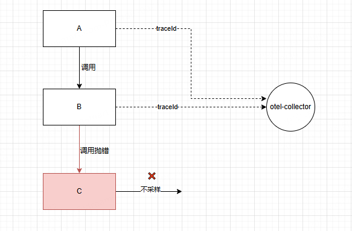
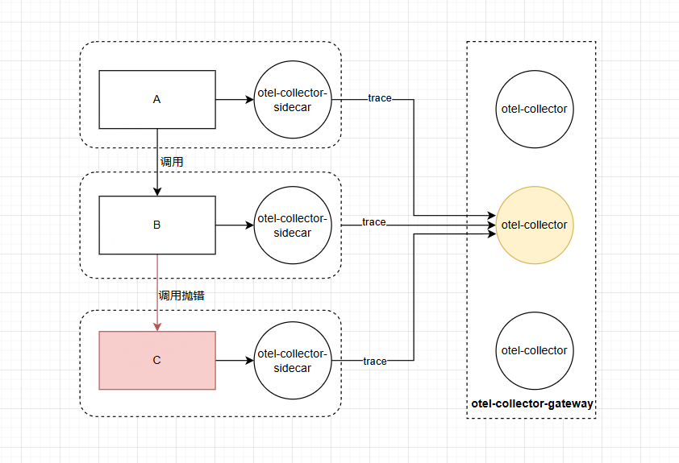

如果你的大多数请求都是成功的，并且在可接受的延迟范围内完成且没有错误，那么你无需收集 100% 的链路数据也能有意义地观测你的应用和系统。


产生的数据越多，你实际所需的代表性样本数据就越少。对于高吞吐量系统， 1% 或更低的采样率通常就能非常准确地代表其余 99% 的数据。除此之外，还能有效降低可观测性成本，提高你的服务可用性。


你只需要设置采样率即可。


采样分为两种：

- 头部采样
- 尾部采样


## 头部采样

头部采样是一种尽早做出采样决策的采样技术。是否采样一个 Span 或链路的决策不是通过检查整个链路来做出的。

> 就是说我可以随机采样，也可以自定义控制采样策略，而不用考虑 子链路、父链路 是什么。


也可在otel-collector配置：

```yaml
processors:
  probabilistic_sampler:
    sampling_percentage: 15
```


头部采样的好处就是在span生成的时候，可以直接扼杀，不用传输，可以提升服务的可用性和性能，配置也比较简单。


但是头部采样有一个致命的缺点。


假如 A —> B —> C 三个服务调用。A作为入口 root span  产生 traceId 传递给 B，B再传给C，然后各自通过头部采样率自定义了10%采样率。

A、B都命中采样。此时C服务产生报错，但C不命中采样。





最终上报的链路只有A、B ，最关键的能定位根因的C链路却没有，这样的链路，可以说是毫无意义。


如何解决断续问题？

我们在SDK指定基于父采样策略的`Sampler.parentBased`，可以实现要么全采，要么全不采的的实现：

```java
SdkTracerProvider sdkTracerProvider = SdkTracerProvider.builder()
                .setResource(resource)
    			// 10% 的采样率
                .setSampler(Sampler.parentBased(Sampler.traceIdRatioBased(0.1)))
                .addSpanProcessor(BaggageSpanProcessor.builder())
                .addSpanProcessor(batchSpanProcessor)
                .build();
```

>  前面提到W3C规范，上下文传递包含了是否采样标识位，子链路会继承父链路的采样策略，子链路不再是随机采样。


这样就不会出现链路断裂的情况。


但是依旧无法解决C服务抛错必采样的问题，毕竟我们无法预测最后的链路状态，可能在A执行的时候就已经不采样了，这样子链路也会不采样。


## 尾部采样

尾部采样是指通过考虑链路中的全部或大多数 Span 来做出是否采样该链路的决策。

> 系统不会立即决定是保留还是丢弃一条追踪数据，而是在收集更多上下文信息的同时，暂时缓存追踪数据。

你可以根据链路中不同部分的特定标准来采样链路，而这是头部采样无法做到的。


首先，对于A、B、C 来说，需要设置100%采样。

```
SdkTracerProvider sdkTracerProvider = SdkTracerProvider.builder()
                .setResource(resource)
    			// 100% 的采样率
                .setSampler(Sampler.parentBased(Sampler.traceIdRatioBased(1)))
                .addSpanProcessor(BaggageSpanProcessor.builder())
                .addSpanProcessor(batchSpanProcessor)
                .build();
```


然后，要求相同的 TraceId **必须发送到同一个 otel-collector** ，otel-collector 网关 对这些span是否采样做统一处理，如果某个span命中采样，则保留整个 trace。


对于otel-collector-gateway 来说，尾部采样器无法跟上接收数据的速率，这样可能需要几十个甚至上百个 计算节点。


如何保证 相同的 TraceId 都可以发送到同一个otel-collector？


由此引出常用的架构 ： otel-collector-sidecar 和 otel-collector-gateway 组合使用

> 引入容器的 sidecar 或者 daemonset 作为 应用的第一层网关，再引入 loadbalancing 导出器根据DNS获取集群的节点，然后该插件对 TraceId 做路由转发，保证相同的TracId发送到同一个otel-collector-gateway。


otel-collector-sidecar 接收单个或一批应用数据，然后发送到  otel-collector-gateway ，汇聚当前trace的所有span后统一做采样。


架构如图所示：

 


otel-collector-sidecar配置：

```yaml
receivers:
  otlp:
    protocols:
      grpc:
        endpoint: 0.0.0.0:4317
        
exporters:
  loadbalancing:
    routing_key: "traceID"
    protocol:
      otlp:
        tls:
          insecure: true
    resolver:
      dns:
      # 通过DNS解析，每次发送到同一个 otel-collector-gateway 节点
        hostname: otel.collector.gateway
service:    
    traces:
      receivers: [otlp]
      exporters: [loadbalancing]
```


尾部采样必须在 otel-collector-gateway 进行，尾采样配置：

```yaml
processors:
  # 尾采样
  tail_sampling:
    decision_wait: 10s
    num_traces: 50000
    expected_new_traces_per_sec: 1000
    policies:
      [
        {
          name: prob-policy,
          type: probabilistic,
          probabilistic: {sampling_percentage: 10}
        },
        {
          name: error-policy,
          type: status_code,
          status_code: {status_codes: [ERROR]}
        },
        {
          name: latency-policy,
          type: latency,
          latency: {threshold_ms: 3000}
        },
        {
        # 如果 attribute 的 agent.force.sample 值为true，则采样
          name: force-sample,
          type: boolean_attribute,
          boolean_attribute: { key: agent.force.sample, value: true }
        }
      ]       
```


最终的结果就是 C 服务抛错，对该 span 染色（具体为对status_code 标志为 ERROR），span 发送到 otel-collector-gateway 后，命中尾采样 `error-policy`策略，记录当前 traceId 要保留，那么 A、B 发送到当前  otel-collector-gateway的 span 都会保留，这样当前批次的Trace包含所有的span都会保留。


如果A、B、C 都没有命中采样策略，那么走的就是 `probabilistic` 策略，即采样率限制下的随机采样，针对同一批次的 span 决定去留，留下来的 span 对应的同一批 Trace都会保留，这样保留的链路就不会断断续续。


