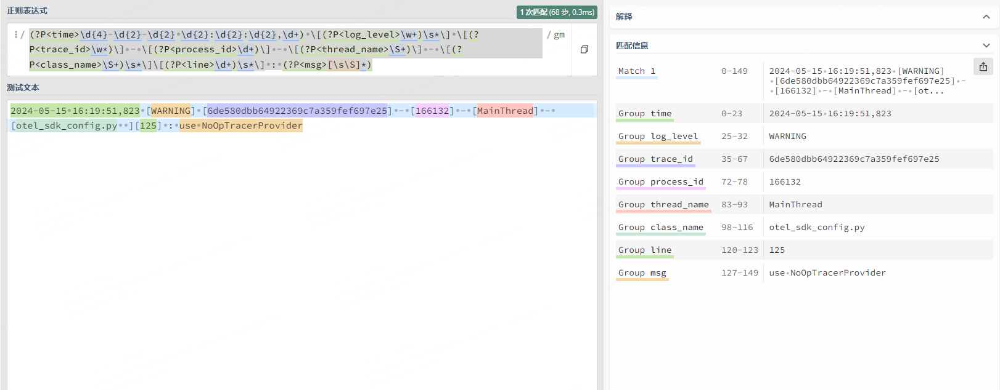

opentelemetry提供了一种类似于 filebeat 的日志收集插件：**filelogreceiver**

>  官方说明：https://github.com/open-telemetry/opentelemetry-collector-contrib/tree/main/receiver/filelogreceiver


这种就是通用的日志收集方案，它和语言无关，opentelemetry 只关心日志在哪里，具体怎么收集，正则？单行？改写？过滤？这些能力都支持。

简单来说，你只需要配置**日志路径**即可。


一般来说，常用4种日志切割方案：

- 单行全文 （默认分行符号切割）
- 多行全文 （需要行首正则切割）
- 多行正则（正则切割）


## 单行全文

单行全文最简单了，只需要配置日子里路径即可：

```yaml
filelog:
  'include':
  - '/otel-file-log/data/log/app/*.log'
  'include_file_path': !!bool 'true'
  'operators': []
```

单行全文 需要注意的是，这里的时间是 filelogreceiver 日志收集的时间，并不是真实的日志打印时间。


同时，像Java、Python的堆栈报错日志，都是分行输出的，也会被采集成一条单独的记录。


我们其实更需要的是 日志真正记录的时间以及分行合并。


## 多行正则


多行正则就不用担心日志时间这个问题，我们可以通过正则，把日志真正记录的时间给提取出来。

假如我本地的日志如下：

```verilog
2024-05-15 16:19:51,823 [WARNING] [6de580dbb64922369c7a359fef697e25] - [166132] - [MainThread] - [otel_sdk_config.py  ][125] : use NoOpTracerProvider
Traceback (most recent call last):
  File "G:\PyCharm 2023.3.4\plugins\python\helpers\pydev\_pydevd_bundle\pydevd_pep_669_tracing.py", line 111, in __call__
    if not is_thread_alive(thread):
           ~~~~~~~~~~~~~~~^^^^^^^^
```


借用正则平台https://regex101.com ，测试一下正则表达式：



然后把正确的正则表达式复制到配置这里，我本地 collector sidecar 的 `config.yaml` 配置如下：

```yaml
receivers:
  filelog:
    start_at: beginning
    include:
    - /otel-file-log/data/log/app/*.log
    include_file_path: true
    multiline:
      line_start_pattern: '\d{4}-\d{2}-\d{2} \d{2}:\d{2}:\d{2},\d+'
    operators:
    - regex: '(?P<log_time>\d{4}-\d{2}-\d{2} \d{2}:\d{2}:\d{2},\d+) \[(?P<log_level>\w+)\s*\] \[(?P<trace_id>\w*)\] - \[(?P<process_id>\d+)\] - \[(?P<thread_name>\S+)\] - \[(?P<class_name>\S+)\s*\]\[(?P<line>\d+)\s*\] : (?P<msg>[\s\S]*)'
      # 使用正则切割的 日志level 替代
      severity:
        parse_from: attributes.log_level
      # 使用正则切割的 log_time 替掉 
      timestamp:
        layout: '%Y-%m-%d %H:%M:%S,%L'
        layout_type: strptime
        parse_from: attributes.log_time
      type: regex_parser
   - field: attributes.log_time
     type: remove
   - field: attributes.log_level
     type: remove
```

