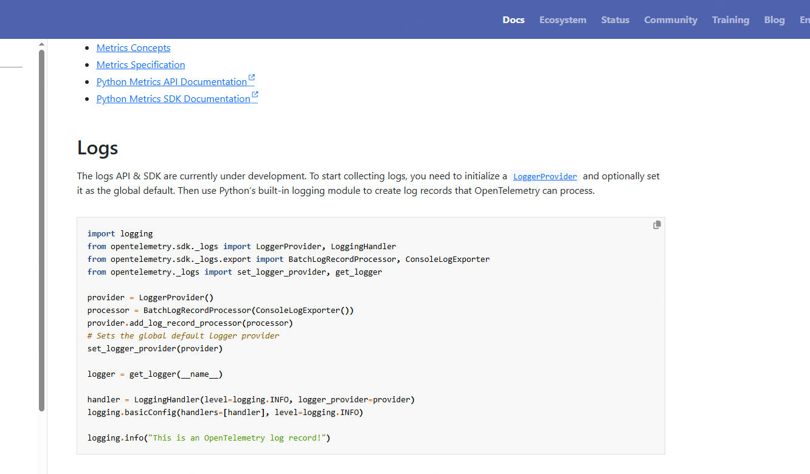
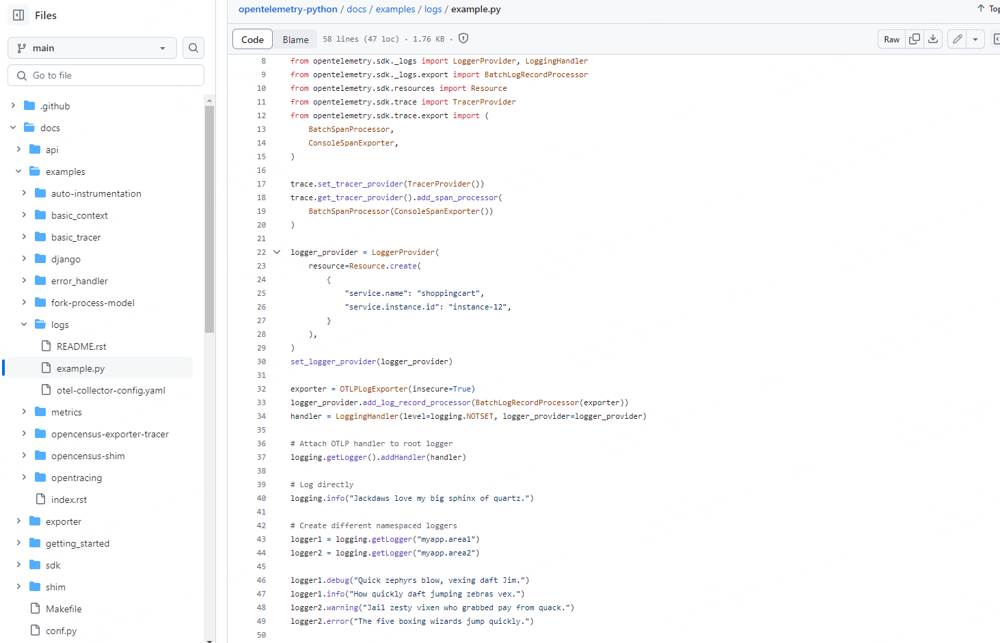
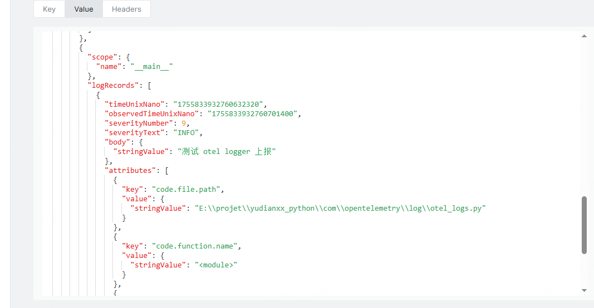

作者我平时不只是写Java，对Python也情有独钟，我尝试使用Python封装opentelemetry，然后提供一个 sdk 给公司团队使用。以下是一些思路和研究，附带到该专栏，对Python不感兴趣的可以略过。


官方对Python接入opentelemetry的说明：

https://opentelemetry.io/docs/languages/python/


前面提到，我已经把 opentelemetry-collector 已经部署起来了，并定义了一个 otlp 协议的 grpc `receiver`。

```yaml
receivers:
  otlp:
    protocols:
      grpc:
        endpoint: 0.0.0.0:4317
```

这里我将直接把数据发送到 `http://172.16.187.55:4317`


## 指标、链路 

其中指标Metrics、链路Trace 官方都有详细的介绍了。

只需要简单几行代码即可接入成功，然后封装一些指标api，即可打包成 sdk 。


整合Metrics、Trace  的核心代码如下：

```python
# metrics
from opentelemetry import metrics
from opentelemetry import trace
from opentelemetry.exporter.otlp.proto.grpc.metric_exporter import OTLPMetricExporter as OTLPMetricExporterGRPC
from opentelemetry.exporter.otlp.proto.grpc.trace_exporter import OTLPSpanExporter as OTLPTraceExporterGRPC
from opentelemetry.metrics import NoOpMeterProvider
from opentelemetry.sdk.metrics import *
from opentelemetry.sdk.metrics._internal.aggregation import AggregationTemporality
from opentelemetry.sdk.metrics.export import PeriodicExportingMetricReader
from opentelemetry.sdk.metrics.view import *
from opentelemetry.sdk.metrics.view import View
from opentelemetry.sdk.resources import *
from opentelemetry.sdk.trace import TracerProvider, Tracer
from opentelemetry.sdk.trace.export import BatchSpanProcessor
from opentelemetry.trace import NoOpTracerProvider
# log
from opentelemetry.exporter.otlp.proto.grpc._log_exporter import OTLPLogExporter as OTLPLogExporterGRPC
from opentelemetry import _logs
from opentelemetry.sdk._logs import LoggerProvider, LoggingHandler
from opentelemetry.sdk._logs._internal.export import BatchLogRecordProcessor

# begin
#endpoint 是 OTLP exporters grpc 协议的 receivers
endpoint = "http://172.16.187.55:4317"
metrics_exporter = OTLPMetricExporterGRPC(endpoint=endpoint)

reader = PeriodicExportingMetricReader(exporter=metrics_exporter, export_interval_millis=15,
                                       export_timeout_millis=5)

# 创建 Prometheus 导出器
# Start Prometheus client

# start_http_server(port=8073, addr="localhost")
# reader = PrometheusMetricReader()
config = get_fcop_config()
metrics_attributes = {
    SERVICE_NAMESPACE: config.tenant_code,
    SERVICE_NAME: config.app_namespace,
    SERVICE_INSTANCE_ID: config.application_code,
    CLUSTER_TYPE: config.cluster_type,
    REGION_CODE: config.region_code,
    HOST_NAME: Utils.get_hostname()
}
metrics_attributes.update(CommonTag.get_common_tag())
resource = Resource.create(metrics_attributes)
# metrics
meter_provider = MeterProvider(
    resource=resource, metric_readers=[reader]
    , views=[
        change_bucket_view
    ]
)
metrics.set_meter_provider(meter_provider)
global _meter
_meter = metrics.get_meter(name="meter-sdk")

# trace
trace_exporter = OTLPTraceExporterGRPC(endpoint=endpoint, timeout=10,
                                       compression=CompressionAlgorithm.gzip
                                      )

trace_processor = BatchSpanProcessor(span_exporter=trace_exporter,
                                     max_queue_size=5120,
                                     max_export_batch_size=1024,
                                     schedule_delay_millis=2000,
                                     export_timeout_millis=10000)
trace_provider = TracerProvider(resource=resource)
trace_provider.add_span_processor(trace_processor)
trace.set_tracer_provider(trace_provider)
global _tracer
_tracer = trace.get_tracer(instrumenting_module_name="tracer-sdk")

```


## 日志

日志怎么办？

这里opentelemetry也提供了一种通用的解决方案，就是类似于 filebeat那种，直接扫描指定的日志路径，然后收集日志。这里可以参考我的另外一篇文章。


以上是一种解决方案。


但是如果要通过日志拦截发送的方式，可能会是更好的方案。


后来我看了下[opentelemetry-python](https://github.com/open-telemetry/opentelemetry-python)的仓库，它的介绍是有关于 Log的试验的：

| Signal  | Status       | Project |
| ------- | ------------ | ------- |
| Traces  | Stable       | N/A     |
| Metrics | Stable       | N/A     |
| Logs    | Experimental | N/A     |

官方也说明了，**日志目前还是 开发 中**。

> 2025年8月21日 18:08:56。此时我使用的是  v136.0 版本，注意这里的版本要求

```shell
1.34.0 Requires-Python >=3.9; 1.34.1 Requires-Python >=3.9; 1.35.0 Requires-Python >=3.9; 1.36.0 Requires-Python >=3.9
```


那这就尴尬，指标、链路都有数据了，没有日志可不行。好消息是最近看到它给了一个例子：

> https://opentelemetry.io/docs/languages/python/instrumentation/#logs

 

接着看，大家猜我发现了什么？


仓库的代码，它在一个[example](https://github.com/open-telemetry/opentelemetry-python/blob/main/docs/examples/logs/example.py)的使用例子里面，有关于log的使用demo：



安装我本地试了下，竟然成功了。

这样日志直接以otel的协议就发送给 otel-collector 了，这种方案就更简单了。


代码：

otel_sdk_config.py :

```python
#!/usr/bin/env python
# -*- coding: utf-8 -*-
# @Time    :  2025/8/21 18:11
# @Author  : 
# @File    : otel_sdk_config
import logging
import os
from logging.handlers import RotatingFileHandler
from pathlib import Path

from opentelemetry._logs import set_logger_provider
from opentelemetry.exporter.otlp.proto.grpc._log_exporter import OTLPLogExporter
from opentelemetry.sdk._logs import LoggerProvider, LoggingHandler
from opentelemetry.sdk._logs.export import BatchLogRecordProcessor
from opentelemetry.sdk.resources import Resource

from common.singleton import SingletonMeta

OTEL_EXPORTER_ENDPOINT = "OTEL_EXPORTER_ENDPOINT"


def setup_custom_logging():
    """配置自定义日志系统，输出到控制台和文件"""

    # 获取当前工作目录（项目根目录）
    log_dir = Path.cwd()

    # 创建根日志记录器
    logger = logging.getLogger()
    logger.setLevel(logging.DEBUG)  # 设置最低日志级别

    # 清除现有的处理器（避免重复添加）
    logger.handlers.clear()

    # 创建格式化器
    formatter = logging.Formatter(
        '%(asctime)s - %(name)s - %(levelname)s - %(message)s',
        datefmt='%Y-%m-%d %H:%M:%S'
    )

    # 1. 控制台处理器
    console_handler = logging.StreamHandler()
    console_handler.setLevel(logging.INFO)  # 控制台只显示 INFO 及以上级别
    console_handler.setFormatter(formatter)

    # 2. 文件处理器 - 按文件大小轮转
    file_handler = logging.handlers.RotatingFileHandler(
        filename=log_dir / "app.log",
        maxBytes=10 * 1024 * 1024,  # 10MB
        backupCount=5,  # 保留5个备份文件
        encoding='utf-8'
    )
    file_handler.setLevel(logging.DEBUG)  # 文件记录所有级别
    file_handler.setFormatter(formatter)

    # 添加处理器到日志记录器
    logger.addHandler(console_handler)
    logger.addHandler(file_handler)

    return logger


class OtelConfig(metaclass=SingletonMeta):

    def __init__(self):
        endpoint = os.getenv(OTEL_EXPORTER_ENDPOINT) or os.getenv(
            OTEL_EXPORTER_ENDPOINT.lower()) or os.getenv(
            OTEL_EXPORTER_ENDPOINT.lower().replace('_', '.')) or "http://localhost:4317"

        exporter = OTLPLogExporter(endpoint)
        record_processor = BatchLogRecordProcessor(exporter)

        log_provider = LoggerProvider(
            resource=Resource.create(
                {
                    "service.name": "business-demo-web",
                    "service.instance.id": "instance-12",
                }
            ),
        )
        log_provider.add_log_record_processor(record_processor)
        set_logger_provider(log_provider)
        handler = LoggingHandler(level=logging.INFO, logger_provider=log_provider)
		# 自定义 logger 配置
        logger = setup_custom_logging()
        logger.addHandler(handler)

        logging.info(" OTEL config successfully")

```

otel_logs.py  main 测试类入口： 

```python
#!/usr/bin/env python
# -*- coding: utf-8 -*-
# @Time    :  2025/8/21 18:03
# @Author  : 
# @File    : otel_logs
import os
import logging
import threading
from datetime import datetime

from com.opentelemetry.otel_sdk_config import OtelConfig, get_loggers

os.environ["OTEL_EXPORTER_ENDPOINT"] = "http://172.16.187.55:4317"

if __name__ == '__main__':

    config = OtelConfig()
    print("OpenTelemetry")

    extra_attributes = {
        "thread.id": threading.get_ident(),
        "thread.name": threading.current_thread().name,
        "process.id": os.getpid(),
        "timestamp": datetime.now().isoformat(),
        "custom.field": "custom_value"
    }

    logger = logging.getLogger(__name__)
    logger.info("测试 otel logger 上报")
```


可以看到，日志已经上报成功：




关于 opentelemetry log 模块的使用，仅支持 python 的 `logging` 日志库，像其他的日志框架和库如：`loguru`、`structlog`、`logbook`  均不支持日志拦截上报。


