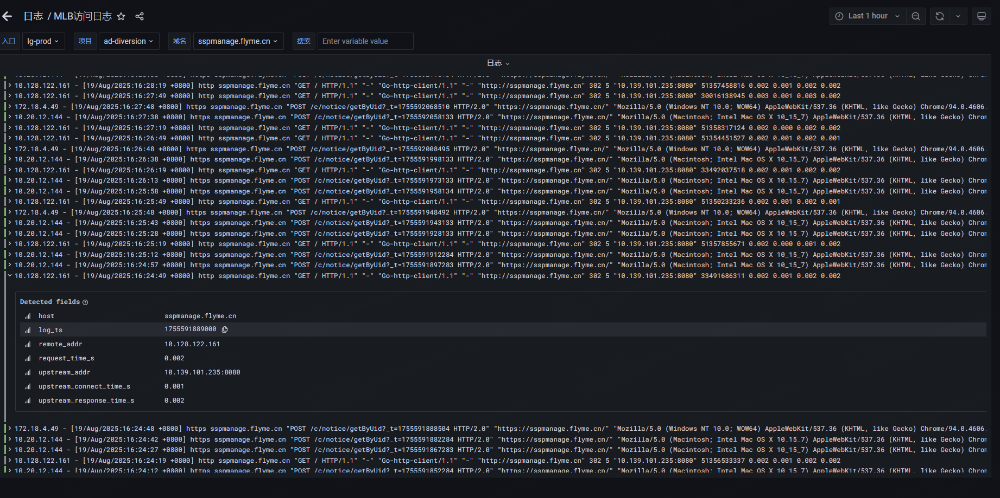

## 经济实用的实施建议

对于小流量服务，可以这样低成本实施：

1. **基础指标**：先启用Spring Boot自带的Prometheus指标(几乎零成本)
2. **关键日志**：只记录ERROR级别和关键业务日志
3. **简单告警**：设置1-2个核心指标告警(如服务不可用)
4. **免费工具栈**：使用Prometheus+Grafana等开源方案





在我的公司，OpenTelemetry  和 Prometheus 是混合使用的：

在基础服务器监控上，运维团队已经很早就使用了prometheus，而且kafka、clickhouse、MySQL 等等组件都有自带或者开源的expoter（prometheus指标采集，见上图），而且还有 grafna监控大盘模板。

只需要几步即可接入。


在这个基础上，应用服务指标（请求量、响应时间、错误率）也需要尽量使用 prometheus 格式。

我们业务团队使用Java居多，springboot已经有相关的sdk开源使用了：

```xml
<dependency>
  <groupId>org.springframework.boot</groupId>
  <artifactId>spring-boot-starter-actuator</artifactId>
</dependency>
<dependency>
  <groupId>io.micrometer</groupId>
  <artifactId>micrometer-registry-prometheus</artifactId>
</dependency>
```

开源的SDK提供了常用的指标，如 HTTP、JVM 等等，都是自动采集的。


但是开源的spring-boot-starter-actuator，对我们来说 有两个缺点：

- 自动埋点的指标不够，如果要上报埋点，需要业务改代码埋点上报
- 只有指标


所以我们就使用了javaagent的形式，拦截常用的足组件埋点  ，另外引入了 OpenTelemetry，解决 链路、日志 问题。


使用 OpenTelemetry   把指标转换成 prometheus 格式。以便接入 prometheus 的告警监控系统。


k8s可自动集成prometheus，

```yaml
spec:
  template:
    metadata:
      annotations:
        prometheus.io/jvm: "true"
        prometheus.io/os: docker
        prometheus.io/paths: /metrics
        prometheus.io/ports: "8073"
```

