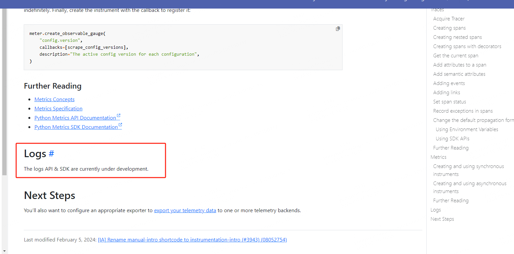

官方对Python接入opentelemetry的说明：

https://opentelemetry.io/docs/languages/python/

## 指标、链路接入成功

其中指标Metrics、链路Trace 都有详细的介绍了。

我在本地都接入数据也都成功上报了，但是唯独没有找到关于 日志Log 的说明。

官方也说明了，日志目前还是 开发 中。




那这就尴尬，指标、链路都有数据了，没有日志可不行。

## 日志怎么办？

这里opentelemetry也提供了一种通用的解决方案，就是类似于 filebeat那种，直接扫描指定的日志路径，然后收集日志。这里可以参考我的另外一篇文章。

以上是一种解决方案。

后来我看了下[opentelemetry-python](https://github.com/open-telemetry/opentelemetry-python)的仓库，它的介绍是有关于 Log的试验的：

| Signal  | Status       | Project |
| ------- | ------------ | ------- |
| Traces  | Stable       | N/A     |
| Metrics | Stable       | N/A     |
| Logs    | Experimental | N/A     |


接着看，大家猜我发现了什么？

仓库的代码，它在一个[example](https://github.com/open-telemetry/opentelemetry-python/blob/main/docs/examples/logs/example.py)的使用例子里面，有关于log的使用demo：


安装我本地试了下，竟然成功了。

这样日志直接以otel的协议就发送给 otel-collector 了，这种方案就更简单了。


整合Metrics、Trace、Log 的核心代码如下：

```python
# metrics
from opentelemetry import metrics
from opentelemetry import trace
from opentelemetry.exporter.otlp.proto.grpc.metric_exporter import OTLPMetricExporter as OTLPMetricExporterGRPC
from opentelemetry.exporter.otlp.proto.grpc.trace_exporter import OTLPSpanExporter as OTLPTraceExporterGRPC
from opentelemetry.metrics import NoOpMeterProvider
from opentelemetry.sdk.metrics import *
from opentelemetry.sdk.metrics._internal.aggregation import AggregationTemporality
from opentelemetry.sdk.metrics.export import PeriodicExportingMetricReader
from opentelemetry.sdk.metrics.view import *
from opentelemetry.sdk.metrics.view import View
from opentelemetry.sdk.resources import *
from opentelemetry.sdk.trace import TracerProvider, Tracer
from opentelemetry.sdk.trace.export import BatchSpanProcessor
from opentelemetry.trace import NoOpTracerProvider
# log
from opentelemetry.exporter.otlp.proto.grpc._log_exporter import OTLPLogExporter as OTLPLogExporterGRPC
from opentelemetry import _logs
from opentelemetry.sdk._logs import LoggerProvider, LoggingHandler
from opentelemetry.sdk._logs._internal.export import BatchLogRecordProcessor

# begin
#endpoint 是 OTLP exporters grpc 协议的 receivers
endpoint = "http://localhost:4317"
metrics_exporter = OTLPMetricExporterGRPC(endpoint=endpoint)

reader = PeriodicExportingMetricReader(exporter=metrics_exporter, export_interval_millis=15,
                                       export_timeout_millis=5)

# 创建 Prometheus 导出器
# Start Prometheus client

# start_http_server(port=8073, addr="localhost")
# reader = PrometheusMetricReader()
config = get_fcop_config()
metrics_attributes = {
    SERVICE_NAMESPACE: config.tenant_code,
    SERVICE_NAME: config.app_namespace,
    SERVICE_INSTANCE_ID: config.application_code,
    CLUSTER_TYPE: config.cluster_type,
    REGION_CODE: config.region_code,
    HOST_NAME: Utils.get_hostname()
}
metrics_attributes.update(CommonTag.get_common_tag())
resource = Resource.create(metrics_attributes)
# metrics
meter_provider = MeterProvider(
    resource=resource, metric_readers=[reader]
    , views=[
        change_bucket_view
    ]
)
metrics.set_meter_provider(meter_provider)
global _meter
_meter = metrics.get_meter(name="meter-sdk")

# trace
trace_exporter = OTLPTraceExporterGRPC(endpoint=endpoint, timeout=10,
                                       compression=CompressionAlgorithm.gzip
                                      )

trace_processor = BatchSpanProcessor(span_exporter=trace_exporter,
                                     max_queue_size=5120,
                                     max_export_batch_size=1024,
                                     schedule_delay_millis=2000,
                                     export_timeout_millis=10000)
trace_provider = TracerProvider(resource=resource)
trace_provider.add_span_processor(trace_processor)
trace.set_tracer_provider(trace_provider)
global _tracer
_tracer = trace.get_tracer(instrumenting_module_name="tracer-sdk")

# log
logger_provider = LoggerProvider(resource=resource)
_logs.set_logger_provider(logger_provider)
log_exporter = OTLPLogExporterGRPC(endpoint=endpoint, timeout=10, insecure=True)
log_record_processor = BatchLogRecordProcessor(exporter=log_exporter, max_queue_size=5120,
                                               max_export_batch_size=1024,
                                               schedule_delay_millis=2000,
                                               export_timeout_millis=10000)
logger_provider.add_log_record_processor(log_record_processor)

handler = LoggingHandler(level=logging.NOTSET, logger_provider=logger_provider)
# Attach OTLP handler to root logger
logging.getLogger().addHandler(handler)
```


关于 opentelemetry log 模块的使用，仅支持 python 的 `logging` 日志库，像其他的日志框架和库，比如：`loguru`、`structlog`、`logbook`  均不支持日志拦截上报。

