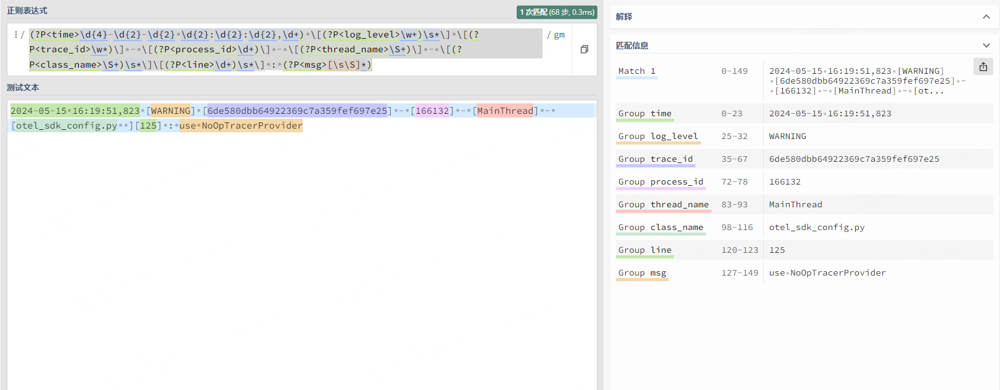

opentelemetry提供了一种类似于 filebeat 的日志收集插件：**filelogreceiver**

简单来说，你只需要配置日志路径即可。


官方说明：https://github.com/open-telemetry/opentelemetry-collector-contrib/tree/main/receiver/filelogreceiver


这种就是通用的日志收集方案，它和语言无关，opentelemetry 只关心日志在哪里，具体怎么收集，正则？单行？改写？过滤？这些能力都支持。


一般来说，常用两种日志切割方案：

- 单行全文
- 多行正则


单行全文最简单了，只需要配置日子里路径即可：

```yaml
filelog:
  'include':
  - '/otel-file-log/data/log/app/*.log'
  'include_file_path': !!bool 'true'
  'operators': []
```

单行全文 需要注意的是，这里的时间是 sidecar日志收集的时间，我们其实更需要的是 日志真正记录的时间。

多行正则就不用担心这个问题，我们可以通过正则，把日志真正记录的时间给提取出来。

假如我本地的日志如下：

```shell
2024-05-15 16:19:51,823 [WARNING] [6de580dbb64922369c7a359fef697e25] - [166132] - [MainThread] - [otel_sdk_config.py  ][125] : use NoOpTracerProvider
```

在正则测试平台可以写一下正则表达式：



我本地 collector sidecar 的 `config.yaml` 配置如下（正则多行）：

```yaml
receivers:
  otlp:
    protocols:
      grpc:
        endpoint: 0.0.0.0:4317
      http:
        endpoint: 0.0.0.0:4318
  filelog:
    start_at: beginning
    include:
    - /otel-file-log/data/log/app/*.log
    include_file_path: true
    multiline:
      line_start_pattern: '\d{4}-\d{2}-\d{2} \d{2}:\d{2}:\d{2},\d+'
    operators:
    - regex: '(?P<time>\d{4}-\d{2}-\d{2} \d{2}:\d{2}:\d{2},\d+) \[(?P<log_level>\w+)\s*\] \[(?P<trace_id>\w*)\] - \[(?P<process_id>\d+)\] - \[(?P<thread_name>\S+)\] - \[(?P<class_name>\S+)\s*\]\[(?P<line>\d+)\s*\] : (?P<msg>[\s\S]*)'
      severity:
        parse_from: attributes.log_level
      timestamp:
        layout: '%Y-%m-%d %H:%M:%S,%L'
        layout_type: strptime
        parse_from: attributes.log_time
      type: regex_parser
   - field: attributes.log_time
     type: remove
   - field: attributes.log_level
     type: remove

processors:
  memory_limiter:
    check_interval: 5s
    limit_percentage: 85
    spike_limit_percentage: 25

  batch/metrics:
    timeout: 200ms
    send_batch_size: 8192
    send_batch_max_size: 8192
  batch/traces:
    timeout: 500ms
    send_batch_size: 9216
    send_batch_max_size: 9216
  batch/logs:
    timeout: 1000ms
    send_batch_size: 7168
    send_batch_max_size: 7168
  resourcedetection:
    detectors: [env]
    override: false
  resourcedetection/sys:
    detectors: [system]
    override: false

exporters:
  logging:
    verbosity: detailed
  prometheus:
    endpoint: "0.0.0.0:8073"
    resource_to_telemetry_conversion:
      enabled: false
  loadbalancing:
    routing_key: "traceID"
    protocol:
      otlp:
        tls:
          insecure: true
    resolver:
      dns:
       hostname: trace.gateway.collector
       interval: 10s
       timeout: 8s
  kafka:
    brokers:
      - log.gateway.collector:9092
    protocol_version: 2.1.0
    encoding: otlp_json
    timeout: 5s
    sending_queue:
      enabled: true
      num_consumers: 10
      queue_size: 5000
    producer:
      max_message_bytes: 8388608
      required_acks: 0
      compression: lz4
    topic: mop-dev-test


extensions:
  health_check:
    endpoint: 0.0.0.0:13133
  zpages:
    endpoint: 0.0.0.0:55679


service:
  extensions: [health_check, zpages]
  pipelines:
    metrics:
      receivers: [otlp]
      processors: [memory_limiter, batch/metrics]
      exporters: [prometheus]
    traces:
      receivers: [otlp]
      processors: [memory_limiter, batch/traces]
      exporters: [loadbalancing]
    logs:
       receivers: [filelog]
       processors: [memory_limiter, resourcedetection, resourcedetection/sys, batch/logs]
       exporters: [kafka]
```

