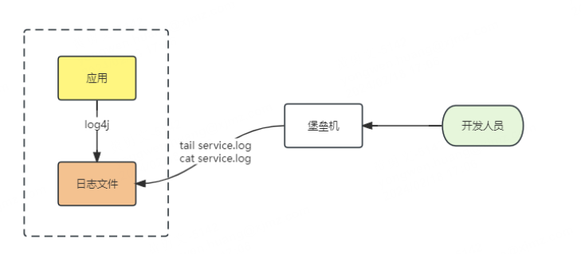

早期的原始架构，没有考虑到日志的记录。

通常开发人员直接登入线上服务器查看日志文件。

这种在架构简单，日志量少，单点部署的应用，是没什么问题的。

如果日志量大，加上分布式部署，缺点明显：

- 每次都要登入服务器，需要通过IP定位到是哪台机器，否则只能一台一台查看
- 日志量大的时候，查询很慢，tail、cat 等等命令可能会导致磁盘IO高
- 日志文件格式不规范，可能保存时间较短被删除、压缩，也可能一直保存导致磁盘空间满

目前行业内的日志架构基本上都是采取ELK。

