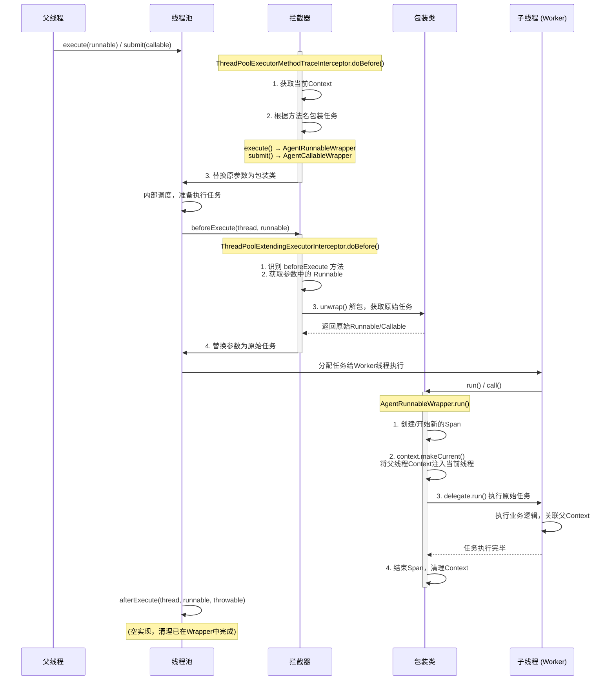

OpenTelemetry Java SDK 的 `Context` 确实默认是基于 `ThreadLocal` 实现的。这意味着当你创建新线程或向线程池提交任务时，父线程的 `Context` 不会自动传递给子线程。


但是业务总会跨线程传递链路ID有这种需求。


## 一、ThreadPoolExecutor 执行流程

这是 Java ThreadPoolExecutor 内部的执行流程：


```
submit()
  └─► execute()
        └─► Worker 线程从队列取任务
              ├─► beforeExecute(thread, task)
              ├─► task.run()          ← 实际执行任务
              └─► afterExecute(task, throwable)
```

具体流程：

1. submit() — AbstractExecutorService 的方法，内部调用 execute()
2. execute() — ThreadPoolExecutor 的核心方法，决定是创建新 Worker、复用 Worker 还是放入队列
3. beforeExecute() — Worker 线程在执行任务前调用（runWorker 方法内）
4. task.run() — 任务实际执行
5. afterExecute() — Worker 线程在任务执行后调用（runWorker 方法内）


```

```


## 二、通用方案：包装 Runnable/Callable

这是最基础、最通用的方法，适用于任何你需要手动创建线程或提交任务的场景。

你需要自己写一个工具类，把原始的 `Runnable` 或 `Callable` 包装一下，在包装类里完成 `Context` 的捕获和注入逻辑。

代码示例（基于搜索到的思路）：

```java
public class ContextAwareRunnable implements Runnable {
    private final Runnable target;
    private final Context parentContext;

    public ContextAwareRunnable(Runnable target) {
        this.target = target;
        // 在父线程中捕获当前Context
        this.parentContext = Context.current(); 

    @Override
    public void run() {
        // 在子线程中，将捕获的Context设置为当前线程的Context
        try (Scope scope = parentContext.makeCurrent()) {
            // 执行真正的业务逻辑
            target.run();
        }
        // try-with-resources 会自动调用 scope.close() 来清理Context
    }
}
```

使用时，将 new ContextAwareRunnable(originalRunnable) 传给 new Thread() 或 executor.submit() 即可。





## 三、具体实现

```
父线程: executor.execute(task)
   ↓
[ThreadPoolExecutorMethodPoints] → 拦截 execute/submit 方法
   → ThreadPoolExecutorMethodTraceInterceptor.doBefore
   → 将 task 包装为 AgentRunnableWrapper(runnable, Context.current())  // 捕获父线程的 OTel 上下文
   ↓
线程池内部: beforeExecute(t, wrappedTask)
   ↓
[ThreadPoolExtendingExecutorPoints] → 拦截 beforeExecute/afterExecute
   → ThreadPoolExtendingExecutorInterceptor.doBefore
   → unwrap wrappedTask 得到原始 Runnable
   → changeArg 替换回原始 Runnable
   ↓
线程池内部: task.run()  // 执行原始任务（此时 OTel context 已通过 wrapper 传递到子线程）
   ↓
线程池内部: afterExecute(wrappedTask, null)
   → 再次 unwrap，恢复原始参数
```

关键设计思路：

- Wrap 阶段（ThreadPoolExecutorMethodPoints + ThreadPoolExecutorMethodTraceInterceptor）：在 execute/submit 入口处，把用户提交的 Runnable/Callable 用 AgentRunnableWrapper 包装，同时把当前线程的 OpenTelemetry Context 捕获进去。这是跨线程 Trace 传递的关键。

- Unwrap 阶段（ThreadPoolExtendingExecutorPoints + ThreadPoolExtendingExecutorInterceptor）：在 beforeExecute/afterExecute 回调中，把参数从 wrapper 中解包出来，恢复原始对象。这样下游追踪看到的是原始 Runnable，而不是包装层。order = HIGH 确保这个解包在其他拦截器之前执行。

 

####  包装

```java
public void doBefore(MethodInfo methodInfo, SessionContext sessionContext) {
        // 获取当前线程的SpanContext，此时父线程调用线程提交方法
        Context context = Context.current();
        SpanContext spanContext = Span.fromContext(context).getSpanContext();
//        如果上下文无效了就没必要了
        if (!spanContext.isValid()) {
            return;
        }
        Object[] args = methodInfo.getArgs();
        if (args == null || args.length < 1) {
            return;
        }
        Object argument = methodInfo.getArgs()[0];
        if (argument == null) {
            return;
        }
//        把  Runnable 和 Callable  放到包装器， 然后返回包装器，包装器也是一个 Runnable 和 Callable
        Object wrapperArgument = null;
        String methodName = methodInfo.getMethodName();
        switch (methodName) {
            case "execute":
                wrapperArgument = ThreadPoolExecutorMethodHelper.wrapExecute(argument);
                break;
            case "submit":
                wrapperArgument = ThreadPoolExecutorMethodHelper.wrapSubmit(argument);
                break;
            default:
        }
        if (wrapperArgument != null) {
            methodInfo.changeArg(0, wrapperArgument);
        }
    }
```


在线程池创建的时候，修改 Runnable 和 Callable  ，用包装器封装一层。


包装器也是一个Runnable / Callable  ，通过工具修改线程池的原始参数，放进去的是包装器。


那么当线程执行的时候，其实执行了包装器的 `run()` 方法。


包装器在执行`run()`的时候，就可以埋点了，同时取出原始的Runnable / Callable 任务，再调用 `run()` 方法，这样就可以成功埋点拦截了。


#### 还原

```java
// ThreadPoolExecutor 源码简化
public void execute(Runnable command) {
    // command = AgentRunnableWrapper(原始task)
    ...
    t = new Worker(firstTask);  // firstTask = wrapped
    ...
}

// Worker.run() 内部
public void run() {
    runWorker(this);
}

// runWorker 简化
final void runWorker(Worker w) {
    Runnable task = w.firstTask;  // task = AgentRunnableWrapper
    
    beforeExecute(w.thread, task);  // ← 参数1是 thread，参数2是 wrapped task
    try {
        task.run();  // ← 这里真正执行任务
    } catch (...) { ... }
    afterExecute(task, thrown);  // ← 参数0是 wrapped task，参数1是异常
}
```

