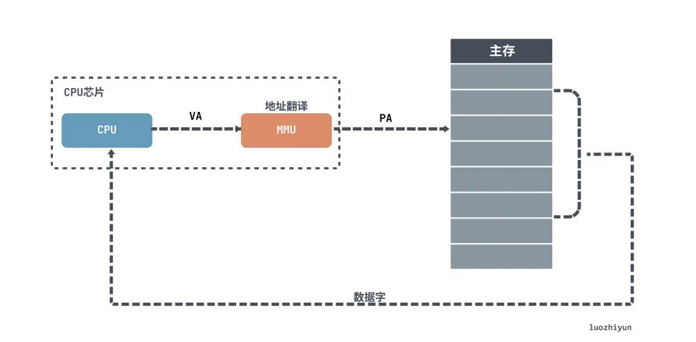

## 储存器分类

计算机中，主要有两大储存器：

- DRAM，就是我们常说的 内存
- SRAM，被称为CPU的cache；这个是CPU自带的，一般又分为 L1、L2、L3 这三层高级缓存

DRAM中存储单元使用电容保存电荷的方式来存储数据，电容会不断漏电，所以需要定时刷新充电，才能保持数据不丢失，这也是被称为“动态”存储器的原因。

SRAM被称为“静态”存储器，是因为只要处在通电状态，里面的数据就可以保持存在。而一旦断电，里面的数据就会丢失了。

L1 、L2 每个核心都有一个，L2 比 L1 的访问速度要慢一点；L3 通常是 多个 CPU 核心共用的。

这几种存储器的**速度**如下：

- L1的存取速度：4个CPU时钟周期。
- L2的存取速度：11个CPU时钟周期。
- L3的存取速度：39个CPU时钟周期。
- DRAM内存的存取速度：107个CPU时钟周期。

## MESI协议

由于多核CPU的出现，且 cache （L1、L2、L3）做了多级，如果存在数据共享的情况下，需要一种机制保证在不同核心中看到的数据必须是一致的。

而 MESI 协议就是用来处理CPU缓存之间的一致性。

> 比如2个核心的CPU，第一个核心运行了QQ，上下文发生切换，第二个核心接着运行QQ，如果修改了同一个变量，需要保证其他核心的变量一致。

**MESI协议**，是一种叫作写失效（Write Invalidate）的协议。在写失效协议里，只有一个CPU核心负责写入数据，其他的核心，只是同步读取到这个写入。在这个CPU核心写入cache之后，它会去广播一个“失效”请求告诉所有其他的CPU核心。

MESI协议对应的四个不同的标记，分别是：

- M：代表已修改（Modified）
- E：代表独占（Exclusive）
- S：代表共享（Shared）
- I：代表已失效（Invalidated）

“已修改”和“已失效”比较容易理解，我们来看看 独占”和“共享” 两个状态。

在独占状态下，对应的cache Line只加载到了当前CPU核所拥有的cache 里。其他的CPU核，并没有加载对应的数据到自己的cache里。这个时候，如果要向独占的cache Block写入数据，我们可以自由地写入数据，而不需要告知其他CPU核。

那么对应的，共享状态就是在多核中同时加载了同一份数据。所以在共享状态下想要修改数据要先向所有的其他CPU核心广播一个请求，要求先把其他CPU核心里面的cache，都变成无效的状态，然后再更新当前cache里面的数据。

## 虚拟内存

在我们日常使用的Linux或者Windows操作系统下，程序并不能直接访问物理内存。

程序都是通过虚拟地址VA（virtual address）用地址转换翻译成PA物理地址（physical address）才能获取到数据。也就是说CPU操作的实际上是一个虚拟地址VA。

## 总结

CPU读取数据只与缓存交互，不会直接访问主存，所以CPU缓存和主存之间维护了一套映射关系。当被查找的数据发生缺失时，需要等待数据从主存加载到缓存中，如果缓存满了，那么还需要进行淘汰。如果被淘汰的数据是脏数据，那么还需要写回到主存中，写的策略有写直达（write-through）和写回（write-back）。

由于现在计算机中的CPU都是多核的，并且缓存数据是由多核共享的，所以就有了类似MESI这样的协议来维护一个状态机保证数据在多核之间是一致的。

为了访问数据安全，便捷，迅速所以加了一层虚拟内存，每个程序在启动的时候都会维护一个页表，这个页表维护了一套映射关系。CPU操作的实际上是虚拟地址，每次需要MMU将虚拟地址在页表上映射成物理地址后查找数据。并且为了节省内存所以设计了多级页表，为了从页表中查找数据更快加了一个缓存芯片TLB。

---

参考：

- https://mp.weixin.qq.com/s/lULejuEivyfWesM2mJJlBg?wxwork_userid=tencentcloud2