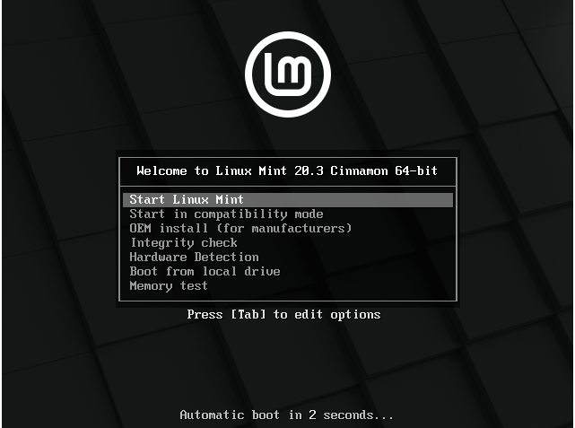
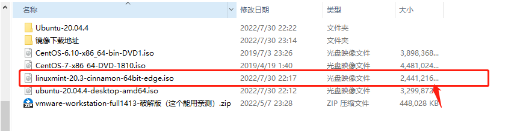

Linux Mint 是一个年轻的操作系统，它于2006年开始发行，然而，它基于非常成熟的软件管理，并且采用了最新的Linux内核，支持XWayland，像GNU软件和Gnome桌面。

**它也基于Ubuntu和Debian项目并且用它们作为基础。**

Linux Mint 提供三种桌面环境的镜像:

- Cinnamon
- Xfce
- MATE

表示这三种不同桌面布局。

## 1、下载镜像

官网：[https://linuxmint.com](https://linuxmint.com)

阿里云镜像地址：[https://mirrors.aliyun.com/linuxmint](https://mirrors.aliyun.com/linuxmint)

**我这里下载的 20.3 的 Cinnamon 版本。**

（阿里云镜像 使用 IDM 或者 迅雷 下载会很快。）

## 2、安装

我这里 使用 VMware 安装，安装比较方便。

### 1、选择下载ISO镜像

### 2、选择版本

VMware 会提升无法检测 Linuxmint的版本，这里选择 Ubuntu 就行

### 3、初始化

选择第一个安装即可，其实不选也行，它会自动安装：

安装比较快，我本地十几秒就安装完毕了，看来这个轻量级、简便 并非浪得虚名。

### 4、正式安装

安装完毕可以就可以看到桌面了。

点击 桌面的 `install linux mint` 

设置你喜欢的 语言、多媒体解码器 、时区、用户名密码 即可。

可以看到 Linuxmint 有点类似windows，又有点像 Mac，上手比较容易。

本身Ubuntu系统的软件市场也带有很多Linux系统的软件，Linuxmint 也不例外。

而且它还有一个自带的软件安装市场，类似于 手机的APP应用商店，像 微信、QQ、WPS、Word、IDEA 都有Linux版本了，所以用来做日常开发也是毫无问题的。

至此，已经安装完毕，接下来就去折腾吧。

## 3、总结

我前前后后也用了几个月，总结我比较喜欢的一些特点：

- 桌面式图形化

带有舒适而优雅的桌面操作系统，我比较喜欢这个桌面，相比Ubuntu，更清爽。

- 轻量级

20.3 版本 镜像只有2.3G，相比 centos、Ubuntu，少了 1个G

- 安装快速

相比 Centos、Ubuntu ，安装非常迅速。

但是因为是图形化的桌面，消耗资源也会较多。

