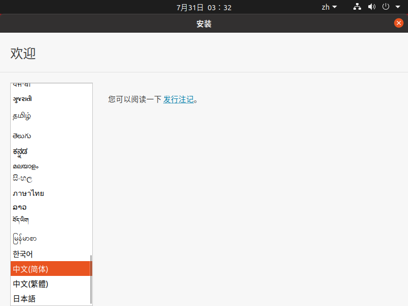
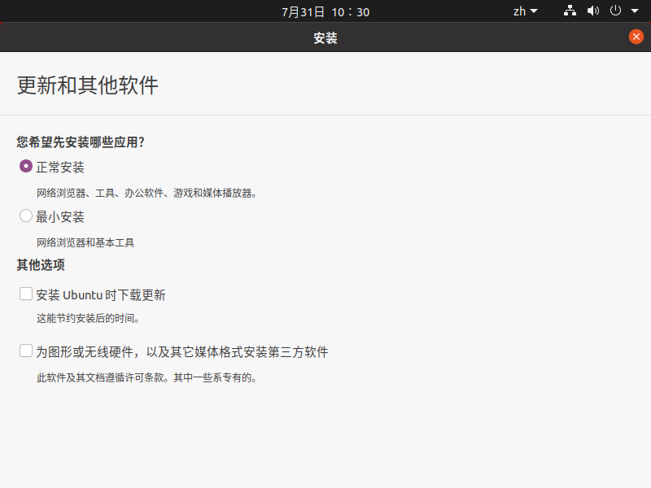

Ubuntu是一个以**桌面应用**为主的Linux操作系统。

在以前人们的印象中，Linux系统都是一个黑色的框，只能使用 Linux命令，如 bash 交互，但在Ubuntu出现后这些都成为了历史，使之可以和windows、mac 一样，拥有了出色的桌面环境。尤其深受软件开发者的喜爱。

> 比如 Centos  开始也是没有桌面环境，后来也出了

 

Ubuntu也拥有庞大的社区力量，用户可以方便地从社区获得帮助。

所以如果你想使用Linux作为开发系统，我这里只推荐 Ubuntu 。

## 1、下载Ubuntu

网易镜像下载：http://mirrors.163.com/ubuntu-releases/

我选用的是 20.04 版本。

## 2、安装

我这里使用 VMware安装，如果你是 windows10版本，也可以使用自带的 Linux子系统创建。

使用 VMware 选择你刚刚下载的 ISO 文件即可。

然后开启你的虚拟机:

初始化一步一步按照提示即可

