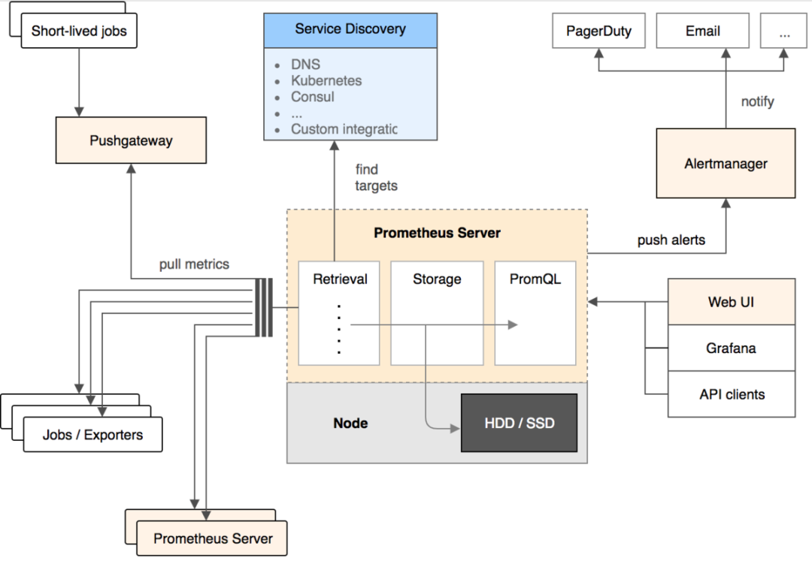

Prometheus（普罗米修斯）是由前google员工2015年正式发布的开源监控系统，采用Go语言开发。

数据采集是基于Pull模式的，通过埋点服务暴露端口，Prometheus server 端定时拉取数据。

- **Prometheus Server**：核心组件，用于收集、存储监控数据。它同时支持静态配置和通过`Service Discovery`动态发现来管理监控目标，并从监控目标中获取数据。此外，Prometheus Server 也是一个时序数据库，它将监控数据保存在本地磁盘中，并对外提供自定义的 PromQL 语言实现对数据的查询和分析。
- **Exporters**： 采集数据，通过HTTP服务的形式将监控数据按照标准格式暴露给Prometheus Server（社区有现成的exporter插件）
- **Push gateway**：主要用于瞬时任务的场景，防止Prometheus Server来pull数据之前，此类Short-lived jobs就已经执行完毕了，因此job可以采用push的方式将监控数据主动汇报给Push gateway缓存起来进行中转。
- **Alert Manager**：当告警产生时，Prometheus Server将告警信息推送给Alert Manager，由它发送告警信息给接收方。
- **Web UI**：Prometheus内置了一个简单的web控制台，可以查询配置信息和指标等，而实际应用中我们通常会将Prometheus作为Grafana的数据源，创建仪表盘以及查看指标。

---

在服务器监控（cpu、IO、内存、带宽）方面，Zabbix 有着绝对的优势，但是对于应用层面（HTTP调用数、线程数）监控，Prometheus  会有优势。

> 但是Prometheus  在对于应用层面的监控，还是需要代码埋点配置，springboot也集成了Prometheus  ，也是说明了Prometheus  的强大。