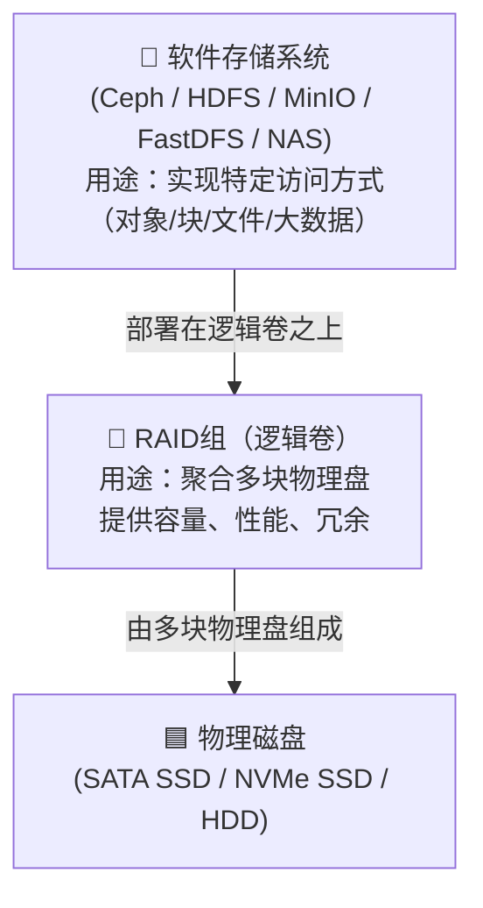
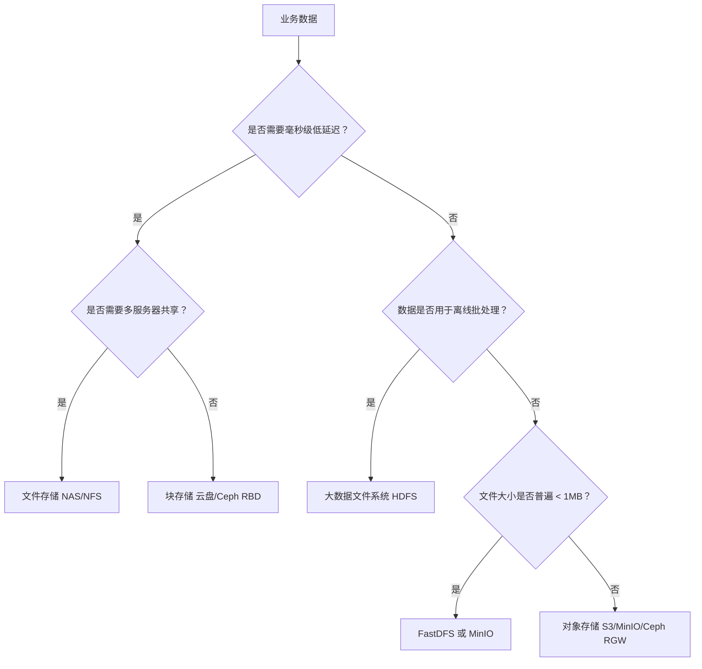

## 一、存储系统五大分类

根据访问方式、数据模型和设计目标，存储系统可以分为以下五类：

| 分类               | 代表系统                           | 核心访问方式                        | 数据模型                                |
| :----------------- | :--------------------------------- | :---------------------------------- | :-------------------------------------- |
| **对象存储**       | AWS S3, MinIO, Ceph RGW, 阿里云OSS | HTTP RESTful API (S3协议)           | 扁平命名空间，Bucket + Object + Key     |
| **块存储**         | AWS EBS, 阿里云盘, Ceph RBD, SAN   | 裸设备块设备，挂载为本地磁盘        | 固定大小的数据块，可格式化文件系统      |
| **文件存储 (NAS)** | NFS, CIFS/SMB, 商用NAS, CephFS     | POSIX兼容文件系统接口，挂载共享目录 | 目录树结构，文件和文件夹                |
| **大数据文件系统** | Hadoop HDFS                        | 专用Java API，顺序读写              | 大文件（GB-TB级），Write-Once-Read-Many |
| **专用文件存储**   | FastDFS, TFS                       | 私有TCP协议，需专用SDK              | 中小文件，按组/路径/文件名存储          |

------

## 二、各分类详解

### 1. 对象存储

**一句话定义**：面向海量非结构化数据的、基于HTTP API访问的、无限扩展的存储服务。

**核心特点**：

- 数据以"对象"为单位，包含数据本身 + 元数据 + 全局唯一Key
- S3 API已成为事实标准，生态工具丰富，通过HTTP RESTful API访问（PUT/GET/DELETE）
- 无限横向扩展，支持EB级容量
- 通常采用纠删码而非多副本，降低成本

**缺点**：

- 不兼容POSIX，无法像文件系统一样挂载使用
- 不适合频繁修改（需要整体覆盖）
- 小文件大量写入性能不如专用方案
- 毫秒级延迟，不适合低延迟应用（如数据库）

**实战场景**：

- 互联网应用的图片、视频、前端静态资源托管 

**例子**：

> 一家社交平台，用户每天上传数千万张图片和视频。这些文件不需要频繁修改，但需要永久保存并随时供全球用户访问。最适合用对象存储来存放，因为它天生为海量非结构化数据而生。上传时，应用通过S3 SDK直接PUT到Bucket；访问时，通过CDN加速URL直接展示。

####  什么是纠删码？

纠删码是一种更高级的数学算法，它不是简单地复制整份数据，而是将数据**分块，然后编码生成额外的校验块**。

- **工作原理**：假设你要存1GB数据。系统会将文件切分成若干个**数据块**（比如4个，每个250MB），然后通过编码算法计算出**校验块**（比如2个，每个250MB）。最终，这4+2=6个块会被分散存储在不同的机器上。
- **存储成本**：你存1GB数据，实际占用空间是4个数据块 + 2个校验块 = 6个块，每个块250MB，总共是 **1.5GB**。
- **容错能力**：只要这6个块中，任意损坏的块不超过2个（即至少4个完好），系统就可以通过算法将原始数据完整地恢复出来。它能容忍的故障数和3副本一样，都是2台机器。

#### 为什么纠删码成本更低？

这个问题的答案就在于计算**存储效率**。

- 同样是提供容忍2台机器故障的可靠性：
  - **3副本**需要 **3.0GB** 物理空间，只能存 **1.0GB** 有效数据。
  - **纠删码 (4+2)** 只需要 **1.5GB** 物理空间，就能存 **1.0GB** 有效数据。

在提供**相同级别容错能力**的前提下，纠删码的**存储成本直接降低了50%**！对于动辄PB甚至EB级别的海量数据存储，这节省的硬件成本是极其可观的。

但是背后是**性能**与**成本**的权衡：

- **纠删码的代价是性能**：当你读取数据时，如果恰好读取到的几个节点有故障或延迟，系统需要实时进行解码计算，这会产生额外的CPU开销和网络传输，导致**读写延迟（Latency）增加**。

### 2. 块存储

**一句话定义**：提供低延迟、高IOPS、像本地硬盘一样挂载使用的存储设备。

> 就是操作系统能直接“看到”和管理的最底层存储设备，**你的window D盘就是其典型代表**。

**核心特点**：

- 以数据块（Block）为单位，提供裸设备
- 通过SCSI/iSCSI/PCIe协议访问，操作系统视为本地硬盘
- 通常只能被单一服务器独占挂载（ReadWriteOnce）
- 延迟微秒级，IOPS可达数十万

**优点**：

- 性能最高，延迟最低
- 可作为系统盘/数据盘，安装操作系统
- 支持任何文件系统（ext4, XFS, NTFS等）
- 数据库等关键应用的首选存储

**缺点**：

- 无法多服务器共享（除非使用集群文件系统）
- 容量扩展需要挂载新盘，不够灵活

**实战场景**：

- 数据库（MySQL, PostgreSQL, MongoDB）的数据目录
- 消息队列（Kafka, RabbitMQ）的数据存储
- 容器化应用的持久化卷（Kubernetes PV）
- 作为虚拟机系统盘

**例子**：

> 你在云上部署一个MySQL数据库，它对磁盘的读写延迟极其敏感。你为这台数据库服务器单独购买一块"ESSD云盘"挂载上去，格式化ext4，将MySQL的数据目录指向它。这块云盘的底层就是分布式块存储（如阿里云盘古），它提供了极低延迟和高IOPS，确保数据库QPS稳定。

**关于可靠性**：

> 阿里云盘等公有云块存储产品，默认采用**分布式三副本机制**。写入的数据会自动生成三个副本，存储在不同机架的物理服务器上。单一硬件故障不会影响数据完整性和读写服务，可靠性达到99.9999999%（9个9）。

### 3. 文件存储 (NAS)

**一句话定义**：通过标准网络协议（NFS/CIFS）共享的、多服务器可同时挂载的分布式文件系统。

> 一个独立的、通过网络共享文件的“存储服务器”。在用户界面上，你可以把它映射成一个盘符，操作起来就像本地磁盘一样方便，

**核心特点**：

- 完全兼容POSIX标准，支持目录树、文件锁、权限控制
- 多台服务器可同时挂载读写（ReadWriteMany）
- 通过NFS（Linux）或CIFS/SMB（Windows）协议访问
- 延迟比块存储高，但远低于对象存储

**优点**：

- 多服务器共享数据，方便维护
- 使用体验与本地文件系统完全一致
- 适合传统应用迁移
- 支持文件级别的细粒度权限控制

**缺点**：

- 性能不如块存储，不适合高IOPS场景
- 网络延迟会带来性能损耗
- 单点故障风险（需高可用部署）

**实战场景**：

- Web集群共享静态资源或配置文件
- 企业内部文档共享（办公网盘）
- 日志集中存储（多服务器写同一份日志目录）
- 容器平台的共享存储卷（Kubernetes ReadWriteMany PV）

**例子**：

> 公司内部有10台Web服务器，它们都需要读取同一份配置文件或静态资源。你不能在每个服务器上都存一份，否则维护更新将是灾难。你配置了一台NAS，通过NFS共享出一个目录，挂载到所有Web服务器的 `/etc/nginx/conf.d/` 下。更新配置时只需修改NAS上的文件，所有服务器立即生效。

块存储和文件存储有点类似，对比：

| 特性             | 块存储 (你的 D盘)            | 文件存储 (NAS)                 |
| :--------------- | :--------------------------- | :----------------------------- |
| **访问协议**     | SATA / NVMe / SCSI           | NFS / SMB/CIFS                 |
| **是否通过网络** | ❌ 本地总线直接访问           | ✅ 通过网络访问                 |
| **数据共享**     | ❌ 通常只能被一台电脑独占访问 | ✅ 可被多台电脑同时挂载和读写   |
| **性能**         | 极高，微秒级延迟             | 较低，受网络速度限制           |
| **使用场景**     | 操作系统、数据库、大型游戏   | 文件共享、多设备协作、备份中心 |

### 4. 大数据文件系统 (HDFS)

**一句话定义**：专为大规模批处理设计、高吞吐量顺序读写的分布式文件系统。

**核心特点**：

- 设计目标：**一次写入，多次读取（WORM）**
- 针对GB到TB级**大文件**优化，不支持文件修改
- 高吞吐量顺序读写，不适合随机访问
- 通过数据副本（默认3副本）提供可靠性
- 是大数据生态（Hive, Spark, Flink）的存储底座

**优点**：

- 极高顺序读写吞吐量，适合批处理
- 为大数据计算引擎深度优化（数据本地性）
- 成熟稳定，生态丰富
- 支持PB级海量数据

**缺点**：

- 不适合小文件（元数据压力大，NameNode内存瓶颈）
- 不支持文件随机写、追加写（除追加API）
- 延迟较高（数百毫秒），不适合在线业务
- 运维复杂，需管理NameNode高可用

**实战场景**：

- 离线数据仓库（Hive表存储）
- 海量日志收集（Flume + HDFS）
- 机器学习训练数据存储（需要大量顺序读）
- 作为大数据平台的"数据湖"底座

**例子**：

> 你是一家电商公司的数据工程师，每天凌晨需要处理前一天上百TB的订单日志。你会把这些日志文件从Kafka消费后，以Parquet格式写入HDFS的 `/data/logs/dt=2026-06-28/` 目录。然后启动一个Spark任务去读取并分析这些数据。它不追求毫秒级响应，只追求"一次读一整块大文件"时的吞吐量最大化。

### 5. 专用文件存储 (FastDFS)

**一句话定义**：轻量级、专为中小文件（4KB-500MB）存储优化的分布式文件系统。

**核心特点**：

- 两层架构：Tracker（调度中心）+ Storage（存储节点，按Group分组）
- 文件与操作系统文件直接对应，不分块存储
- 使用私有TCP协议，需专用SDK访问
- 提供Nginx扩展模块支持HTTP下载

**优点**：

- 轻量部署，对硬件要求低
- 针对中小文件读写性能优异
- 架构清晰，快速落地
- 与Nginx配合，下载可直接走HTTP

**缺点**：

- **私有协议**，无法与S3生态集成，生态封闭
- 扩展性有限（以Group为单位扩容，不够灵活）
- 缺乏生命周期管理、版本控制等高级功能
- 运维主要靠日志，缺乏可视化监控面板
- 不支持大文件（>500MB性能下降）
- 官方迭代不活跃，社区支持有限

**实战场景**（适合存量或中小规模项目）：

- 电商网站的用户头像、商品图片
- 社交应用的论坛附件、表情包
- 短视频封面图
- 对S3生态无依赖、追求极致轻量的中小项目

**例子**：

> 你是一个早期的图片分享网站，每天上传数百万张头像和缩略图（文件大小在几十KB到几MB之间）。你发现HDFS处理小文件效率极低，而FastDFS正好专为这种场景设计，读写快速，架构轻量。你的后端通过fastdfs-client-java SDK上传文件，返回一个 `group1/M00/00/01/xxx.jpg` 的路径，前端通过配置好的Nginx HTTP服务直接访问这个路径展示图片。

## 三、存储系统的技术分层

> 在实际生产环境中，HDFS 是一个特例。官方推荐 **HDFS 直接部署在 JBOD（Just a Bunch Of Disks）** 上，即**不做 RAID**。因为 HDFS 自身通过 3 副本机制提供了数据冗余，如果再在底层做 RAID，会浪费存储容量。

结构说明

- **物理磁盘**：最底层，是实实在在的硬件，包括 SATA SSD、NVMe SSD、机械硬盘（HDD）等。它们单块容量和性能有限，且容易故障。
- **RAID组（逻辑卷）**：中间层，通过 RAID 卡或软件 RAID（如 Linux mdadm）将多块物理磁盘组合成一个逻辑卷。这一层解决了单盘的性能、容量和可靠性问题（例如 RAID 0 提升性能，RAID 1/5/6 提供冗余）。
- **软件存储系统**：最上层，部署在 RAID 组提供的逻辑卷之上。这些软件（如 Ceph、HDFS、MinIO 等）利用逻辑卷提供的存储空间，通过软件层实现特定的数据访问模型（对象、块、文件、大数据流等），并提供更高级的功能（如多副本、纠删码、自动均衡等）。

## 四、决策框架：如何选择？

### 三条选取原则

1. **数据库 → 块存储**：有事务、低延迟要求的结构化数据，永远优先选块存储。
2. **静态资源 → 对象存储**：图片、视频、JS/CSS、备份文件，对象存储性价比最高。
3. **共享文件 → 文件存储**：多服务器需要同时读写同一份数据，NAS是标准解法。

## 五、总结对照表

| 存储类型     | 延迟         | 并发访问     | 扩展性 | 典型应用               | 成本模式  |
| :----------- | :----------- | :----------- | :----- | :--------------------- | :-------- |
| **对象存储** | 高（毫秒）   | 无限并发     | 无限   | 静态资源、数据湖、备份 | 按量付费  |
| **块存储**   | 极低（微秒） | 单服务器独占 | 有限   | 数据库、系统盘         | 预购容量  |
| **文件存储** | 中（亚毫秒） | 多服务器共享 | 中等   | 共享配置、日志         | 按量付费  |
| **HDFS**     | 高（毫秒）   | 专用API      | PB级   | 离线数仓、日志         | 硬件+运维 |
| **FastDFS**  | 低（毫秒）   | 专用SDK      | 有限   | 中小文件、图片         | 硬件+运维 |