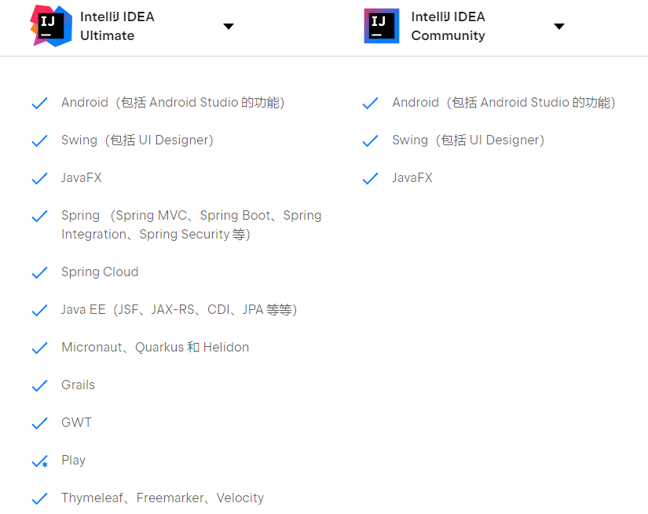
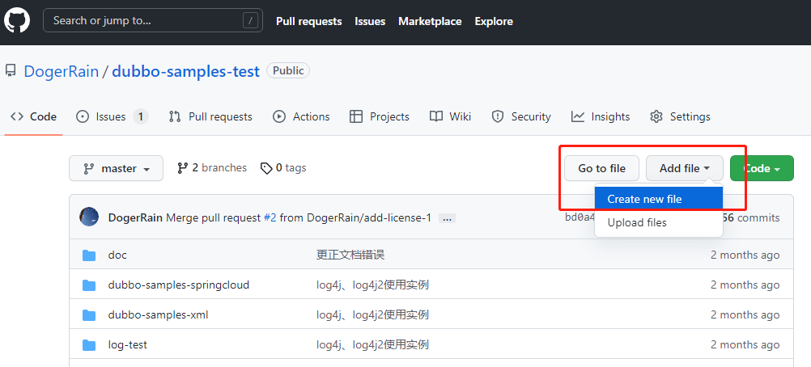
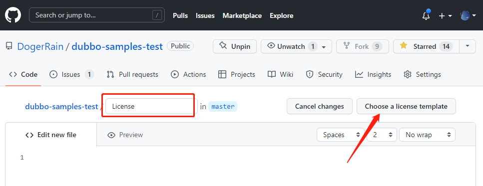
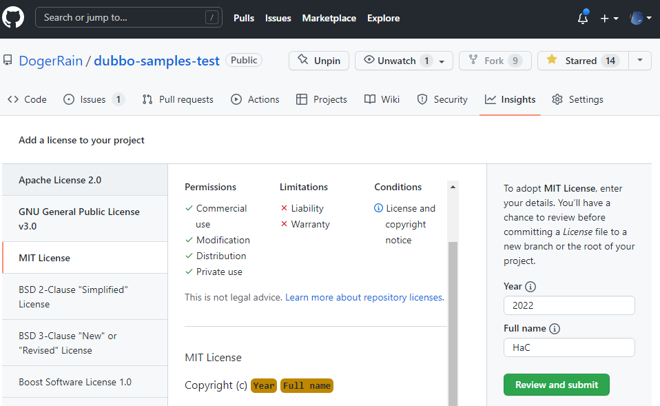
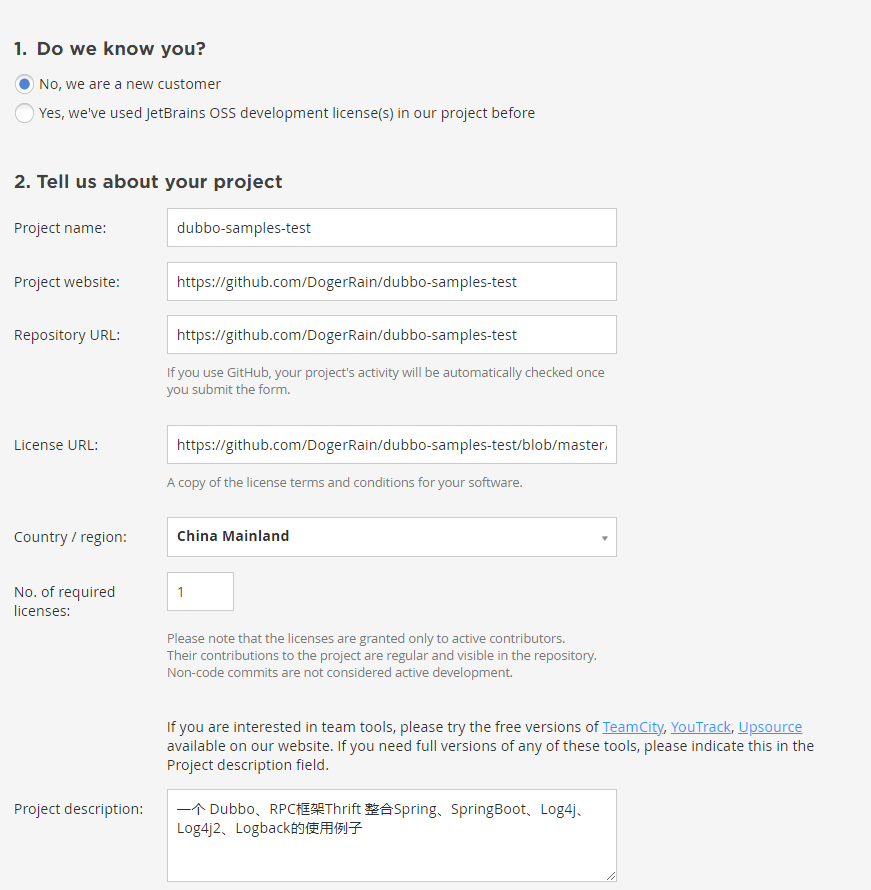
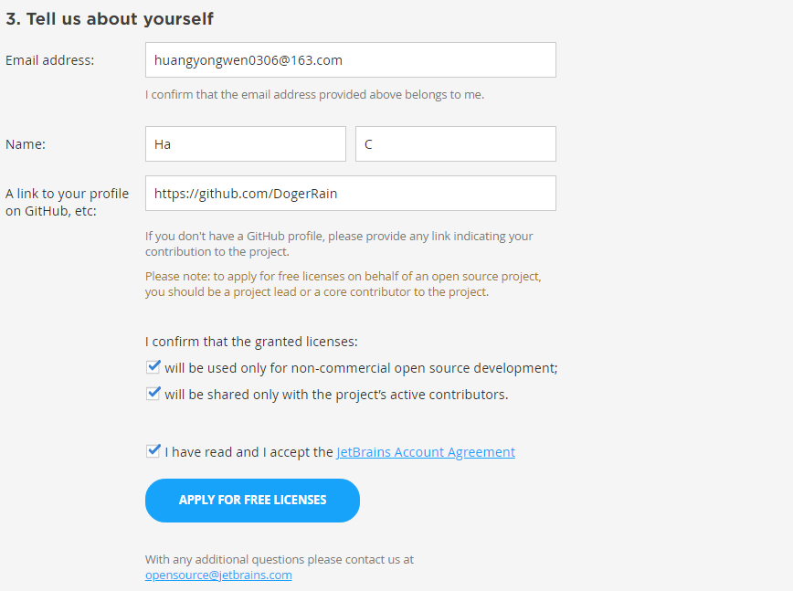
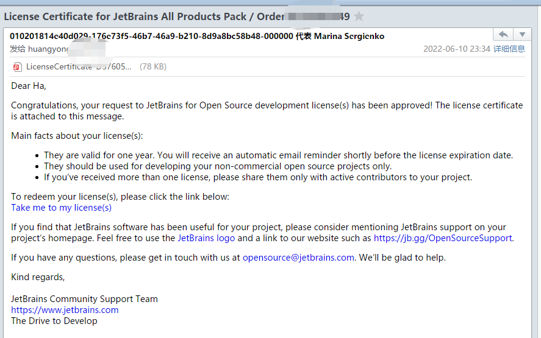
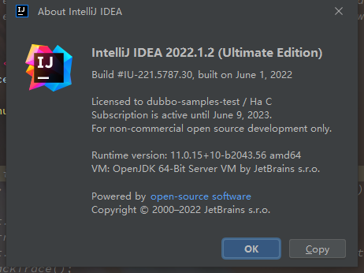

IntelliJ IDEA的强大功能让每个开发者都感受到了它的魅力。

IDEA分两个版本：

- 企业版，功能强大
- 社区版，功能阉割

就框架来说，社区版 连 Spring （Spring MVC、Spring Boot、Spring Integration、Spring Security 、SpringBoot等）都不支持，仅这一条，已经劝退大部分人了。

> 这里可以看到两者的对比：https://www.jetbrains.com/zh-cn/products/compare/?product=idea&product=idea-ce

所以使用 企业版的IDEA对职业开发者来说，是必不可少的。

但企业版的收费却不便宜。

网上都有很多破解的过程，而且不同IDEA的版本破解步骤也不一致，不知道哪一天就失效了。

如果不想破解，还有另外一种方法可以使用企业版IDEA，那就是**利用开源项目免费申请IDEA激活码**。

## 1、第一步，创建一个开源项目

利用 github 创建一个项目，随便都可以。我这里就用一个dubbo的使用demo开源项目申请的。

要求：

- 积极开发 3 个月以上，有commit（其实不一定）
- 需要在自己的开源项目里面添加License开源协议

如何添加  **License开源协议**?

1、在项目首页 ADD file ，Create new file

2、输入 **License** ，会自动弹出 **Choose a license template**

点击它。

3、选择合适的开源协议，我这里选择**MIT**

提交即可。

## 2、第二步，IDEA官网申请

打开 [https://www.jetbrains.com/shop/eform/opensource?product=ALL](https://www.jetbrains.com/shop/eform/opensource?product=ALL)

填写你的开源项目信息：

提交即可。

注意：

- 邮箱一定要和github的邮箱地址一致，IDEA官方审核通过后邮箱联系你

## 3、第三步，公开你的github邮箱

IDEA工作人员会审核你的github项目，同时会验证你的邮箱是否是作者邮箱。

1、选择 setting，Emails

**Keep my email addresses private** 不要勾选。

2、选择 setting，Public profile

查看你的  Public email 是否正确显示，如果是，则没问题。

## 4、第四步，确认license

几天后，IDEA官方会给你发一封邮件。

> 我这里只用了两天

点击邮箱中的`Take me to my license(s)`这个链接，会跳转到Jetbrains的License协议说明。

跳过去后，拉到最下方，点击`I Accept`确认。

然后IDEA已经默认给你的邮箱注册了，点击忘记密码，即可设置你的新密码。

打开你的IDEA，点击`help` ， `about` ，可以配置你的idea账户密码：

除此之外，还可以使用IDE全家桶产品：

## 5、总结

1、申请的激活码也没有想象中的那么难，网上说要半个月左右，但我只用了两天。

2、github的项目一定要声明开源的license，然后邮箱要一致

3、申请的激活码一年有效期，到期IDEA会提前通知你，你可以继续 续一年