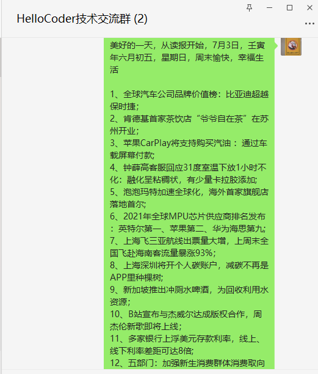

## 1、关于我

我是`阿雨`，以前在博客经常署名`醋酸菌HaC`，一名非科班的程序员，医药专业转行计算机，大三开始自学Java，历经半年，面试30多家公司找到一份实习，正式踏入打码的职业。

没有大厂经验，但一直有个大厂梦。

> 奈何技术太菜了没大厂捞我

写了四五年的Java，有点腻了，所以现在在学Python，用来**爬虫+聚合数据**。

我觉得代码的世界还是很有趣的，比如一些代码（脚本、自动化程序）可以帮助我完成一些重复的工作，也能聚合数据产生价值。

所以技术这条路，如无意外，我还是会继续走下去。

在一线城市卷过几年，后来突然就开窍，选择去了一个小城市开启965的生活。

小城市的生活的也是很香的，虽然刚从一线城市过来有一点不适应，但是后来慢慢发现，生活远比工作重要。

但每个人想法都不一样，我就是那种喜欢相对自由和压力小一点的生活。

（我最喜欢的滨海城市⬇）

## 2、入门互联网

大学的专业和计算机可以说是毫无关系，但也有点计算机的课程。

临近毕业的时候，发现什么也不会，就开始学习Java，最后找到了一份实习，遂开始在互联网搬砖。

 

刚开始并不知道互联网有这么多的职位，前前后后也走了很多弯路，刚开始学的是 Android方向，发现局限太小了，遂放弃。

又自学了一个月前端，面试的十几个前端岗位，没有收到一个实习offer，遂放弃。

这个阶段就开始产生消极的情绪了，渐渐开始自暴自弃，对自己的能力产生怀疑，甚至觉得大学也白读了....

在培训班遍地都是的年代，我曾询价好几个机构，奈何价格太高把我劝退了。

于是我转变了想法：

- 只学Java，其他都先不学
- 降低要求，只要能实习，其他一切好说

 

后来开始把精力到 Java后端 这一块，网上找了套 **“Java之父马士兵”** 的速成视频（那时候的B站还没有什么免费的技术视频），再看了些SSM、SSH、Linux、MySQL的视频就开始找实习了。

大三暑假又面了二十多家公司终于拿到了一个offer，从此开启互联网搬砖的大门。

## 3、关于本项目

围绕着新手、初级程序员的两个难题：

- 新手入门Java，学到什么程度才能找到工作
- 怎么样才能找到一份高薪的工作，面试会问些什么

曾经也有好几个人问过我上面这两个问题，我也分享过自己在有道云笔记记录的一些知识点：

加上我也会写写技术文章，遂一起整理，搭建了我的博客。

第一个版本 利用 docsify + github 搭建了自己的笔记系统，托管在 github page。

第二个版本用了 vuepress 搭建，主题是 Vdoing，也就是目前这个，托管在 阿里云 & 腾讯云 ，图床使用七牛云。

### 3.1《Java小白求职之路》

《Java小白求职之路》是我本人在求职过程中整理的一些Java面试题。

涵盖 了**初级、中级 的面试题，也有一些面经和求职建议**。

对 新手和初级程序员来说，是个不错的参考。

### 3.2《小白学Java》

《小白学Java》是我自己当初自学Java以及走了不少弯路总结的Java知识点。

这部分面向 **新手程序员，特别是在校学生**。

当初我也不知道Java学到什么程度才能找到一份工作，只能一边面试，一边总结，然后恶补知识点。

所以我以一个多年开发经验的程序员 以及 面试官 的角度，来给个 **新手程序员** 一个方向，要掌握哪些知识点，才能找到一份工作。

 

以上两个项目是本博客主要的内容，它们被整理成了一个有顺序的文档。

除此之外，还有一些 免费的计算机资源，如电子书、学习视频、开发的脚手架工具等等。

还有就是一些作者自身的一些技术随笔，还有技术的有趣小项目。

## 4、写在未来

Java的知识点对我来说，已经达到了一种**“边际效益”**递减的状态，未来会把精力放在下面几个方向，同时我也会分享出来：

- 中间件的使用专栏文章，如es、dubbo、mq、kafka等等

- Python

  - 爬虫+数据聚合
  

## 5、写在结尾

目前本项目只有我一个人维护，无任何盈利性质。仅代表我自己的观点，但关于技术的观点，力求做到严谨，如果瑕疵的地方，也希望你可以联系我改正。

公众号也会不定时更新有趣的技术，也会分享一些Python爬虫学习记录。

 

 </img> 

| 公众号                                                       | 微信                                                         |
| ------------------------------------------------------------ | ------------------------------------------------------------ |
|  |  |

::: tip 未来TODO
后续可能建个免费技术交流群（看人数），群主会不定时分享：

- 每日早报，国内外重大新闻
- 行业数据报告和电子书
- 薅羊毛福利
- 技术探究（需要活跃的、爱分享的小伙伴支撑 ）
:::

类似于以下这种形式：

| 每日早报                                   | 行业数据报告                               | 薅羊毛福利 |
| ------------------------------------------ | ------------------------------------------ | ---------- |
|  |  | 暂无       |

 

---

> 《佛典》曰：“ 自未得渡而渡人者，菩萨发心，又自渡生死苦海，而又渡人。”  

做开源也好，写文章也好，对自己也是一种知识的沉淀，最重要的是**内容对他人有价值**，*渡人如渡己，渡己，亦是渡人*。

 

前路浩浩荡荡，未来皆可期。

 

在这里，期待和各位进步。

 

<!-- 评论 -->
<Vssue :title="$title" />